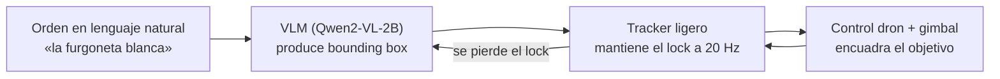

# Un dron que pilotas hablándole

**Le dices en lenguaje natural qué seguir —"la furgoneta blanca", "el coche azul"— y el dron lo localiza, lo engancha y lo mantiene encuadrado él solo. Todo corre en la placa, sin nube.** Trabajo Fin de Máster (TFM) de Edge-AI.

---

## El problema

Los drones se pilotan con mando o con waypoints GPS. Nadie le dice a un dron *"sigue a aquel coche"* — porque entender lenguaje natural sobre imágenes requiere modelos grandes que viven en la nube, y la nube añade latencia, dependencia de red y coste.

Este TFM demuestra que un dron puede aceptar órdenes en lenguaje natural y seguir el objetivo **enteramente on-device**, en una Jetson Orin Nano de 8 GB a **15 W**, sin conexión a internet.

---

## Cómo funciona

El sistema es un **bucle de seguimiento de dos niveles**: un modelo pesado que ancla y uno ligero que coastea entre anclajes.

- **VLM afinado y cuantizado para caber en 15 W.** Qwen2-VL-2B con LoRA, exportado a GGUF **Q8_0 (~1.65 GB)** y servido con llama.cpp. Se eligió por su resolución dinámica nativa (clave para objetos aéreos diminutos, ~16 px) y porque su fidelidad al cuantizar apenas cae, a diferencia de otros backbones probados.
- **Dos niveles, cada uno en lo suyo.** El VLM re-ancla el objetivo cada ~2 s (es preciso pero lento, ~0.44 Hz); un tracker ligero (ByteTrack, ~0.14 ms/frame en la Orin) mantiene el lock a 20 Hz entre anclajes. El re-grounding con el VLM se dispara **al perder el lock**, no en cadencia fija, porque el horizonte de coasteo (~1.5 s) es menor que el periodo de anclaje.
- **Re-ancla más rápido recortando la ROI.** En lugar de reprocesar el fotograma completo, se le pasa al VLM un recorte alrededor del último box: prefill 2.7× más rápido *y* más preciso (super-resolución del recorte).
- **Evaluación por etapas con puertas.** Cada fase (backend → datos → resolución → entreno → despliegue) tiene una puerta cuantitativa medida (IoU@0.25) antes de pasar a la siguiente; nada de código especulativo.

---

## En números

> **Todo corre en una Jetson Orin Nano 8 GB a 15 W, sin nube.**
>
> - **Modelo en el dispositivo:** Qwen2-VL-2B GGUF **Q8_0 = 1.65 GB** (vs 3.09 GB en F16, precisión indistinguible).
> - **Grounding on-device:** **62.6 %** IoU@0.25 en RefDrone (n=439), subiendo a **63.1 %** con salida compacta. El despliegue cuantizado *iguala o supera* al modelo de referencia HF bf16 (59.5 %) — la caída catastrófica de la Parte I (−23 pp) no se reproduce.
> - **Re-anclaje ROI:** **85.2 %** IoU@0.25 con recorte alrededor del objetivo (+22.6 pp sobre fotograma completo, y 2.7× más rápido).
> - **Seguimiento temporal sostenido:** carry con memoria (SAM2.1-tiny, zero-shot) da **0.849** IoU@0.25 y **0.891** de consistencia de identidad sobre 186 tracks de AerialMind.
> - **Latencia del tracker:** 0.14 ms/frame en la Orin → 20 Hz con ~350× de margen.
> - **Techo de seguimiento validado:** hasta **3.0 m/s** de objetivo en SITL de extremo a extremo.

---

## Estructura del repo

El repositorio es un cuaderno de laboratorio en dos partes:

- **Parte I — Exploratoria** (`experiments/`, `runners/`, `runners/legacy/`, `archive/`): campañas de benchmark del dispositivo y el arco inicial de fine-tune del VLM (Stages 1–4). Congelada como registro histórico.
- **Parte II — Rebuild principled** (paquete `grounding/`): reconstrucción deliberada organizada en torno a **un único contrato compartido** (`grounding/contract.py`: prompt, parser y métricas, importados por todos los módulos para que no vuelvan a divergir) y un flujo *fidelidad-antes-que-GPU* con fases con puerta. Ver [`grounding/README.md`](grounding/README.md).

El trabajo posterior extiende esta base: seguimiento persistente y permanencia de objeto (Parte III), refinamiento end-to-end del bucle de vuelo (Parte IV) y grounding anticipatorio / warm-start (Parte V). Los libros de resultados y decisiones están divididos por parte:

- **[`RESULTS.md`](RESULTS.md)** — índice de resultados por parte (`docs/results/`).
- **[`DECISIONS.md`](DECISIONS.md)** — registro de decisiones por parte (`docs/decisions/`).

---

## Hardware

Todo se ejecuta sobre un **NVIDIA Jetson Orin Nano 8 GB Developer Kit** (no la Jetson Nano original):

| Componente | Valor |
|---|---|
| SoC | Tegra234 (Orin), GPU Ampere 1024 CUDA + 32 Tensor cores (sm_87) |
| Memoria | 8 GB LPDDR5 **unificada** CPU+GPU (~6–6.5 GB útiles para el modelo) — la restricción principal |
| JetPack / L4T | 6.2.2 / R36.5.0, Ubuntu 22.04, kernel 5.15-tegra (aarch64) |
| Potencia | modo **15 W** (por defecto) y 7 W; sin modo Super de 25 W en esta placa |
| Runtime LLM | llama.cpp (CUDA full-offload) |

El detalle completo del hardware, el stack CUDA/TensorRT y las convenciones de entorno está en [`CURRENT-SETUP.md`](CURRENT-SETUP.md) y en el histórico de la Parte I.
</content>
</invoke>
