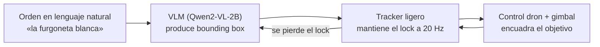

# Un dron que pilotas hablándole

**Le dices en lenguaje natural qué seguir —"la furgoneta blanca", "el coche azul"— y el dron lo localiza, lo engancha y lo mantiene encuadrado él solo. El sistema desplegado corre en la placa, sin nube.** Trabajo Fin de Máster (TFM) de Edge-AI.

---

## El problema

Los drones se pilotan con mando o con waypoints GPS. Nadie le dice a un dron *"sigue a aquel coche"* — porque entender lenguaje natural sobre imágenes requiere modelos grandes que viven en la nube, y la nube añade latencia, dependencia de red y coste.

Este TFM demuestra que un dron puede aceptar órdenes en lenguaje natural y seguir el objetivo **sobre hardware embarcado**, en una Jetson Orin Nano de 8 GB a **15 W**, sin conexión a internet.

El sistema *desplegado* sí corre entero en la placa, pero **más despacio de lo que este README dijo hasta el 2026-07-22**. E1 midió el VLM y el arrastre SAM2 co-residentes en la Orin a 6.15 FPS con SAM2 a `image_size` **768**; el despliegue real corre a **1024**, y esa tasa nunca se había medido allí. R-16 la midió: **2.69 Hz en solitario**, una corrección de **2.30×** (`P4-R16-carry-rate-1024`, medida íntegramente en la placa). La misma campaña falsifica el corolario más citado de E1 — «la co-residencia no cuesta FPS» se midió contra un `llama-server` **ocioso**; bajo un cliente de grounding real el arrastre paga ~2.3× y el VLM ~2×. `P3-E1-TRT-fps` queda marcada como superada. La estimación previa de «~2× optimista» estaba en la dirección correcta y se quedaba corta. Lo que no corrió entero en la placa son muchos de los *experimentos*: 49 de las 74 afirmaciones del registro se midieron a caballo entre la Orin y una RTX 3090. Eso está desglosado abajo, en «Sobre las cifras», y auditado afirmación por afirmación en [`experiments/2026-07-21-machine-disclosure/`](experiments/2026-07-21-machine-disclosure/README.md).

---

## Cómo funciona

El sistema es un **bucle de seguimiento de dos niveles**: un modelo pesado que ancla y uno ligero que coastea entre anclajes.

- **VLM afinado y cuantizado para caber en 15 W.** Qwen2-VL-2B con LoRA, exportado a GGUF **Q8_0 (~1.65 GB)** y servido con llama.cpp. Se eligió por su resolución dinámica nativa (clave para objetos aéreos diminutos, ~16 px) y porque su fidelidad al cuantizar apenas cae, a diferencia de otros backbones probados.
- **Dos niveles, cada uno en lo suyo.** El VLM re-ancla el objetivo cada ~2 s (es preciso pero lento, ~0.44 Hz); un tracker ligero (ByteTrack, ~0.14 ms/frame en la Orin) mantiene el lock a 20 Hz entre anclajes. El re-grounding con el VLM se dispara **al perder el lock**, no en cadencia fija, porque el horizonte de coasteo (~1.5 s) es menor que el periodo de anclaje. De los dos términos de esa desigualdad sólo uno está medido: el anclaje son 2.26 s reales en la Orin (`P3-T0a-anchor-cadence`); el horizonte de 1.5 s es una **constante de configuración** (`MAX_LOST_FRAMES = 30` a 20 Hz), no una medición.
- **Re-ancla más rápido recortando la ROI.** En lugar de reprocesar el fotograma completo, se le pasa al VLM un recorte alrededor del último box: prefill 2.7× más rápido *y* más preciso (super-resolución del recorte).
- **Evaluación por etapas con puertas.** Cada fase (backend → datos → resolución → entreno → despliegue) tiene una puerta cuantitativa medida (IoU@0.25) antes de pasar a la siguiente; nada de código especulativo.

---

## En números

> **El modelo desplegado corre en una Jetson Orin Nano 8 GB a 15 W, sin nube.** Cada
> cifra lleva el identificador de su afirmación en `thesis/claims.json` y la máquina
> que la midió; el informe completo está en [`thesis/stats-report.md`](thesis/stats-report.md).
>
> - **Modelo en el dispositivo:** Qwen2-VL-2B GGUF **Q8_0 = 1.65 GB** (vs 3.09 GB en F16). La cuantización a 8 bits **no** cuesta precisión medible: F16 62/100 frente a Q8_0 55/100, p = 0.248 (`P1-S3.3-quantisation-is-not-the-cost`).
> - **Grounding en la Orin:** **62.6 %** IoU@0.25 en RefDrone (n=439) (`P2-RQ4.1-deploy-fidelity`, ambas máquinas), y **63.1 %** a max_side=1024 medido **íntegramente en la placa** (`P3-wholeframe-resolution-knee`). Frente a la referencia HF bf16 (59.5 %) lo defendible es «sin pérdida medible por la exportación», no «la mejora»: la diferencia de 14 ítems entra en lo que el emparejamiento produce por azar.
> - **Re-anclaje ROI, medido íntegramente en la placa:** **85.2 %** IoU@0.25 con el recorte M=2.0 @512 frente a **63.1 %** del control de fotograma completo, ambos brazos en la misma sesión Q8_0 de la Orin, n=439 pareados: **+22.1 pp**, McNemar exacto **p = 2.5e-14**, y sobrevive a Holm (`P3-ROI-M2.0-512-ondevice`, R-14). Ésta es la forma que hay que citar. La versión anterior (`P3-ROI-M2.0-512`, +21.2 pp) sigue en el registro marcada como superada: su control era el barrido en la 3090, no la placa. La rejilla es una **meseta** — M=1.5 @512 da 368/439, seis ítems de diferencia sobre los mismos ítems — así que se tomó un punto sobre la meseta, no se descubrió un óptimo. El prefill baja de 3680 a 1371 ms en dispositivo (2.68×).
> - **Contra un detector externo, en la placa:** el VLM afinado bate a **OWLv2** en grounding referencial sobre RefDrone (n=439, ambos medidos en la Orin): 277 aciertos frente a 208 del mejor brazo del detector, McNemar exacto **p = 2.26e-07**, sobrevive a Holm (`P3-R13-owlv2-vs-vlm`). Con dos salvedades que la afirmación necesita: la comparación de latencia (263.5 ms por pasada del detector frente a 4216 ms de cómputo del VLM, **16.0×**) enfrenta *una pasada* del detector con un anclaje generativo completo y **excluye la etapa de selección** que una ruta descompuesta seguiría necesitando; y el brazo `D-oracle` del 90.4 % elige entre las diez primeras propuestas usando la verdad-terreno, luego es una cota superior sobre cualquier reordenador y **no** un resultado de OWLv2.
> - **Seguimiento temporal sostenido:** el arrastre con memoria (SAM2.1-tiny, zero-shot) da **0.830** IoU@0.25 medio por track en el punto de operación **desplegado** (768 px) sobre 186 tracks de AerialMind (`P3-carry-OP768-accuracy`). A 1024 px sube a 0.849. Esa diferencia **no** llega a significación una vez que se cuenta la unidad independiente correcta: los 186 tracks salen de 93 secuencias, y sobre ellas la prueba de signos da p = 0.096 (sin deflactar, p = 0.013). 768 se eligió por la restricción de FPS, y lo que los datos permiten decir es que el coste de precisión, si existe, es pequeño — no que esté medido.
> - **Latencia del tracker ligero:** 0.143 ms/frame en la Orin, 350× de margen sobre su presupuesto de control de 50 ms (`P3-T4a-tracker-cost`). **No es el coste por fotograma del sistema:** el arrastre SAM2 domina, y a la resolución que corre de verdad (1024) son **372 ms** por paso, no los ~162 ms medidos a 768 (`P4-R16-carry-rate-1024`, R-16; `P3-E1-TRT-fps` queda superada). Es ese número, no el del tracker, el que fija la cadencia.
> - **Techo de seguimiento validado:** **2.5 m/s** de objetivo en SITL de extremo a extremo, techo medido con un barrido de cuatro velocidades (1.5 → 1/1, 2.0 → 3/3, 2.5 → 3/3, 3.0 → 0/2): la última configuración que engancha es 2.5 m/s (`E10-fast-follow-ceiling`). Presentarlo como «3/3 frente a 0/2» invitaría a una prueba que con estos tamaños no tendría sentido. La cifra de 3.0 m/s que figuraba aquí era el ajuste que falló.

### Sobre las cifras

La premisa de la tesis es el despliegue en el borde, así que dónde se midió cada número
forma parte del número. El registro `thesis/claims.json` lo hace explícito.

La tabla siguiente **se genera** desde el registro (`thesis/run_stats.py`), no se teclea:
hasta el 2026-07-23 decía 47/13/3/2 y el registro decía otra cosa, infra-reportando a la
mitad las afirmaciones medidas íntegramente en la placa — el eje exacto del que trata
toda la primera oleada de remediación.

<!-- BEGIN generated: machine-table -->

| Máquina que produjo la cifra | Afirmaciones (de 74) |
|---|---|
| **ambas** (anclaje VLM en la Orin, arrastre SAM2 en la 3090 con tope de tasa) | 49 |
| RTX 3090 (ablaciones, referencia de fidelidad HF bf16, simulador, generación de escenas) | 17 |
| Jetson Orin Nano, íntegramente | 6 |
| sin máquina (sin datos) | 2 |

<!-- END generated: machine-table -->

Ejecutar una ablación en una estación de trabajo es práctica corriente y a menudo la
opción correcta — la referencia de fidelidad HF bf16 **tiene** que correr en la 3090,
porque es contra ella como se mide la ruta cuantizada. Lo que no es corriente es no
decirlo. La auditoría completa, campaña por campaña, con la cadena de evidencia citada,
está en [`experiments/2026-07-21-machine-disclosure/`](experiments/2026-07-21-machine-disclosure/README.md);
la decisión de **no** volver a medir la Parte V en la placa, y por qué, está en
`docs/decisions/part6-flight.md` (D-MACH.1).

---

## Estructura del repo

El repositorio es un cuaderno de laboratorio en dos partes:

- **Parte I — Exploratoria** (`experiments/`, `runners/`, `runners/legacy/`, `archive/`): campañas de benchmark del dispositivo y el arco inicial de fine-tune del VLM (Stages 1–4). Congelada como registro histórico.
- **Parte II — Rebuild principled** (paquete `grounding/`): reconstrucción deliberada organizada en torno a **un único contrato compartido** (`grounding/contract.py`: prompt, parser y métricas, importados por todos los módulos para que no vuelvan a divergir) y un flujo *fidelidad-antes-que-GPU* con fases con puerta. Ver [`grounding/README.md`](grounding/README.md).

El trabajo posterior extiende esta base: seguimiento persistente y permanencia de objeto (Parte III), refinamiento end-to-end del bucle de vuelo (Parte IV) y grounding anticipatorio / warm-start (Parte V) y vuelo en bucle cerrado (Parte VI). Los libros de resultados y decisiones están divididos por parte:

- **[`RESULTS.md`](RESULTS.md)** — índice de resultados por parte (`docs/results/`).
- **[`QUESTIONS.md`](QUESTIONS.md)** — pregunta de investigación y veredicto por ejecución (`docs/questions/`).
- **[`DECISIONS.md`](DECISIONS.md)** — registro de decisiones por parte (`docs/decisions/`).
- **[`thesis/stats-report.md`](thesis/stats-report.md)** — las 74 afirmaciones del registro, con su prueba exacta, su máquina y sus salvedades. **Doce** sobreviven a la corrección de Holm por Parte —la familia adoptada en R-30— y **diez** en familia global; 24 nunca tuvieron nada que contrastar y 10 llevaban una puerta que ningún resultado posible habría superado. El reparto completo, en ocho categorías disjuntas, está en la sección «Qué sobrevive» del informe.

---

## Hardware

El objetivo de despliegue, y la máquina donde corre el sistema entregado, es un **NVIDIA Jetson Orin Nano 8 GB Developer Kit** (no la Jetson Nano original):

| Componente | Valor |
|---|---|
| SoC | Tegra234 (Orin), GPU Ampere 1024 CUDA + 32 Tensor cores (sm_87) |
| Memoria | 8 GB LPDDR5 **unificada** CPU+GPU (~6–6.5 GB útiles para el modelo) — la restricción principal |
| JetPack / L4T | 6.2.2 / R36.5.0, Ubuntu 22.04, kernel 5.15-tegra (aarch64) |
| Potencia | modo **15 W** (por defecto) y 7 W; sin modo Super de 25 W en esta placa |
| Runtime LLM | llama.cpp (CUDA full-offload) |

Parte del trabajo experimental — ablaciones, la referencia HF bf16, el simulador y la generación de escenas — corrió en una estación de trabajo con **RTX 3090**; el reparto exacto está en «Sobre las cifras» arriba.

El detalle completo del hardware, el stack CUDA/TensorRT y las convenciones de entorno está en [`CURRENT-SETUP.md`](CURRENT-SETUP.md) y en el histórico de la Parte I.
</content>
</invoke>
