<!-- GENERATED FILE — do not edit. Source: thesis/borrador/cap*.md + assemble.py.
     Edit the chapter scaffold, then run `make borrador`. Hand edits here are
     silently destroyed on the next regeneration. -->


## Introducción y motivación

<!-- Guion de capítulo. Cada viñeta -> un párrafo. Tablas/figuras/código ya colocados. -->

### El problema: pilotar un dron hablándole, y hacerlo en el borde

<!-- Guion de párrafos. Sustituir cada viñeta por prosa. -->
- **P1 — El hueco que nadie llena.** Establecer que hoy los drones se pilotan con mando o con waypoints GPS, y que nadie le dice a un dron «sigue a aquel coche» porque entender lenguaje natural sobre imágenes exige modelos grandes que viven en la nube, y la nube añade latencia, dependencia de red y coste (`README.md`, «El problema»). El objetivo del TFM es cerrar ese hueco.
- **P2 — La tesis en una línea de sistema.** Enunciar lo que se demuestra: un dron acepta una orden en lenguaje natural — «la furgoneta blanca», «el coche azul» — localiza el objetivo, lo engancha y lo mantiene encuadrado él solo, y el sistema *desplegado* corre **entero en la placa**, sobre una Jetson Orin Nano de 8 GB a **15 W**, sin conexión a internet. Fijar aquí el techo de la plataforma: SoC Tegra234, 8 GB LPDDR5 **unificada** CPU+GPU (~6-6.5 GB útiles, la restricción principal), y **sin modo Super de 25 W** en esta placa — el techo es 15 W, no MAXN. [@dosovitskiy2017carla no aplica aquí]
- **P3 — La arquitectura en dos niveles, de un vistazo.** Adelantar la forma del sistema sin entrar en cifras finas (eso es el Cap. 3-5): un modelo pesado que **ancla** — Qwen2-VL-2B afinado con LoRA y cuantizado a GGUF **Q8_0 (~1,65 GB)**, servido con llama.cpp, elegido por su resolución dinámica nativa para objetos aéreos de ~16 px — y un tracker ligero que **coastea** entre anclajes (ByteTrack a 20 Hz), con re-grounding disparado al perder el lock. El grounding referencial se mide sobre RefDrone. [@wang2024qwen2vl] [@hu2022lora] [@llamacpp] [@zhang2022bytetrack] [@refdrone]
- **P4 — La salvedad de alcance, puesta por delante.** Dejar claro desde el primer capítulo lo que el cuaderno tardó en admitir: el sistema *desplegado* sí corre entero en la placa, pero **más despacio de lo que se afirmó**. La tasa de arrastre desplegada, medida íntegramente en la Orin a `image_size` 1024, es **2,69 Hz en solitario** (`P4-R16-carry-rate-1024`, R-16), no los 6,15 FPS que se citaban (medidos a 768 y contra un servidor ocioso). Y «todo corre en la placa» es **falso para los experimentos**: 51 de las 76 afirmaciones del registro se midieron a caballo entre la Orin y una RTX 3090 (arrastre SAM2 en la 3090 con tope de tasa). Cada cifra de este TFM lleva la máquina que la produjo; ninguna tabla mezcla precisión-3090 con FPS-Jetson sin etiquetar la celda. [@ravi2024sam2]

### El hallazgo que cambia el planteamiento

<!-- Guion de párrafos. Sustituir cada viñeta por prosa. -->
- **P1 — El supuesto falso de la Parte IV.** Establecer que todo el arco de latencia de adquisición (Parte IV) asumía «frame 0 == llegada de la orden»: la orden llega en frío, corre una adquisición VLM bloqueante de ~4,85 s, y **entrega una caja ya obsoleta** porque el objetivo se movió ~146 frames durante ese tiempo (`E18-cold-acquire-vs-warm-oracle-n25`; ver Cap. 6). Ese supuesto es falso para el caso de uso real.
- **P2 — La observación que reordena el problema.** Enunciar el hallazgo (insight del operador, 2026-07-04, `experiments/PART5-PROPOSAL-anticipatory-grounding.md`): un dron ya está volando; su vídeo lleva **segundos** transmitiéndose al operador antes de que este teclee nada. Esa ventana previa a la orden es **cómputo gratuito** — la ranura del VLM está ociosa entre órdenes.
- **P3 — El giro: de «adquirir más rápido» a «adquirir en caliente».** Argumentar que, por tanto, el problema correcto no es «acelerar la adquisición en frío» (E20-E22, todas topadas o fallidas) sino **hacerla en caliente**: gastar el flujo ocioso previo en saber ya qué hay en pantalla y dónde, de modo que al hablar el operador se **seleccione y entregue**, no se adquiera. Nota metodológica: el oráculo B de E18 (arrastre sembrado correcto y fresco) fue 6/6 — el arrastre es casi perfecto una vez sembrado bien, el fallo del arco entero era sembrar bajo presión de tiempo.
- **P4 — La forma concreta: mantener geometría, no prosa.** Precisar el mecanismo que se lleva a experimento (opción 1, la más perezosa): reusar la única instancia de Qwen en tiempo ocioso para emitir **cajas + etiquetas** de objetos salientes — no prosa, que reintroduce la aspereza de la celda 3×3 que ya topó a E20 — SAM2 arrastra cada candidato como pista viva y actual, y al llegar la orden se **entrega** la caja ya anclada y ya en el «ahora». La capa de lenguaje solo casa frase→pista, montada sobre cajas reales. [@ravi2024sam2]
> **[FIGURA POR GENERAR]** Diagrama conceptual «mantener-y-entregar» frente a «adquirir-en-frío»: línea de tiempo con la orden asíncrona en t_p > 0, la ventana previa marcada como cómputo gratuito (arrastre continuo de candidatos), y la entrega de la pista ya arrastrada sin re-anclar; abajo, el brazo frío que arranca la adquisición bloqueante de ~4,85 s en t_p y entrega una caja obsoleta ~146 frames tarde. | fuente: conceptual (`00-esquema.md` §Tesis defendida; `PART5-PROPOSAL-anticipatory-grounding.md`) | script: make_proof.py

### La tesis defendida y la decisión de autor R-28

<!-- Guion de párrafos. Sustituir cada viñeta por prosa. -->
> Cuando la orden del operador llega a mitad de vuelo y no en el instante cero, la
> ventana previa es cómputo gratuito: gastarla en mantener el objetivo vivo y
> limitarse a **entregar** la pista ya arrastrada elimina la latencia de
> adquisición que hace que un sistema de grounding sobre vídeo aéreo entregue una
> caja ya obsoleta; **seleccionar** entre varios candidatos mantenidos se queda en
> propuesta medida, porque el selector multi-candidato no cabe en un Orin Nano de
> 8 GB y, allí donde la memoria no ataba, la selección seguía fallando por deriva
> del arrastre y por ambigüedad de la expresión referencial.
- **P1 — La frase-tesis, y por qué se enuncia así.** Reproducir la frase-tesis de arriba (verbatim de `00-esquema.md`, «Tesis defendida») y explicar la asimetría deliberada que contiene: **mantener-y-entregar** se defiende como demostrado; **seleccionar** se presenta como propuesta medida, no como resultado. Una frase, porque si no cabe en una frase no está clara.
- **P2 — La decisión de autor R-28 (2026-07-23).** Registrar que una versión anterior de la frase defendía «mantener + **seleccionar**» como una sola cosa demostrada, y que no lo está; la reformulación es del autor: *se intentó montar un selector y un arrastre; el arrastre y la entrega funcionan y están certificados, el selector se quedó en propuesta*. Esta es una decisión documentada con su porqué, no un matiz de redacción.
- **P3 — Lo que la evidencia sí sostiene.** Establecer el pilar positivo: el brazo WARM de P5.2a *es* el sistema completo de mantener-y-entregar — semilla del VLM en la ventana previa, arrastre SAM2, entrega sin re-anclar — con **21/25 frente a 5/25** sobre 5 categorías, p = 6,10e-05 deflactado a 23 clips independientes, y **sobrevive a Holm** (`P5.2a-warm-generalization`; detalle inferencial en Cap. 7). «Ni el arrastre funcionó» sería falso contra el propio mejor resultado del proyecto.
- **P4 — Por qué el selector queda en propuesta (i): la placa lo veta.** Establecer la restricción de hardware: R-16 midió los dos candidatos co-residentes con el VLM en el Orin — a **N = 2** con el anillo desplegado (`PRUNE_AFTER=100`) el proceso **muere por OOM**; con anillo 32 sobrevive a 0,540 Hz por candidato. La restricción vinculante es **memoria**, y aparece exactamente al segundo candidato, que es lo que un selector necesita por definición (`R-16`, medida en la placa).
- **P5 — Por qué el selector queda en propuesta (ii): el hardware no explica los fallos medidos.** Cerrar el matiz para que no se atribuya todo a la memoria: las celdas de selección corrieron en réplica sobre la 3090, donde la memoria nunca ató, y aun así la selección falló — P5.20 dio un SAM2 mayor gratis y recuperó **0** celdas, P5.4 recortó la adquisición de 4,9 s a 2,08 s y movió el veredicto **0** celdas; las causas medidas son **deriva del arrastre y ambigüedad referencial** (`P5.18`, 17/26). Atribuirlo todo al hardware sería cómodo y falso.

### Alcance y límites de la evidencia

<!-- Guion de párrafos. Sustituir cada viñeta por prosa. -->
- **P1 — Tres afirmaciones subordinadas, un capítulo cada una.** Presentar la tabla como el mapa del TFM: de la frase-tesis salen tres afirmaciones subordinadas y cada capítulo empírico existe para sostener una, cada una con su **límite de evidencia pegado** (la salvedad no es opcional: es la condición bajo la que la afirmación es cierta). Remitir a la tabla siguiente. [ver Tabla 1.1]
<!-- caption: Las tres afirmaciones subordinadas, el capítulo que sostiene cada una y el límite de esa evidencia -->

| Afirmación | Cap. | Límite de la evidencia |
|---|---|---|
| Un VLM de 2B cuantizado hace grounding referencial útil sobre imagen aérea y cabe en un Orin Nano de 8 GB | 4-5 | Protocolo propio, más fácil que el benchmark publicado. La parte medida **en la placa** es el grounding de un frame (R-13, R-14); la precisión del arrastre nunca se midió allí |
| La adquisición en frío es el cuello de botella del sistema integrado, y no se arregla optimizando la adquisición | 6 | n = 6 clips, todas coches, sin vehículo en el lazo |
| Anticipar **mantener + entregar** sí lo arregla; **seleccionar** entre candidatos queda propuesto, no demostrado | 7 | Desigual, y esa es la tesis: mantener-y-entregar es inferencial (P5.2a, p = 6,10e-05, sobrevive a Holm) — el **refinamiento de la selección** no lo es, el único SÍ a n real (P5.19, 20/26) queda en p = 0,25 y en p = 0,5 al deflactar a 13 clips, y el selector multi-candidato ni siquiera cabe en la placa (R-16: OOM a N = 2) |

- **P2 — El cuello de botella, ahora con potencia (Cap. 6).** Reforzar la segunda afirmación con su pilar inferencial: la re-ejecución con potencia de E18 a n = 25 (R-34) da **ORACLE 23/25 frente a COLD 3/25**, McNemar exacta p = 4,0e-05 sobre 23 clústeres de origen independientes, y sobrevive a Holm por Parte y global — la adquisición en frío pasa de negativo sin potencia (p = 0,0625 a n = 6) a **confirmada** (`E18-cold-acquire-vs-warm-oracle-n25`). El coste del brazo frío no es salir de cuadro sino la obsolescencia: la caja llega ~146 frames tarde.
- **P3 — El primer resultado de lazo cerrado, con su alcance (Cap. 8).** Adelantar el tercer pilar y su salvedad crítica: P6.2-DELIVERY pone, por primera vez, un copter que **vuela su propia salida de control** (ArduCopter SITL como física, CARLA como renderizador nadir esclavizado a la pose) y da **WARM 23/25 frente a COLD 2/25**, McNemar exacta p = 9,5e-07, sobrevive a Holm (`P6.2-DELIVERY-warm-vs-cold-closedloop`). **Salvedad de alcance (S5):** el grounding se mantiene constante por **designación por oráculo** porque el q8_0 desplegado no es discriminativo en nadir a 45 m, así que la afirmación es de **acoplamiento de control condicionado a designación correcta**, no de grounding+entrega; y la matriz se midió íntegramente en la 3090 (arrastre topado a la tasa Jetson de 2,69 Hz). [@dosovitskiy2017carla] [@ardupilot]
- **P4 — El estado estadístico global, sin sobre-detalle.** Cerrar el alcance con la cifra que ordena el TFM (el detalle es del Cap. 3): 76 afirmaciones en el registro `thesis/claims.json`; **11 sobreviven a la corrección de Holm por Parte** (la familia adoptada en R-30) y **10 en familia global**; muchas nunca tuvieron nada que contrastar o llevaban una puerta inalcanzable. La regla de honestidad que gobierna todas las cifras: cada número lleva su máquina, y se prefiere un negativo bien medido a un positivo mal delimitado.

### Contribuciones

<!-- Guion de párrafos. Sustituir cada viñeta por prosa. -->
- **P1 — Grounding referencial aéreo desplegable en 8 GB / 15 W.** Reivindicar la primera contribución: un VLM de 2B afinado (LoRA sobre Qwen2-VL-2B) y cuantizado a Q8_0 (1,65 GB) que hace grounding referencial útil sobre imagen aérea corriendo en la placa objetivo, con la cuantización a 8 bits **sin pérdida medible** de precisión (no una pérdida de -2,7 pp) y una palanca de recorte ROI que gana en las dos dimensiones a la vez. Detalle y cifras en Cap. 4-5. [@wang2024qwen2vl] [@refdrone]
- **P2 — El diagnóstico del cuello de botella de adquisición.** Reivindicar la segunda: la caracterización, cerrada y ahora potenciada (n = 25), de que la latencia de adquisición en frío — no la precisión del grounding — es lo que hace obsoleta la entrega sobre objetivos en movimiento, y de que **optimizar la adquisición no lo arregla** (E20-E23, palancas muertas listadas). Cap. 6.
- **P3 — El reencuadre mantener-y-entregar, certificado.** Reivindicar la contribución central: reformular la adquisición como **selección/entrega sobre pistas mantenidas** aprovechando la ventana previa a la orden, con el brazo mantener-y-entregar certificado inferencialmente (P5.2a, sobrevive a Holm) y el refinamiento del selector **entregado como propuesta medida** — incluido el veto de memoria del Orin (R-16) y los negativos que acotan la contribución (P5.20, P5.21, R-38). Cap. 7.
- **P4 — El primer cierre de lazo, honesto en su alcance.** Reivindicar la cuarta: la primera medición del contrato de percepción con el vehículo en el lazo (P6.2), separando explícitamente lo que se demuestra (acoplamiento de control) de lo que no (grounding real, que sigue anclado en el vídeo real de la Parte V). Cap. 8.
- **P5 — Un cuaderno de laboratorio con su propia auditoría.** Reivindicar la contribución metodológica: un registro de 76 afirmaciones con prueba exacta, máquina por celda y salvedad pegada, y un marco estadístico retroactivo que corrige errores de signo/máquina del cuaderno (`thesis/claims.json`, `thesis/stats-report.md`, `01-método-estadístico.md`). Cap. 3 y Cap. 9.

### Hoja de ruta de la memoria

<!-- Guion de párrafos. Sustituir cada viñeta por prosa. -->
- **P1 — Cómo leer el resto.** Guiar al lector por la estructura: el Cap. 2 sitúa el estado del arte (VLMs pequeños, grounding referencial, datasets aéreos); el Cap. 3 fija plataforma, método y métricas — incluida la justificación del umbral IoU@0,25 y el etiquetado por máquina — antes que cualquier capítulo empírico.
- **P2 — El recorrido empírico.** Encadenar los cuatro capítulos empíricos y la afirmación que sostiene cada uno: Cap. 4 (grounding de un solo frame, Partes I-II), Cap. 5 (permanencia de objeto, Parte III + arrastre SAM2), Cap. 6 (el arco de la latencia de adquisición, Parte IV, E2-E23), Cap. 7 (grounding anticipatorio, Parte V, la contribución central) y Cap. 8 (hacia el lazo cerrado, Parte VI).
- **P3 — El cierre crítico.** Anunciar que el Cap. 9 recoge las amenazas a la validez de forma transversal (protocolo propio más fácil que el benchmark, n pequeños, sim más fácil que el vídeo real, reparto de máquinas) y el Cap. 10 las conclusiones y el trabajo futuro. Dejar sentado que el TFM defiende **mantener-y-entregar**, no seleccionar, y que ese límite es la tesis, no una omisión.


## Estado del arte

<!-- Guion de capítulo. Cada viñeta -> un párrafo. Tablas/figuras/código ya colocados. -->

### Encuadre: una revisión por temas, no por orden de lectura

<!-- Guion de párrafos. Sustituir cada viñeta por prosa. -->
- **P1 — Por qué por temas.** Establecer que la revisión se organiza por líneas de investigación (siete ejes) y no por orden cronológico de lectura, porque la contribución del TFM no vive en ninguna línea aislada sino en su intersección. Anunciar los siete ejes que estructuran el capítulo: (1) modelos de visión-lenguaje y grounding referencial, (2) detección de vocabulario abierto y prompts de región, (3) seguimiento y segmentación temporal, (4) despliegue en el borde y cuantización, (5) conjuntos de datos aéreos, (6) simulación y pipeline de dron, (7) superresolución y objeto pequeño; y cerrar anunciando la subsección de «Posicionamiento» que nombra el hueco.
- **P2 — Qué situamos y qué no.** Aclarar que cada eje termina situando la elección concreta de este trabajo (el spine Qwen2-VL-2B, el arrastre SAM2, el runtime `llama.cpp` Q8_0, el benchmark RefDrone, el renderer CARLA) dentro de esa línea, sin adelantar cifras propias inferenciales —esas viven en los capítulos empíricos 4-8— salvo como referencia hacia delante. Este capítulo es contexto: no defiende ninguna de las tres afirmaciones subordinadas del TFM.

### Modelos de visión-lenguaje y grounding de expresiones referenciales

<!-- Guion de párrafos. Sustituir cada viñeta por prosa. -->
- **P1 — El campo de VLM pequeños se movió después de la elección del spine.** Situar la familia de VLM abiertos de escala 2-3B que hoy pueden hacer grounding referencial (frase en lenguaje natural → caja): Qwen2-VL [@wang2024qwen2vl] —el spine incumbente de todo el proyecto, elegido en la Parte I antes de que el campo se moviera—, InternVL3-2B [@opengvlab2025internvl3], Qwen2.5-VL [@qwen2025qwen25vl], PaliGemma 2 [@google2024paligemma2], Florence-2 [@microsoft2024florence2] y SmolVLM2 [@hf2025smolvlm2]. Señalar que estos modelos localizan por generación (emiten coordenadas como texto), lo que los distingue de la rama de detección del eje siguiente, y que la resolución variable de Qwen2-VL es la propiedad que motivó su elección para objeto aéreo pequeño.
- **P2 — CLIP como sustrato compartido.** Encuadrar CLIP [@radford2021clip] como el codificador contrastivo imagen-texto del que descienden tanto la puntuación de propuestas de la rama de detección como los backbones visuales de varios VLM; nombrarlo aquí porque las palancas de selección evaluadas y falsadas en la Parte V (crop-scoring, círculo rojo) operan directamente sobre CLIP. Es contexto compartido entre el eje 1 y el eje 2.
- **P3 — El hueco que motiva el bake-off.** Establecer que ninguno de estos modelos había sido *comparado* como spine para grounding aéreo en 8 GB antes de este trabajo: la elección de Qwen2-VL-2B era heredada, no medida. El bake-off de backbone (Parte II) cerró esa brecha midiendo los brazos A (InternVL3-2B), B (Qwen2.5-VL-3B, cuya salida ROI colapsó al 33 %), C (PaliGemma2-3B) y E (SmolVLM2-500M), con el brazo D (Florence-2-large) cancelado sin ejecutar, y decidió mantener el incumbente. Insertar aquí la tabla-resumen de candidatos [ver Figura por generar], marcando que la comparación de precisión se midió en la RTX 3090 y la de latencia en la Jetson a 15 W, sin mezclar celdas.
> **[FIGURA POR GENERAR]** Tabla-resumen de los modelos VLM candidatos del bake-off de backbone: por columna, parámetros nominales, runtime/backend de medida, brazo (A-E), y por qué se descartó o se retuvo cada uno (p. ej. B: ROI colapsó al 33 %; D: cancelado sin ejecutar). Sin cifras de precisión comparables entre brazos en la misma celda —la precisión se midió en la RTX 3090 y la latencia en la Jetson 15 W—; etiquetar la máquina por columna. | fuente: experiments/2026-06-30-vlm-backbone-bakeoff/ | script: make_proof.py

### Detección de vocabulario abierto y prompts visuales de región

<!-- Guion de párrafos. Sustituir cada viñeta por prosa. -->
- **P1 — La ruta alternativa: detector de vocabulario abierto + selector.** Situar la rama de detección de vocabulario abierto como la alternativa arquitectónica al anclaje generativo del eje 1: un detector propone regiones a partir de una consulta de texto abierta en una sola pasada, en lugar de generar coordenadas token a token. El representante usado como única línea base externa del proyecto es OWLv2 [@minderer2023owlv2]. Nombrar el hueco que este trabajo llena: hasta la campaña R-13 (2026-07-22) el proyecto no se había comparado nunca contra un sistema externo —todo lo demás del cuaderno es ablación interna—; la medición y su descomposición (el detector propone bien pero ordena mal; su fallo es de selección, no de localización) se desarrollan en el Cap. 4, no aquí.
- **P2 — Prompts de región sobre CLIP para puntuar candidatos.** Encuadrar la línea de *visual prompt engineering* / *proposal scoring* como el mecanismo que un sistema descompuesto necesitaría para su etapa de selección: ReCLIP [@subramanian2022reclip] con su método IPS (recorte + aislamiento gaussiano, sigma=100, suma de logits CLIP) y el prompt visual de círculo rojo [@shtedritski2023redcircle] tras la variante `circlectx`. Marcar el hueco: ambos se pilotaron para la selección de candidatos (P5.4) y se falsaron en tiempo de diseño sobre crops aéreos de 16-100 px (el scoring vanilla resultó sesgado por tamaño), de modo que la literatura de prompt-region no transfiere a esta escala de objeto —un resultado negativo que este TFM aporta, desarrollado en el Cap. 7.

### Seguimiento y segmentación temporal en vídeo

<!-- Guion de párrafos. Sustituir cada viñeta por prosa. -->
- **P1 — Arrastre de máscara sin clase: SAM2.** Situar SAM2 [@ravi2024sam2] como el mecanismo de permanencia de objeto del proyecto: predictor de vídeo con prompt de caja → propagación de máscara por frame, tier de arrastre zero-shot. Nombrar los checkpoints usados: `facebook/sam2.1-hiera-tiny` (38,9M parámetros, desplegado) y `facebook/sam2.1-hiera-small` (46M, solo como brazo de capacidad de P5.20, no desplegado, recuperó cero fallos). El hueco: SAM2 arrastra sin entender lenguaje —es class-agnostic— por lo que necesita un VLM que le entregue la caja inicial; la combinación VLM-semilla + SAM2-arrastre es la que este TFM monta. **Advertencia de máquina obligatoria:** SAM2 corrió en la RTX 3090; en la Jetson solo se midieron su tasa y su memoria. La tasa de arrastre desplegada es **2,69 Hz** (medida R-16, image_size 1024), no la cifra co-residente de 6,15 FPS que quedó retirada por haberse medido a image_size 768.
- **P2 — Asociación de detecciones: ByteTrack.** Encuadrar ByteTrack [@zhang2022bytetrack] como el asociador multi-objeto por emparejamiento de cajas que cierra el lazo de seguimiento en el banco de vuelo (VLM→ByteTrack→PID→MAVLink). Nombrar el hueco cerrado de paso: la campaña P6.0 encontró que ByteTrack solo re-emparejaba pistas perdidas con detecciones de baja puntuación, lo que convertía la «inercia de Kalman» en un zero-order hold; corregirlo bajó el error de píxel de 64,7 a 36,0. Es contexto de sistema, no una afirmación defendida en este capítulo.

### Despliegue en el borde y cuantización

<!-- Guion de párrafos. Sustituir cada viñeta por prosa. -->
- **P1 — Runtime de inferencia cuantizado: llama.cpp / GGUF Q8_0.** Situar `llama.cpp` [@llamacpp] como el runtime que hace caber el spine VLM en el Orin Nano de 8 GB mediante cuantización GGUF Q8_0. Nombrar el hueco y la corrección de errores: el salto de precisión a Q8_0 es **sin pérdida medible** frente al f16 —no hay «−2,7 pp de pérdida», que fue un mislabel del cuaderno—; el techo de potencia del dispositivo es **15 W** con `jetson_clocks`, no MAXN ni 25 W (esta placa no soporta MAXN_SUPER). Toda cifra de despliegue del proyecto se reporta bajo estas dos condiciones.
- **P2 — Aceleración del encoder y adaptación barata.** Encuadrar TensorRT [@tensorrt] como la vía de export fp16 del encoder de SAM2 (campaña E1) y LoRA [@hu2022lora] como el método de adaptación de bajo rango con el que se fine-tunea el spine sobre imagen aérea sin re-entrenar el modelo entero. Marcar el hueco: la literatura de despliegue en el borde y cuantización es genérica; lo que este TFM aporta es su aplicación conjunta a un pipeline de grounding referencial aéreo que debe caber, con VLM y arrastre co-residentes, en 8 GB —restricción de memoria que veta el selector multi-candidato (R-16: OOM a N=2 con el anillo desplegado `PRUNE_AFTER=100`).

### Conjuntos de datos aéreos y su idoneidad

<!-- Guion de párrafos. Sustituir cada viñeta por prosa. -->
- **P1 — RefDrone es el único conjunto de grounding referencial de vista dron abierto y refinado por humanos.** Situar RefDrone [@refdrone] como benchmark titular de grounding de un frame a altitud de dron: 8.536 imágenes, 17.900 expresiones referenciales, 63.679 instancias, 10 categorías heredadas de VisDrone; expresiones generadas por GPT-4o (pipeline RDAgent/RDAnnotator) con verificación humana (media 9,0 palabras, 3,8 objetivos por expresión). Marcar por qué se eligió: es esencialmente el único conjunto abierto, refinado por humanos, de vista dron a baja altitud y multi-categoría de comprensión de expresiones referenciales con caja —las alternativas fuertes son satélite/alta altitud, viewpoint y escala de objeto equivocados [ver Tabla comparativa].
- **P2 — El desajuste de protocolo, obligatorio de declarar.** Establecer la advertencia que el TFM debe hacer explícita: RefDrone es un benchmark multi-objetivo / sin-objetivo (una expresión mapea de 0 a 242 cajas), puntuado por **F1 @ IoU>=0,5** a nivel de instancia; el estado del arte publicado allí es **34,44 F1** (NGDINO-B), los VLM listos para usar colapsan (Qwen-VL 14,14 F1) y el techo humano es **58,14 F1**. El protocolo interno de este trabajo mide **una caja a IoU@0,25** sobre el subconjunto de captions con exactamente una caja real, por lo que su cifra propia **no es comparable** con la tabla publicada; ponerlas una al lado de otra sin esta frase sería una tergiversación [ver Tabla de protocolo].
<!-- caption: Protocolo publicado de RefDrone (multi-objetivo) frente al protocolo interno de una caja; NO comparables entre sí -->

| Protocolo | Métrica | Mejor reportado | Fuente |
|---|---|---|---|
| RefDrone publicado (multi-objetivo) | F1 @ IoU>=0,5 | 34,44 (NGDINO-B) | paper Tabla 2 |
| RefDrone publicado (VLMs) | F1 @ IoU>=0,5 | 14,14 (Qwen-VL) | paper Tabla 2 |
| Techo humano / RDAnnotator | F1 @ IoU>=0,5 | 58,14 | paper |
| Pipeline v2 propio (una caja) | IoU @ 0,25 | 62,6 | repo, Parte II |

<!-- caption: Conjuntos aéreos de grounding referencial frente a RefDrone; todas las alternativas fuertes son satélite/alta altitud -->

| Conjunto | Año | Dominio | Tarea | Tamaño | Notas |
|---|---|---|---|---|---|
| **RefDrone** | 2025 | Dron (baja alt.) | REC bbox, multi-objetivo | 8,5k img / 17,9k expr / 10 cat | Base. En-tarea. CC BY 4.0. |
| OPT-RSVG | 2024 | Satélite | REC bbox | 25,5k img / 49k pares | Mayor REC de teledetección; pre-entreno auxiliar. |
| VRSBench | 2024 | Satélite | caption+VQA+grounding | 29,6k img / 52k refs | Verificado por humanos; alta calidad. |
| DIOR-RSVG | 2023 | Satélite | REC bbox | 17,4k img / 38,3k expr | Baseline RSVG estándar. |
| RRSIS-D | 2024 | Satélite | RES (máscara) | 17,4k tripletas | Segmentación, fuera de tarea. |
| RefSegRS | 2023 | Aéreo | RES (máscara) | 4,4k tripletas | Pequeño, lenguaje de plantilla. |
| GeoText-1652 | 2024 | Dron+satélite | retrieval / región-texto | ~100k pares | Geolocalización de edificios, nicho. |

- **P3 — La cadena de licencias, condición pegada al dato.** Marcar la salvedad de licencia que condiciona el uso: RefDrone es CC BY 4.0 pero reutiliza la imagen de VisDrone2019-DET [@zhu2021visdrone], que es **CC BY-NC-SA 3.0 (solo académico)**; la cadena aguas arriba domina, de modo que el uso es válido para el TFM pero no para uso comercial. La misma cadena afecta a AerialMind [@aerialmind] (paper dice CC BY 4.0, HF etiqueta MIT, pero deriva de VisDrone + UAVDT). Es la condición bajo la cual el dato es utilizable, no una nota al pie opcional.
- **P4 — El hueco temporal y las fuentes de vídeo real.** Establecer que RefDrone es de un solo frame, sin track-IDs, y por tanto no puede sostener seguimiento persistente de objetivo móvil; nombrar cómo se llena el hueco [ver Tabla de candidatos temporales]: AerialMind [@aerialmind] (RMOT con track-IDs, extiende la misma base VisDrone) para la evaluación zero-shot del arrastre, y UAV123 [@mueller2016uav123] (vídeo real, GT por frame `x,y,w,h` a 30 fps) como base de la evaluación de las Partes IV y V. Aclarar que la palabra correcta es **vídeo**, y que las cifras de arrastre sobre AerialMind (p. ej. 0,849 IoU@0,25) se midieron en la RTX 3090 a image_size 1024, no en la placa.
<!-- caption: Candidatos para cubrir el hueco temporal de RefDrone (seguimiento con lenguaje) -->

| Opción | Aporta | Pega |
|---|---|---|
| **AerialMind** (AAAI 2025) | bbox UAV + track-IDs + expresiones referenciales; 93 seq / 24,6k expr / 293,1k instancias / ~46M cajas; extiende **VisDrone + UAVDT** | Liberado y verificado; cadena de licencia como RefDrone (VisDrone NC-SA). |
| **VisDrone-MOT + RDAgent** | Mismo dominio que RefDrone; pistas/oclusión/clases; acuñar expresiones con el propio generador de RefDrone | Lo construyes tú, pero reutilizas tooling conocido; control total de procedencia. |
| WebUAV-3M | NL + pistas, CC0, 4,5k vídeos / 3,3M frames | El NL es una única frase global por clip, mono-objetivo. |
| UAVNLT | NL-a-pista listo | Solo vehículos, mono-objetivo, pequeño. |

### Simulación y pipeline de dron

<!-- Guion de párrafos. Sustituir cada viñeta por prosa. -->
- **P1 — El renderer esclavo de pose: CARLA sobre Gazebo.** Situar CARLA 0.9.16 [@dosovitskiy2017carla] como el renderer fotorrealista que sustituyó a Gazebo Harmonic [@gazebo2024harmonic] en la Parte VI: `Town10HD_Opt` con tráfico autónomo, esclavizado a la pose de un vuelo GUIDED, con la pila de control intacta. Nombrar la decisión y su límite: Gazebo se descartó como renderer por la inestabilidad de su ruta `gz service` bajo churn por frame (~0,42 %/llamada de fallo `RecvSrvRequest() ... Host unreachable`, lo que bloqueó la campaña P5.7); ArduPilot [@ardupilot] queda como física del vehículo (SITL), y se decidió **no** poner el copter bajo física de CARLA ni adoptar lockstep `ardupilot_gazebo`.
- **P2 — Dónde encaja este banco en la taxonomía de pipelines de dron.** Encuadrar la guía metodológica de pipeline de testeo de dron [@jiang2025dronepipeline] (referencia metodológica, sin cifras tomadas) para nombrar la etapa que ocupa la Parte VI: el rig `run_phase_c.py` (SITL como física, CARLA como renderer esclavo, VLM→ByteTrack→PID→MAVLink cerrado) es SIL de manual, y las Partes I-V se situaban *por debajo* de SIL (vídeo reproducido, sin vehículo en el lazo). Marcar el hueco: la percepción de esa guía es fiducial (ArUco) + TPH-YOLOv5, sin vocabulario abierto ni grounding VLM —justo lo que este TFM pone en el lazo.

### Superresolución y objeto pequeño

<!-- Guion de párrafos. Sustituir cada viñeta por prosa. -->
- **P1 — Superresolución sobre el crop ROI: una palanca falsada.** Situar la línea de superresolución de imagen para teledetección y objeto pequeño: Swin2SR [@conde2022swin2sr], la survey de SR en teledetección [@survey2025rssr], la survey de detección de objeto pequeño [@survey2025smallobject] y el modelo de difusión EDiffSR [@xiao2023ediffsr]. Nombrar el hueco y el resultado negativo que este TFM aporta: la SR aprendida (Swin2SR) sobre el crop ROI **pierde** frente al escalado bicúbico/LANCZOS gratuito (+1331 ms, peor IoU), de modo que la palanca se rechazó y se mantiene LANCZOS —un negativo bien medido que cierra una vía que la literatura de SR sugeriría probar.
- **P2 — Por qué el objeto aéreo pequeño motiva el umbral y la escala.** Encuadrar la survey de objeto pequeño [@survey2025smallobject] como justificación del régimen de operación del proyecto: el objeto aéreo mediano ronda los 16 px, escala en la que la métrica IoU@0,5 estándar es inestable, lo que motiva reportar a IoU@0,25 (con IoU medio al lado). Marcar que esta es una decisión de medida heredada de la naturaleza del dato aéreo, no una elección arbitraria —su justificación completa se desarrolla en el Cap. 3.

### Posicionamiento: el hueco que ocupa este TFM

<!-- Guion de párrafos. Sustituir cada viñeta por prosa. -->
- **P1 — Ninguna línea cubre la intersección.** Establecer, línea por línea, que cada eje resuelve una pieza pero ninguno resuelve el problema completo: los VLM de grounding [@wang2024qwen2vl] asumen GPU de servidor; la detección de vocabulario abierto propone en una pasada hacia delante, no anticipa; SAM2 [@ravi2024sam2] arrastra sin lenguaje; el trabajo de cuantización en el borde [@llamacpp; @tensorrt] es genérico, no de grounding aéreo; los datasets aéreos son de un frame (RefDrone) o temporales-sin-lenguaje; y los pipelines de dron [@jiang2025dronepipeline] usan percepción fiducial/YOLO, no grounding VLM.
- **P2 — El hueco, en una frase.** Nombrar la intersección desocupada que este TFM ocupa: **grounding referencial anticipatorio sobre imagen aérea dentro de 8 GB** —usar la ventana previa a la orden del operador como cómputo gratuito para mantener el objetivo vivo y limitarse a entregar la pista ya arrastrada. Marcar que ninguna de las siete líneas cubre esa combinación *junta*: es la conjunción (anticipatorio + referencial + aéreo + 8 GB en el borde) la que no tiene antecedente, y es la que sostienen los capítulos empíricos 4-8.
- **P3 — Qué se demuestra y qué queda propuesto.** Cerrar delimitando honestamente el alcance de la contribución frente al estado del arte: lo que se demuestra de forma inferencial es **mantener-y-entregar** (semilla del VLM + arrastre SAM2 + entrega sin re-anclar); **seleccionar** entre varios candidatos mantenidos queda como propuesta medida, porque el selector multi-candidato no cabe en el Orin de 8 GB (R-16) y, donde la memoria no ataba, la selección seguía fallando por deriva del arrastre y ambigüedad referencial. Es la distinción que separa la aportación real del proyecto de lo que solo se intentó.


## Plataforma, método y métricas

<!-- Guion de capítulo. Cada viñeta -> un párrafo. Tablas/figuras/código ya colocados. -->

### Orientación: por qué este capítulo va antes que los empíricos

<!-- Guion de párrafos. Sustituir cada viñeta por prosa. -->
- **P1 — Un capítulo corto pero necesario.** Establecer que tres decisiones de medida condicionan todas las cifras posteriores y ninguna es obvia: el umbral `IoU@0,25`, el techo de potencia de la placa (15 W) y qué máquina midió cada número. Justificar el orden: van antes de los capítulos empíricos porque un tribunal pregunta por el método y por la instrumentación antes que por los resultados.
- **P2 — El diagrama del banco va antes que la primera cifra.** Anticipar la sección de topología y su regla: el capítulo presenta el diagrama del banco de pruebas *antes* de dar una sola cifra, porque de otro modo el lector supone un sistema embarcado que nunca se midió como tal. Es la razón de que la topología abra el capítulo y no lo cierre.

### El banco de pruebas: qué máquina midió qué

<!-- Guion de párrafos. Sustituir cada viñeta por prosa. -->
- **P1 — La topología real, dicha sin rodeos.** Fijar el hecho que más se malinterpreta al leer el cuaderno: en casi todas las partes **la Jetson ejecutó solo el VLM** (Qwen2-VL-2B Q8_0 sobre `llama.cpp`), servido por SSH con un PNG en base64 cruzando el cable por llamada; el arrastre con SAM2, el replay de vídeo y el *scoring* corrieron en una RTX 3090 de sobremesa. [cita @wang2024qwen2vl] [cita @ravi2024sam2] [cita @llamacpp] [ver Figura 3.1].
- **P2 — La auditoría de máquina que lo destapó.** Reportar las cifras de la revelación de composiciones (`experiments/2026-07-21-machine-disclosure/`): en la auditoría de las 76 campañas (`2c7f7a3`), de las 65 afirmaciones con puerta del registro **solo 3 se midieron íntegramente en la placa** y 47 son compuestos entre la Orin y la 3090; el `README.md` decía «todo corre en la placa, sin nube» en tres sitios y se corrigió en `cd8cca6`. Dar la cifra **vigente** del registro actual: **seis afirmaciones se midieron íntegramente en la placa, y dos de ellas son inferenciales** — `P3-ROI-M2.0-512-ondevice` y `P3-R13-owlv2-vs-vlm`. [ver Figura 3.2].
- **P3 — El host del VLM, parte por parte.** Explicar que `ambas` es la respuesta honesta y mayoritaria en las Partes IV-V (el anclaje del VLM en la Jetson, el arrastre de SAM2 en la 3090 con un tope de tasa), y que por eso ninguna cifra de esas partes puede citarse como «embarcada» sin la etiqueta de máquina. [ver Figura 3.3].
- **P4 — El coste del par desplegado, y nada más.** Presentar la tabla del coste del par co-residente en la placa —VLM más arrastre— como única cifra cuantitativa de esta sección [ver Tabla 3.1]. Citar `P4-R16-carry-rate-1024`: la constante `CARRY_HZ = 6.15` que todo replay de las Partes IV-V emulaba es **2,30x optimista** para la pila desplegada (tasa real de arrastre **2,69 Hz** en solitario a `image_size` 1024), y la restricción vinculante con dos candidatos es la **memoria** (`PRUNE_AFTER = 100` muere por OOM), no la tasa. Remitir la medida, su descomposición (1,83x tamaño x 1,26x runtime) y la corrección que obliga al Cap. 5, donde vive la cifra que corrige (los 6,15 FPS de E1) — no se repite aquí.
- **P5 — La regla de etiquetado por celda.** Enunciar la norma que gobierna todo el documento: cualquier tabla que mezcle precisión medida en la 3090 con FPS medidos en la Jetson **etiqueta la máquina por celda**; una resta entre máquinas (como el 85,2 % HF-3090 menos el 62,6 % Q8_0-Orin del ROI original) no es una medición y se marca como tal.

<!-- caption: Figura 3.1 — Diagrama del banco: la Jetson sirve solo el VLM por SSH (PNG base64); SAM2, replay y scoring en la 3090 -->
> **[FIGURA POR GENERAR]** Diagrama del banco de pruebas — Jetson Orin Nano 8 GB (VLM Qwen2-VL-2B Q8_0, servido por SSH con PNG en base64 por llamada) ⇄ RTX 3090 de sobremesa (arrastre SAM2, replay de vídeo, scoring). Etiquetar cada bloque con lo que corre y la dirección del cable. | fuente: experiments/2026-07-21-machine-disclosure/README.md | script: make_proof.py

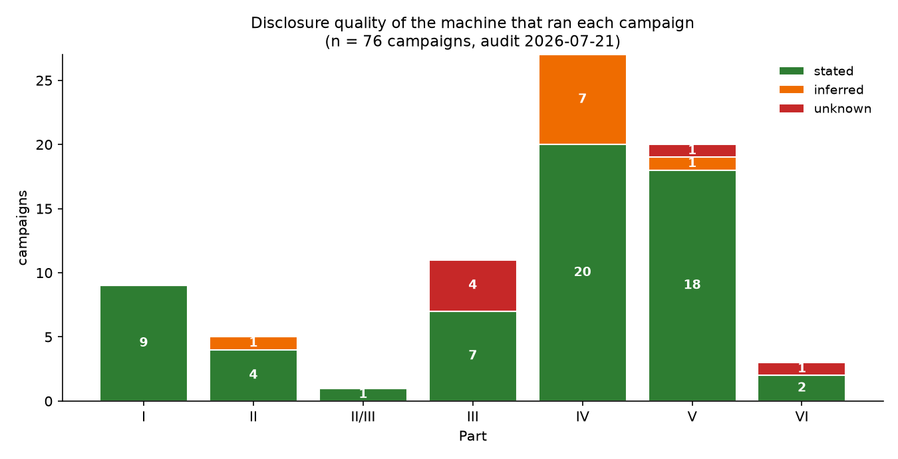

<!-- caption: Figura 3.2 — Reparto de qué máquina midió qué, por Parte -->

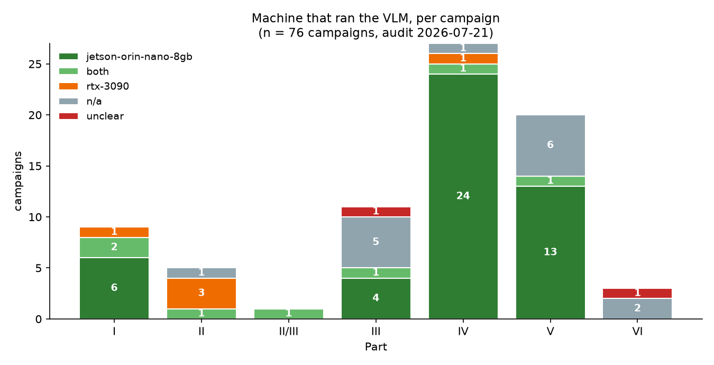

<!-- caption: Figura 3.3 — Host del VLM por Parte -->

<!-- caption: Tabla 3.1 — Coste del par desplegado (VLM + arrastre) co-residente en la placa; la máquina va por celda -->

| Componente | Coste medido (en la placa) | Máquina | Fuente |
|---|---|---|---|
| VLM — anclaje generativo | prefill 3680 ms + decodificación 536 ms = 4216 ms | Jetson Orin Nano 8 GB, Q8_0, `llama.cpp` | R-14 |
| Arrastre SAM2 — por fotograma | 372,1 ms → 2,69 Hz en solitario a `image_size` 1024 | Jetson Orin Nano 8 GB, TensorRT fp16 | R-16 (`P4-R16-carry-rate-1024`) |
| Par co-residente — restricción vinculante | memoria (OOM a N=2 con `PRUNE_AFTER = 100`), no la tasa | Jetson Orin Nano 8 GB | R-16 |

<!-- caption: nota de la Tabla 3.1: la cifra `CARRY_HZ = 6.15` (E1) queda RETIRADA; la corrección 2,30x y su descomposición son material del Cap. 5. -->

### El umbral IoU@0,25

<!-- Guion de párrafos. Sustituir cada viñeta por prosa. -->
- **P1 — La elección y su flanco abierto.** Establecer que toda la precisión del proyecto se reporta a `IoU@0,25`, frente al estándar de la literatura de comprensión de expresiones referenciales que es `IoU@0,5` [cita @refdrone]. Declarar el problema sin adornarlo: **no existe justificación registrada en ningún sitio del repositorio** — `grounding/contract.py` declara la constante y apunta a la puerta, sin razón. [ver Código 3.1].
- **P2 — La justificación por escrito, que este TFM debe dar.** Argumentar la elección: el objeto aéreo mediano ronda los **~16 px** y a `IoU@0,5` la métrica es inestable (un desplazamiento de pocos píxeles hunde el solape de una caja diminuta), de modo que 0,25 mide capacidad de localización sin castigar el ruido de cuantización de coordenadas. Reportar **el IoU medio al lado** como cifra más sobria — [VERIFICAR: no hay un valor de IoU medio registrado todavía; es la partida «Justificar por escrito el umbral IoU@0,25 y reportar el IoU medio» de la deuda de evidencia, y hay que calcularla antes de cerrar el capítulo].
- **P3 — La semántica exacta de la puerta.** Precisar qué es la puerta: `IOU_GATE_THRESHOLD = 0.25`, y PASS significa que **≥ 20 % de las muestras** superan ese solape (decisión de la Parte II). Distinguir el umbral de solape por muestra (0,25) de la fracción de muestras que deben superarlo (0,20) — son dos cosas y el cuaderno las confunde con facilidad. [ver Código 3.1].
- **P4 — El flanco de tribunal, dicho explícitamente.** Cerrar reconociendo que escribir este capítulo sin resolver la justificación deja un flanco abierto en la primera pregunta del tribunal; el TFM lo cierra por escrito en lugar de heredar la constante sin defenderla.

<!-- caption: Código 3.1 — La constante de la puerta y la métrica IoU, ambas en grounding/contract.py -->
```python
IOU_GATE_THRESHOLD = 0.25   # IoU@0.25 ≥ 20% of samples = PASS (see DECISIONS Part II)

def iou(a: Sequence[float], b: Sequence[float]) -> float:
    """Intersection-over-union of two [x1,y1,x2,y2] boxes (same coordinate space)."""
    ix1 = max(a[0], b[0]); iy1 = max(a[1], b[1])
    ix2 = min(a[2], b[2]); iy2 = min(a[3], b[3])
    if ix2 <= ix1 or iy2 <= iy1:
        return 0.0
    inter = (ix2 - ix1) * (iy2 - iy1)
    area_a = (a[2]-a[0]) * (a[3]-a[1])
    area_b = (b[2]-b[0]) * (b[3]-b[1])
    return inter / (area_a + area_b - inter)
```

### La placa y su techo de 15 W

<!-- Guion de párrafos. Sustituir cada viñeta por prosa. -->
- **P1 — La placa y su techo real.** Fijar el hardware: Jetson Orin Nano 8 GB, **15 W + `jetson_clocks`**. El modo de 25 W **no existe** en esta placa: el firmware expone solo 15 W y 7 W, y desbloquearlo exigiría un flasheo de bootloader que se decidió no intentar. La consecuencia que hay que llevar al texto: toda cifra de rendimiento del TFM es un **techo de 15 W, no un techo de silicio**.
- **P2 — La etiqueta MAXN, que era falsa.** Registrar la corrección como negativo documentado: una etiqueta anterior del cuaderno decía `MAXN_SUPER`, era falsa, y se corrigió el 2026-07-03. No debe reaparecer en el TFM.
- **P3 — Qué mide exactamente la potencia.** Precisar la instrumentación: la potencia medida es `VDD_IN` de `tegrastats` — entrada total de placa, **incluido un suelo de plataforma en reposo de ~5,2 W**. No es potencia de módulo ni de SoC, y toda lectura de J/tok o de vatios arrastra ese suelo.

### Lo que la placa hace, medido: el barrido de capacidad de la Parte I

<!-- Guion de párrafos. Sustituir cada viñeta por prosa. -->
- **P1 — Un barrido medido que el esquema no colocaba.** Situar la sección: la Parte I dejó **15 configuraciones** medidas en la placa a 15 W + `jetson_clocks` (`experiments/2026-06-13-model-capability-sweep/` y `experiments/2026-06-14-gemma-family-sweep/`), con **84 ficheros crudos versionados**, que ningún capítulo recogía. Es evidencia medida y sin usar, no evidencia que falte.
- **P2 — El enunciado exacto de la n, porque no es uniforme.** Dar la n con precisión: *15 configuraciones; caudal a 5 repeticiones, TTFT y potencia/térmica a una sola pasada.* Solo `llama-bench` corrió con `-r 5`; el TTFT es **una** llamada por modelo y la potencia es una ventana continua de `tegrastats` a 1 Hz. Advertir que escribir «15 modelos x 5 repeticiones» sería falso para tres de las cuatro familias de métrica. [cita @llamacpp].
- **P3 — `gemma-3-12b` no carga, y el fallo es el resultado.** Reportar que 14 de las 15 produjeron caudal y una no: `gemma-3-12b` **no cargó** (`cudaMalloc` al cargar, sin rescate por descarga parcial). Ese fallo es el resultado medido, no una casilla vacía.
- **P4 — El acantilado de los 8 GB es un acantilado, no una pendiente.** Defender la primera conclusión: los diez modelos Q4_K_M entran a `n_ctx` 4096 y el de 12B no entra en absoluto — el límite de memoria es un borde, no una degradación gradual. [ver Figura 3.4].
- **P5 — El prefill nunca es la restricción.** Defender la segunda: en esta clase de carga el prefill nunca liga — **TTFT ≤ 204 ms** en las 14 configuraciones que cargaron.
- **P6 — Limitada por ancho de banda en decodificación.** Defender la tercera: la placa está limitada por ancho de banda al decodificar — `tg128` cae de **71,52 a 7,75 tok/s** sobre una razón de **12,4x** en bytes de pesos. [ver Figura 3.4].
- **P7 — H4 queda falsificada (negativo pre-registrado).** Reportar el negativo con su nombre: se pre-registró (H4) que la energía por token tendría un óptimo en 2-3B, y sale **monótonamente creciente, 0,157 → 1,795 J/tok**. Es un negativo pre-registrado y va etiquetado como tal. [ver Figura 3.4].
- **P8 — Cero estrangulamiento térmico.** Cerrar la lista de lo positivo: no hubo *thermal throttling* en todo el barrido, de modo que las cifras son de placa fría-a-caliente sostenida, no de un pico recortado por temperatura.
- **P9 — Qué NO se defiende, para no sobrevender.** Acotar el alcance: estas 15 configuraciones son LLM de **texto**, ninguna es el modelo desplegado, y **ninguna cifra de latencia posterior de la tesis se deriva de este banco** — las de después salen del VLM (R-14: prefill 3680 + decodificación 536 ms) y de SAM2 (R-16: 372,1 ms). Responde a «qué LLM de texto cabe en 8 GB», que no es la pregunta que hace el sistema final; se cuenta como caracterización de plataforma y como el origen de la regla de que el techo es de 15 W, no de silicio.
- **P10 — Cuatro defectos declarados que viajan con la sección.** Enumerar las limitaciones sin esconderlas: (1) un único modo de potencia — los brazos de 7 W y 25 W nunca se corrieron, luego **no hay curva de compromiso**; (2) la cuantización no se mantiene fija en las 15; (3) el «±» del `pp512` es una dispersión entre agregados y no ruido de medida; (4) la fórmula de J/tok del README de la campaña contradice sus propios números.

<!-- caption: Figura 3.4 — Barrido de capacidad del dispositivo: tg128 (tok/s) frente a bytes de pesos (el acantilado de los 8 GB) y J/tok monótona (H4 falsificada) -->
> **[FIGURA POR GENERAR]** Dos paneles. Panel A: `tg128` (tok/s) frente a bytes de pesos del modelo, marcando el acantilado de los 8 GB (Q4_K_M entran a `n_ctx` 4096; `gemma-3-12b` no carga) y la caída 71,52 → 7,75 tok/s sobre 12,4x. Panel B: energía por token (J/tok) frente a tamaño de parámetros, monótona 0,157 → 1,795, sin el óptimo en 2-3B que predecía H4. | fuente: experiments/2026-06-13-model-capability-sweep/ y experiments/2026-06-14-gemma-family-sweep/ | script: make_proof.py

### El marco de inferencia

<!-- Guion de párrafos. Sustituir cada viñeta por prosa. -->
- **P1 — Por qué existe y qué NO es.** Enmarcar la sección obligatoria (borrador completo en `thesis/01-método-estadístico.md`, detalle en el **Anexo A**): el proyecto se llevó como cuaderno de laboratorio — se pre-registraba una puerta, se corría el brazo, se comparaba a ojo. Una búsqueda por `mcnemar|binomtest|scipy.stats|statsmodels|wilson|p-value` sobre el repositorio devolvía **cero ficheros** antes de este trabajo. Aclarar que el marco **no** convierte NOs en YESes: añade la incertidumbre que siempre debió acompañar a las puertas, y buena parte de él son reglas de rechazo, no de cálculo.
- **P2 — Punto 1: qué prueba corresponde a qué diseño, todo exacto.** Resumir la regla: McNemar exacto (pareado), binomial exacta + Wilson (un brazo contra puerta), Fisher (no pareado), Wilcoxon de rangos con signo (continuo pareado). Ninguna aproximación normal — con estos n, Wald da `[0, 0]` para un 0/6 y un límite superior mayor que 1 para un 24/25. La elección la fija el **diseño**, nunca el p-valor que sale.
- **P3 — Punto 2: `n_effective` frente a `n_rows`.** Explicar la distinción con los ejemplos del registro: seis clips por dos repeticiones deterministas son **seis** observaciones; diez ensayos SITL del mismo fallo determinista son **uno**; 439 *captions* sobre 316 imágenes no son 439 observaciones independientes. Cada afirmación declara las dos cifras y la razón por la que difieren.
- **P4 — Punto 3: la deflación a n efectivo.** Resumir `deflate_to_effective()`: se conserva la proporción y se sustituye el denominador por `n_effective` (corrección por efecto de diseño, `deff = n_rows / n_effective`), que **solo ensancha el intervalo y debilita el p-valor**, nunca al revés, luego no puede fabricar un resultado — E17 pasa de `[0, 0,28]` a `[0, 0,79]` sobre n = 1. Añadir la regla de independencia: la unidad es el **videoclip**, no la escena (P5.18: 26 escenas con puerta salen de **13 clips**, luego `n_effective = 13`), y que la calibración por ICC (R-29, límite superior al 95 %) **no recuperó ni un superviviente**. [ver Código 3.2].
- **P5 — Punto 4: diseños que no podían responder a su pregunta.** Enunciar el aporte más incómodo del marco: una comparación pareada de 5 elementos **no puede** alcanzar p < 0,05 bilateral aunque los cinco volteen — el suelo es 0,0625 — y se calcula desde n **solo**, sin mirar el resultado. La consecuencia dura: un NO salido de un diseño de n = 5 no es evidencia de ausencia de efecto, es **evidencia de ausencia de experimento**. [ver Tabla 3.2] [ver Figura 3.5].
- **P6 — Punto 5: empates y pruebas que no existen.** Cero pares discordantes devuelve `NaN`, no p = 1,0 — «indefinido» significa que no hubo prueba, no «brazos equivalentes». Ilustrar con los tres empates de simulación (24/24 vs 24/24, 24/24 vs 23/24, 56/56 vs 55/56).
- **P7 — Punto 6: multiplicidad (Holm).** Resumir la corrección: Holm-Bonferroni sobre la familia de afirmaciones con puerta, con las pruebas indefinidas (`NaN`) fuera de la familia. Declarar la convención de autor (R-30): **la familia es la Parte**, y la familia global se reporta en columna contigua como análisis de sensibilidad declarado, no se esconde.
- **P8 — Punto 7: los tres estados de los datos.** Cerrar con la clasificación por lo que sobrevive en disco — `per_item`, `counts_only`, `missing` — y la regla: una afirmación en `missing` **no se defiende** en el TFM; se re-ejecuta o se retira (cola en `thesis/rerun-backlog.md`).

<!-- caption: Tabla 3.2 — Cuántos pares discordantes en una sola dirección hacen falta para alcanzar alpha = 0,05 bilateral -->

| Pares (n) | Discordantes necesarios | Se puede alcanzar |
|---|---|---|
| 5 | — | **No, con ningún resultado** |
| 6 | 6 (todos) | Solo si es perfecto |
| 12 | 6 | Sí |
| 25 / 26 | 6 | Sí |
| 56 | 6 | Sí |


<!-- caption: Figura 3.5 — Diseños pareados por n efectivo; en rojo los que no podían alcanzar alpha con ningún resultado -->

<!-- caption: Código 3.2 — Deflación a n efectivo y McNemar exacto (0 discordantes = NaN, no p=1,0), en grounding/stats.py -->
```python
def deflate_to_effective(k: int, n: int, n_effective: int) -> tuple[int, int]:
    if n_effective >= n or n <= 0:
        return k, n
    n_eff = max(1, int(n_effective))
    return min(n_eff, round(k * n_eff / n)), n_eff

def mcnemar(b: int, c: int, alternative: Alternative = "two-sided") -> float:
    if b < 0 or c < 0:
        raise ValueError("discordant counts must be non-negative")
    n_disc = b + c
    if n_disc == 0:
        return float("nan")   # 0 pares discordantes: no hay prueba, NO p = 1,0
    return float(stats.binomtest(b, n_disc, 0.5, alternative=alternative).pvalue)
```

### El método de desarrollo multiagente, acotado

<!-- Guion de párrafos. Sustituir cada viñeta por prosa. -->
- **P1 — Por qué aparece en un TFM de Edge-AI.** Justificar la inclusión y su ubicación (subsección corta aquí, material extenso en el **Anexo B**, borrador en `thesis/02-método-multiagente.md`): no es un TFM sobre desarrollo asistido por IA, pero la práctica totalidad del código, los experimentos y la documentación los produjo una flota de agentes bajo revisión humana, y eso condicionó qué defectos aparecieron y cuáles sobrevivieron meses. Un lector que evalúe las cifras necesita saberlo, igual que necesita saber el modo de potencia.
- **P2 — Se cuenta en las dos direcciones o no se cuenta.** Fijar la regla del apartado: un informe que solo cuente los aciertos del método es publicidad; se reportan los hallazgos **y** los defectos producidos.
- **P3 — Lo que el método encontró y el trabajo en solitario no.** Dar las cifras trazables a *commit*: la auditoría de máquina sobre 76 campañas (3 de 65 en la placa; `2c7f7a3`), cuatro números mal en el `README.md` (la precisión de arrastre de 1024 px 0,849 citada donde la desplegada es la de 768 px 0,830; «hasta 3,0 m/s» como techo cuando 3,0 m/s es exactamente el ajuste que **falló** — 3/3 a 2,5 m/s, 0/2 a 3,0; `cd8cca6`), el fallo de re-emparejamiento de ByteTrack (`px_err` 64,7 → 36,0; `f1e58e9`) y el propio re-análisis estadístico (33 de 65 diseños inalcanzables por diseño). [cita @zhang2022bytetrack].
- **P4 — Lo que el método produjo, con la misma firma.** Reportar los defectos que introdujo el mismo sistema —*confiados, precisos y falsos*—: la cámara de Gazebo apuntando al **cielo** durante semanas (`+pi/2` es abajo, no arriba; RQ-S1.4 retirada; `5426ed0`, regla en `03d37bb`), un `b=39, c=7` en lugar de `b=4, c=2` por adivinar nombres de campos JSON, y tres anclajes por número de línea erróneos escritos el mismo día en el fichero que exige no fiarse de la primera lectura.
- **P5 — Por qué la mitigación que funcionó fue mecánica.** Enunciar la aportación metodológica: **en un flujo multiagente la verificación tiene que ser un artefacto ejecutable, no un párrafo** — la regla «no te fíes de tu primera lectura» estaba escrita, en mayúsculas, en el mismo fichero con tres citas erróneas. Lo que funcionó fue externo al agente: `tests/test_thesis_integrity.py`, el patrón de trinquete, la regla «míralo» y el protocolo de traspaso. [ver Tabla 3.3].
- **P6 — Amenaza a la validez de la propia sección.** Cerrar con la salvedad obligatoria: **no hay grupo de control** — no existe una versión de este TFM hecha por una persona sola con la que comparar — así que ninguna afirmación causal sobre el método («el multiagente mejoró X») es defendible. Solo el registro de incidentes lo es, y cada uno resuelve a un *commit*.

<!-- caption: Tabla 3.3 — La asimetría flota de agentes / persona sola, dicha sin adornos -->

| | Flota de agentes | Persona sola |
|---|---|---|
| Amplitud (auditar 76 campañas) | minutos | días, y no se hace |
| Profundidad en un problema conocido | buena, con coste invisible | buena |
| Autoverificación | **mala**: repite su error con más confianza | mala, pero más lenta y con más dudas |
| Coste de un defecto silencioso | alto: se propaga a la documentación al instante | alto, pero se propaga más despacio |
| Sensibilidad a instrucciones escritas | baja bajo carga | media |
| Sensibilidad a una prueba que falla | **total** | total |

### Qué le hizo el re-análisis al cuaderno

<!-- Guion de párrafos. Sustituir cada viñeta por prosa. -->
- **P1 — El marco cambió resultados, no los adornó.** Anticipar el material del Cap. 9: el marco no se escribió para adornar resultados sino porque **cambió varios**, y por eso conviene presentar aquí el resultado global del re-análisis retroactivo antes de entrar en los capítulos empíricos.
- **P2 — El reparto global en ocho categorías disjuntas.** Presentar la tabla de resultado global [ver Tabla 3.4]: las 76 afirmaciones del registro repartidas en ocho categorías **disjuntas** que suman 76 (cada afirmación aparece exactamente una vez; cuando dos podrían aplicar, gana la más específica). Registrar el negativo de método: esta tabla tenía cuatro filas y sumaba 82 hasta el 2026-07-23, con 29 afirmaciones contadas dos veces, y la corrección (R-23) no suaviza el diagnóstico — **doce diseños con puerta que ningún resultado posible habría superado** es la frase que el capítulo debe llevar.
- **P3 — Cuántas sobreviven a Holm.** Dar la cifra vigente leída de `thesis/stats-report.md`: **sobreviven 11 por Parte frente a 10 en familia global** (la única que solo sobrevive por Parte es `P2-RQ4.1-deploy-fidelity`). Advertir que las cifras más bajas que circulan por el repositorio son históricas y quedan sustituidas: el «diez que sobreviven» de `00-esquema.md` y el «6 sobre 65» de `02-método-multiagente.md` son de re-análisis anteriores; la cifra vigente es **11 por Parte / 10 global**. Nombrar las once: `P1-S3.3-export-parity-catastrophe`, `P2-RQ2.1-resolution-ladder-1024`, `P2-RQ3.1-lora-aerial-gate`, `P2-RQ4.1-deploy-fidelity`, `P3-ROI-M2.0-512`, `P3-ROI-M2.0-512-ondevice`, `P3-R13-owlv2-vs-vlm`, `E18-cold-acquire-vs-warm-oracle-n25`, `P5.2a-warm-generalization`, `P5.12-bankv21-recal`, `P6.2-DELIVERY-warm-vs-cold-closedloop`, y declarar que **la contribución central del TFM está entre ellas**. [ver Figura 3.6].
- **P4 — Los dos matices que la lista no puede omitir.** Dar las dos condiciones que acompañan a la lista: `P5.12` sobrevive a Holm pero su propia salvedad la llama *parcialmente definicional* (los suelos se recalibraron a partir de la población de P5.11); y de las supervivientes **solo dos son inferenciales y de la placa a la vez** — `P3-R13-owlv2-vs-vlm` (R-13, p = 2,205e-09) y `P3-ROI-M2.0-512-ondevice` (R-14, p = 6,384e-18) — que es exactamente el flanco que el Cap. 9 declara.
- **P5 — Las tres correcciones que el re-análisis obliga a llevar al texto.** Enumerar las tres, cada una con su salvedad pegada: (1) **Swin2SR no pierde en precisión** — el descarte es por latencia (+1331 ms), no por IoU (cita @conde2022swin2sr); (2) **la catástrofe de la Parte I es la exportación, no la cuantización** — F16 contra Q8_0 da b=17, c=10, p=0,248 (los 7 pp atribuidos al cuantizado no se distinguen del ruido), mientras que HF contra GGUF es significativa bajo cualquier emparejamiento compatible con los marginales (peor caso p = 1,3e-04); (3) **el arrastre a 768 no pierde precisión medible frente a 1024** — por pista 1024 gana 55 y 768 gana 31 (p=0,013), pero sobre las 93 secuencias independientes la prueba de signos da b=28, c=16, **p=0,096** (Holm la deja en 1), luego la adopción de 768 fue una cota de tamaño de efecto más una restricción de FPS, no una afirmación de igualdad (corregido el 2026-07-21, R-7). [ver Figura 3.6].

<!-- caption: Tabla 3.4 — Resultado global del re-análisis retroactivo de las afirmaciones con puerta (recuentos vigentes de thesis/stats-report.md, ocho categorías disjuntas que suman 76) -->

| Categoría | N | Qué significa |
|---|---|---|
| Significativas tras Holm | 11 | Se pueden defender como efectos |
| Probadas, no significativas | 23 | Contraste real que no rechazó |
| Puerta pre-registrada **inalcanzable por diseño** | 10 | Ningún resultado posible habría bastado a esa n |
| Descriptivas, sin hipótesis | 12 | Nunca hubo nada que contrastar, por diseño |
| Sin puerta pre-registrada, sólo intervalo | 12 | Se reporta el Wilson y nada más |
| Pareadas sin un solo par discordante | 3 | Los brazos no se separaron en ninguna celda |
| Sin datos crudos | 3 | En cola de re-ejecución, no se defienden |
| Sólo sobreviven agregados | 2 | Se perdieron los valores por elemento |

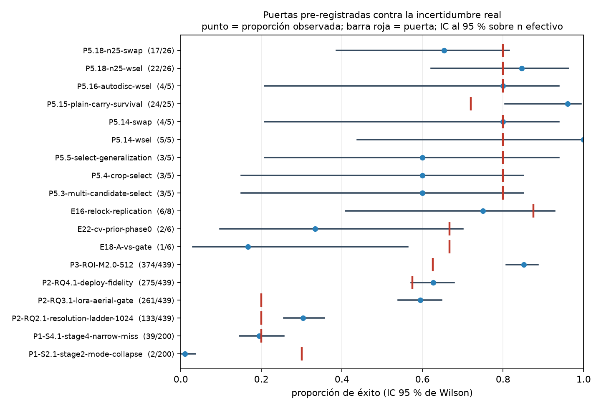

<!-- caption: Figura 3.6 — Proporciones observadas con intervalo de Wilson al 95 %; la barra roja marca la puerta pre-registrada -->


## Grounding de un solo frame

<!-- Guion de capítulo. Cada viñeta -> un párrafo. Tablas/figuras/código ya colocados. -->

Este capítulo cubre la Parte I (exploratoria, congelada) y la Parte II (reconstrucción principiada). La Parte I se narra **como fracaso metodológico**, no como resultado: es la lección que obliga a reconstruir la evaluación desde cero. La Parte II es la respuesta a ese fallo.

### Parte I: la catástrofe de fidelidad

<!-- Guion de párrafos. Sustituir cada viñeta por prosa. -->
- **P1 — La Parte I se cuenta como un fracaso metodológico, no como un resultado.** Establece que lo medido en el banco (la RTX 3090) no era lo que ocurría en el dispositivo (la Jetson Orin Nano): cinco copias del modelo divergieron en silencio y ninguna herramienta del cuaderno permitía saber cuál era la desplegada. Sin este arco la Parte II parece burocracia; con él es la respuesta a un fallo concreto. [ver Figura banco-vs-dispositivo]
- **P2 — La cascada de fases con puerta que fue fallando.** Recorre los tres tropiezos previos a la catástrofe con sus cifras exactas y sus matices estadísticos: el *fine-tune* de la Etapa 2 colapsa a 2/200 en IoU@0,25 contra una puerta del 30 % (el diagnóstico de *mode collapse* se apoya en 5 predicciones inspeccionadas a mano, no es en sí una afirmación medida) [claim `P1-S2.1-stage2-mode-collapse`]; un modelo ajustado en RefCOCO transfiere a lo aéreo a 1/50, cuyo IC de Wilson al 95 % es ≈[0,001, 0,106], de modo que la lectura defendible es «como mucho ~10 %», no «suelo de acierto aleatorio» [claim `P1-S3.4-coco-to-aerial-domain-shift`]; y la Etapa 4 se queda a un ítem, 39/200 = 19,5 % contra una puerta del 20 %, un fallo que el intervalo de Wilson [0,146, 0,257] hace **estadísticamente indefensible** — hay que presentarlo como una decisión de ingeniería, no como una medida [claim `P1-S4.1-stage4-narrow-miss`, máquina rtx-3090].
- **P3 — La catástrofe central es la EXPORTACIÓN (HF → GGUF), no la cuantización.** Enuncia el resultado individual más fuerte de la Parte I: la exportación cuesta 30,0 pp de acierto de grounding contra una puerta de fidelidad de 5 pp, con McNemar exacta pareada en el peor emparejamiento compatible con los datos (b=45, c=15) que aún da p = 1,3e-04 y **sobrevive a Holm** — la catástrofe es significativa bajo todo emparejamiento [claim `P1-S3.3-export-parity-catastrophe`, máquina *both*]. Deja fijado desde ya que la pérdida vive en el paso de exportación a GGUF, no en la cuantización de 8 bits (se demuestra en §«La corrección de signo»).
- **P4 — Hay DOS medidas del mismo fenómeno y no coinciden; se da el par, no el número más dramático.** Presenta las dos lecturas de la brecha banco→dispositivo: la original 85,0 → 62,0 → 55,0 (−23 pp en el tramo de exportación) frente a la re-medida de la Fase 0b sobre el mismo *checkpoint*, 85,0 → 69,0 → 67,0 (−16 pp). La divergencia se atribuye a decodificación voraz frente a muestreada y a n = 100 frente a n = 200. El TFM debe dar el par y su explicación, no elegir la cifra más aparatosa. [ver Figura banco-vs-dispositivo]
- **P5 — La lección que obliga a la Parte II.** Cierra: el fallo no fue una cifra baja sino la **imposibilidad de saber qué se estaba midiendo**. La Parte II existe porque esto obliga a reconstruir la evaluación con fases con puerta y manifiestos por ejecución (SHA de git, *hash* del *lockfile*, *hash* del *dataset*) que la Parte I no tiene. Transición al siguiente apartado.

> **[FIGURA POR GENERAR]** Barras banco-vs-dispositivo con las DOS medidas discrepantes de la brecha de la Parte I (85,0→62,0→55,0 = −23 pp, y la re-medida Fase 0b 85,0→69,0→67,0 = −16 pp); es la figura que justifica la existencia de la Parte II. | fuente: runs Parte I / logs Fase 0b | script: make_proof.py

### La reconstrucción principiada: fases con puerta y manifiestos

<!-- Guion de párrafos. Sustituir cada viñeta por prosa. -->
- **P1 — Qué cambia respecto de la Parte I.** Establece los dos mecanismos que la Parte I no tenía: fases con puerta (cada etapa pasa un umbral pre-registrado o no se avanza) y **manifiestos por ejecución** (SHA de git, *hash* del *lockfile*, *hash* del *dataset*), que hacen imposible la divergencia silenciosa de «cinco copias». Esta es la infraestructura, no el resultado.
- **P2 — Selección de espina dorsal: Qwen2-VL-2B.** Da la comparación cero-*shot* que fija el modelo base: Qwen2-VL-2B ancla 15/100 donde SmolVLM-500M ancla 0/100 [claim `P2-RQ0.3-spine-selection`, máquina rtx-3090] [@wang2024qwen2vl]. Salvedad pegada: la decisión se apoyó TAMBIÉN en una pata de fidelidad de exportación de −2 pp (Qwen) frente a −16 pp (SmolVLM), pero el −2 pp es 15/100 frente a 14/100, una diferencia de UN SOLO ítem presentada como propiedad de fidelidad — esa pata **no está respaldada**; la pata 15/100 vs 0/100 sí lo está.
- **P3 — Bien-planteamiento del dataset RefDrone.** Fija el conjunto de evaluación de toda la Parte II: solo 439 de 1.421 captions de validación llevan exactamente una caja real (30,9 %), muy por debajo de una barra de bien-planteamiento de 0,95, de modo que el crudo es *ill-posed* (puerta FAIL) y se adopta el subconjunto filtrado [claim `P2-RQ1.1-dataset-well-posedness`]. Es un censo completo, no una muestra, así que un IC sería un error de categoría; su peso está aguas abajo: estas mismas 439 captions sobre **316 imágenes únicas** son el conjunto de TODOS los números de la Parte II, y por eso el agrupamiento por imagen se propaga por toda la parte. [@refdrone]

### Las cifras del grounding, con su matiz

<!-- Guion de párrafos. Sustituir cada viñeta por prosa. -->
- **P1 — La escalera de resolución despeja la puerta de pre-entrenamiento aéreo.** Da la cifra: 133/439 = 30,3 % a `max_side=1024` contra una barra del 20 %, binomial exacta p = 7,77e-06, **significativa tras Holm** [claim `P2-RQ2.1-resolution-ladder-1024`, máquina rtx-3090]. El «codo» de la escalera no tiene barra numérica y es un juicio a ojo: preséntalo como decisión de diseño, no como hallazgo.
- **P2 — El LoRA alcanza el 59,5 % — y NO se titula con el 65,0 %.** Establece el número correcto: el *fine-tune* LoRA llega a 261/439 = **59,5 %** IoU@0,25 contra una puerta del 20 % [claim `P2-RQ3.1-lora-aerial-gate`, máquina rtx-3090] [@hu2022lora]. Advertencia obligatoria: NO citar en bucle el 65,0 % (n = 200) como titular — esa evaluación en-bucle es un subconjunto reusado cada época, así que 0,63/0,65/0,65 son tres medidas solapadas sobre un modelo cambiante, no tres muestras independientes. El titular es 59,5 % a n = 439.
- **P3 — El despliegue en la Jetson: 59,5 → 62,2 → 62,6 %, etiquetando la máquina por celda.** Da la cadena de la Fase 4 con su artefacto por columna: 59,5 % (HF, 261/439) → 62,2 % (F16, 273/439) → **62,6 %** (Q8\_0 en la Jetson, 275/439), contra un presupuesto de fidelidad del 57,5 % [claim `P2-RQ4.1-deploy-fidelity`, máquina *both*] [@llamacpp]. Es el número estrella de la Parte II y la eliminación de la catástrofe de la Parte I. La lectura del signo de este último salto se corrige en el apartado siguiente.
- **P4 — Verificación cualitativa y bake-off de espina.** Cierra con las dos figuras por generar: una rejilla cualitativa de aciertos y fallos sobre imagen aérea (los objetivos de RefDrone ocupan un pequeño porcentaje del ancho de frame, hay que recortar al objeto), y el bake-off de *backbone* que sostiene «ningún brazo desplazó al titular» — **no** una clasificación, porque los brazos no comparten *backend* ni n.

<!-- caption: Fase 4 — acierto de grounding IoU@0,25 por artefacto, con la máquina de cada celda -->
| Artefacto | Aciertos / n | IoU@0,25 | Máquina | Runtime |
|---|---|---|---|---|
| HF (referencia) | 261/439 | 59,5 % | RTX 3090 | transformers/PyTorch |
| F16 (GGUF) | 273/439 | 62,2 % | RTX 3090 | llama.cpp |
| **Q8\_0 (desplegado)** | 275/439 | **62,6 %** | **Jetson Orin Nano (15 W)** | llama.cpp |

> **[FIGURA POR GENERAR]** Rejilla cualitativa de aciertos y fallos de grounding sobre imagen aérea (recortada al objeto: los objetivos son un pequeño % del ancho de frame). | fuente: runs/*/results.json Parte II | script: make_proof.py

> **[FIGURA POR GENERAR]** Bake-off de espina dorsal. AVISO: los brazos **no comparten backend ni n** — A y C en HF a n = 200; el titular y B en Jetson Q8\_0 a n = 439; D cancelado sin ejecutar. Sostiene «ningún brazo desplazó al titular», no un ranking. | fuente: 2026-06-30-vlm-backbone-bakeoff | script: make_proof.py [@opengvlab2025internvl3; @qwen2025qwen25vl; @google2024paligemma2; @microsoft2024florence2; @hf2025smolvlm2]

### La corrección de signo: sin pérdida medible por el runtime

<!-- Guion de párrafos. Sustituir cada viñeta por prosa. -->
- **P1 — El «−2,7 pp» es convención de magnitud de brecha, NO una pérdida.** Establece la corrección más importante del documento: el cuaderno etiqueta el último salto (a Q8\_0) como «−2,7 pp» y lo repite en cuatro sitios, pero es una convención de magnitud de brecha. Las cifras **suben**: el artefacto cuantizado (275/439) puntúa por encima de la referencia HF (261/439), y una inversión de ~3 pp sobre n = 439 está dentro del ruido de muestreo. La lectura honesta es **«sin pérdida medible por el runtime»** — nunca «la cuantización mejora el modelo». Escribirlo como pérdida es un error; como mejora, peor.
- **P2 — Dónde vive de verdad la pérdida: la exportación, no la cuantización de 8 bits.** Aporta la prueba nueva calculada por primera vez en el análisis estadístico: F16 62/100 frente a Q8\_0 55/100 sobre la parada de paridad de la Parte I da b=17, c=10, McNemar p = 0,248 — el hueco de 7 pp NO se distingue del ruido [claim `P1-S3.3-quantisation-is-not-the-cost`, máquina *both*]. Por tanto la pérdida de fidelidad está en la EXPORTACIÓN (HF → GGUF), no en la cuantización; toda frase de la tesis que atribuya parte de la caída a Q8\_0 debe matizarse.
- **P3 — Por qué la Parte II elimina la catástrofe de la Parte I.** Cierra el hilo: la Parte II supera la catástrofe porque los brazos de runtime (F16 273, Q8\_0 275) quedan POR ENCIMA de la referencia HF (261), no porque la cuantización ayude — esa diferencia de 14 ítems está dentro de lo que el emparejamiento podría producir por azar [claim `P2-RQ4.1-deploy-fidelity`]. La afirmación defendible es «no hay pérdida medible en la exportación», no «la exportación la mejoró».

### Una línea base externa: OWLv2 frente al VLM (R-13)

<!-- Guion de párrafos. Sustituir cada viñeta por prosa. -->
- **P1 — Por qué existe: la primera pregunta de un tribunal es «¿comparado con qué?».** Establece que R-13 (2026-07-22) es la **única comparación contra un sistema externo** en todo el proyecto; hasta entonces la respuesta no existía y todo lo demás del cuaderno era una ablación interna. Cualquiera de las dos respuestas es contenido: o la arquitectura queda justificada, o la tesis se convierte en «¿cuándo merece un VLM su coste?».
- **P2 — El montaje, elegido para no montar un espantapájaros.** Describe la prueba: OWLv2 (`google/owlv2-base-patch16-ensemble`) en fp16 contra el VLM desplegado a Q8\_0, **las dos en el Orin**, sobre las mismas 439 muestras bien planteadas de RefDrone val y con el mismo camino de puntuación `grounding/contract.py` [@minderer2023owlv2]. El detector recibe cuatro brazos ordenados de más a menos caritativo; el registrado como titular es el más fuerte (D-phrase), no el más favorable, y se añadió D-phrase antes de puntuar precisamente para no infravalorar al detector. [ver Tabla de brazos]
- **P3 — El resultado principal: el VLM gana a todo brazo que sea un sistema.** Da la cifra pareada: VLM 63,10 % frente al mejor brazo del detector D-phrase 47,38 %; deflactado a 316 imágenes únicas, McNemar exacta p = 2,26e-07 y **sobrevive a Holm** [claim `P3-R13-owlv2-vs-vlm`, máquina jetson-orin-nano-8gb]. Matiz de n efectivo: R-29 recalibra por ICC el n efectivo a 417 (con el suelo colapsado de 316 conservado como análisis de sensibilidad conservador). [ver Tabla de brazos]
- **P4 — El resultado que IMPORTA es la descomposición: propone bien, no sabe elegir.** Enuncia el recall@k del brazo D-phrase, que sube de **47,4 % en k = 1 a 88,8 % en k = 10**; su segunda propuesta ya empata con el top-1 del VLM (63,0 % vs 63,1 %), y solo 49/439 (11,2 %) no tienen ninguna caja correcta entre las diez. Hay que enunciar la distancia como **41,5 pp entre `recall@1` y `recall@10` del mismo brazo** — no confundirla con el 90,43 % del D-oracle, que es otra cosa (brecha del oráculo de 27,3 pp). Deja claro que D-oracle NO es un sistema: elige entre las diez primeras usando la verdad-terreno, es una cota superior y nunca debe citarse como resultado de OWLv2. [ver Figura recall@k] [ver Tabla de brazos]
- **P5 — Dos apoyos de la descomposición.** Aporta las dos ablaciones: el lenguaje relacional **perjudica** — D-full (25,74 %) queda 21,6 pp por debajo de D-phrase, luego la cláusula se puntúa y arrastra el emparejamiento fuera del objetivo; y los adjetivos de apariencia son **toda** la aportación del detector — D-phrase menos D-head = 22,8 pp. [ver Figura barras por brazo]
- **P6 — Un techo arquitectónico encontrado de paso: 16 tokens.** Da el hallazgo: el codificador de texto de OWLv2 tiene `max_position_embeddings = 16` y una consulta de 17+ tokens **rompe** la pasada (`size of tensor a (17) must match tensor b (16)`) en vez de degradarse. Las descripciones de RefDrone van de 7 a 27 tokens, así que 5/439 (1,1 %) exceden lo que el modelo puede representar — una afirmación sobre la aptitud de la arquitectura para expresiones referenciales, no una molestia.
- **P7 — Y obliga a una corrección: la bifurcación se cerró por latencia SIN medir un detector.** Establece que la campaña de 2026-06-14 cerró la bifurcación «VLM extremo a extremo contra detector + selector» **por latencia y sin haber medido jamás un detector**. Medido: OWLv2 es ~**16,0x más barato** por llamada (263,5 ms de pasada frente a 4216 ms de cómputo en placa del VLM) y ocupa ~5x menos. El argumento de latencia estaba del revés; lo que descarta la ruta descompuesta es la brecha de **selección** (calidad, 41,5 pp), no el coste. **La decisión sobrevive; su justificación registrada, no.**
- **P8 — Dos cautelas que van pegadas al 16,0x o la cifra miente.** Fija las condiciones: (a) se compara contra **cómputo en placa** (prefill 3680 + decodificación 536 ms) y no contra los 4319 ms de reloj, que llevan ~103 ms de base64 por un túnel SSH — cargarle el cable al VLM daría 16,4x; (b) es **una pasada de detector contra un anclaje generativo completo**: un sistema descompuesto necesitaría además una etapa de selección que nadie ha costeado, y si esa etapa fuese a su vez un VLM el ahorro desaparece. Añade que OWLv2 corrió en fp16 con transformers/PyTorch mientras el VLM corrió en Q8\_0 con llama.cpp, así que la razón cruza dos motores de ejecución: es una observación de sistema, no una medición controlada de eficiencia.
- **P9 — Nota de no-independencia con R-14.** Advierte que el brazo VLM de esta comparación (63,10 %, arm A) **es el mismo** brazo A de R-14 del Capítulo 5, no una re-ejecución: los dos resultados comparten una medición, lo que introduce una dependencia dentro de la familia de corrección múltiple. Cómo se trata esa dependencia se detalla en el Capítulo 9 (marco estadístico). [ver Cap 9]

<!-- caption: R-13 - IoU@0,25 por brazo del detector frente al VLM desplegado, ambos en el Orin (verbatim del esquema) -->
| Brazo | IoU@0,25 | Qué es |
|---|---|---|
| VLM desplegado | **63,10 %** | el sistema de la tesis |
| D-phrase | 47,38 % | sintagma nominal con adjetivos — el mejor brazo del detector |
| D-full | 25,74 % | la expresión referencial entera |
| D-head | 24,60 % | el núcleo nominal a secas |
| D-oracle | 90,43 % | **no es un sistema**: elige entre las diez primeras con la verdad-terreno |

<!-- caption: R-13 - recall@k del brazo D-phrase (fracción de items con caja que pasa la puerta en el top-k) -->
| k | 1 | 2 | 3 | 5 | 10 |
|---|---|---|---|---|---|
| D-phrase recall@k | 47,4 % | 63,0 % | 72,4 % | 81,5 % | **88,8 %** |

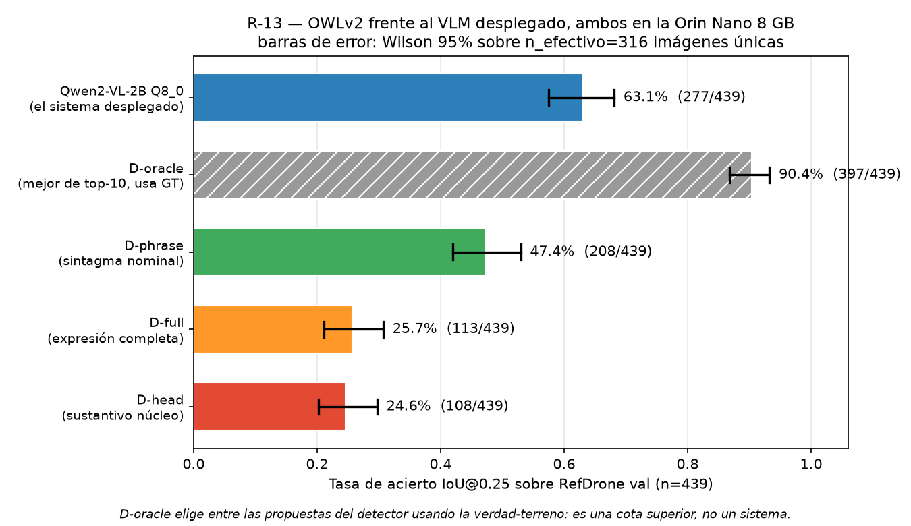

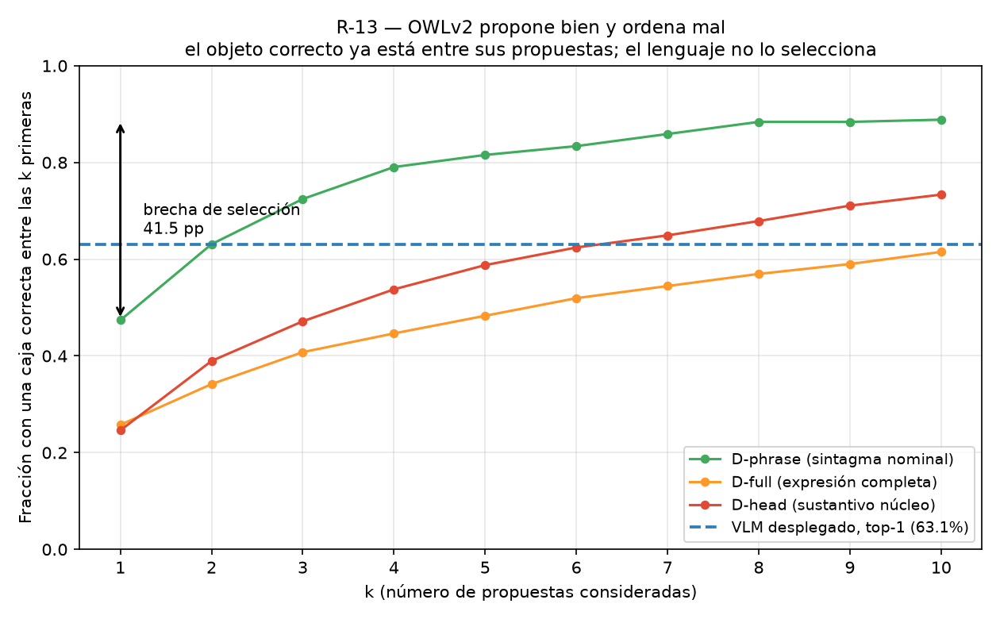

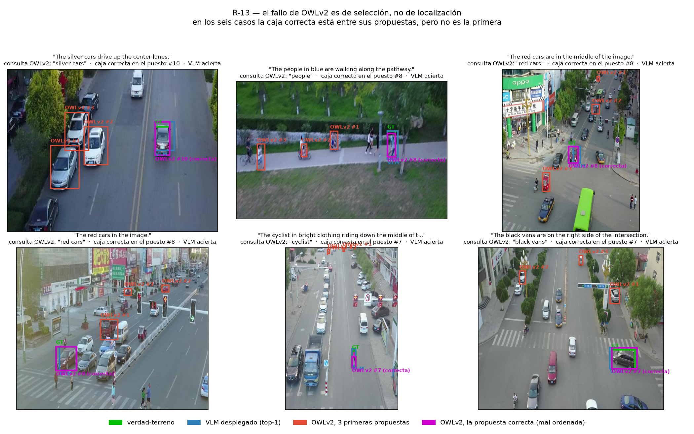

### Comparabilidad con RefDrone y licencias

<!-- Guion de párrafos. Sustituir cada viñeta por prosa. -->
- **P1 — Advertencia obligatoria: el 62,6 % NO es comparable con la tabla publicada de RefDrone.** Establece la diferencia de protocolo: el benchmark publicado mide **F1 multi-objetivo a IoU >= 0,5** (una expresión puede mapear de 0 a 242 cajas), con estado del arte 34,44 F1 y techo humano 58,14. Lo que aquí se mide es **una caja, IoU@0,25**, sobre el 30,9 % de las captions de validación con exactamente una caja real (n = 439 de 1.421) — se descartan precisamente los casos multi-objetivo y los negativos, para los que RefDrone fue construido. Es un protocolo distinto y más fácil; poner el 62,6 % al lado del 34,44 sin esta frase sería una tergiversación. [@refdrone]
- **P2 — Licencias: la etiqueta permisiva aguas abajo no anula la cadena aguas arriba.** Declara la cadena de licencias: las anotaciones de RefDrone son CC BY 4.0 pero reutilizan imagen de VisDrone2019-DET bajo **CC BY-NC-SA 3.0**, de uso académico. Vale para un TFM y hay que declararlo explícitamente. [@refdrone; @zhu2021visdrone]


## Permanencia de objeto

<!-- Guion de capítulo. Cada viñeta -> un párrafo. Tablas/figuras/código ya colocados. -->

### Un grounding por frame no es seguimiento

<!-- Guion de párrafos. Sustituir cada viñeta por prosa. -->
- **P1 — Grounding por frame no es seguimiento.** Establece la tesis del capítulo: invocar el VLM en cada fotograma no es seguir un objetivo, es re-detectarlo desde cero cada vez, y a ~4,3 s de pared por llamada en la placa eso es inviable en vídeo. La permanencia de objeto (Parte III, T0-T4) separa dos trabajos: mantener la identidad del objetivo y volver a fundamentarlo en lenguaje. [@ravi2024sam2]
- **P2 — El reparto de trabajo: SAM2 arrastra, el VLM re-ancla.** Aquí entra el arrastre temporal: SAM2 [@ravi2024sam2] mantiene la máscara del objetivo entre anclajes y el VLM (Qwen2-VL-2B [@wang2024qwen2vl]) solo se invoca para re-anclar, es decir para pasar de una frase a una caja. Ese reparto es lo que hace viable un VLM de 2B en la placa: no se paga el prefill del VLM por fotograma, solo en cada re-anclaje.
- **P3 — Evidencia visual, no de log.** La permanencia y el lazo cerrado son afirmaciones sobre píxeles y por tanto exigen mirar el vídeo, no leer el log. Remite a los dos GIF versionados como prueba: la máscara persiste entre anclajes y el seguidor cierra el lazo sobre un objetivo en movimiento (demo de la Parte III).
> **[CLIP]** ../experiments/2026-06-24-t2-permanence/permanence.gif — permanencia de máscara entre anclajes
> **[CLIP]** ../experiments/2026-06-24-t3-closed-loop/closedloop.gif — seguimiento en lazo cerrado (demo Parte III)

### La palanca ROI, dicha con precisión

<!-- Guion de párrafos. Sustituir cada viñeta por prosa. -->
- **P1 — El mejor resultado del proyecto, y el más fácil de exagerar.** La cifra titular es la de R-14, porque es la única que mide las dos ramas en la misma máquina y con el mismo runtime: sobre la Jetson a Q8\_0, frame completo @1024 da **63,10 %** IoU@0,25 y el recorte ROI M=2,0 @512 da **85,19 %**, es decir **+22,1 pp** pareados sobre n = 439 (b = 112, c = 15; deflactado a n efectivo = 316 imágenes únicas → b = 81, c = 11, **p = 2,50e-14**, sobrevive a Holm). Es la afirmación `P3-ROI-M2.0-512-ondevice`, una de las dos únicas del registro que son a la vez inferenciales y medidas por completo en la placa. [ver Tabla 1][ver Figura R-14 pareada]
- **P2 — Qué NO decir: el compuesto "+22,6 pp".** El "+22,6 pp" del cuaderno comparaba 85,2 % (HF bf16, en la 3090, y contra un checkpoint ya sustituido) contra 62,6 % (Q8\_0 en la Orin): un compuesto entre máquinas y entre cuantizaciones que no debe reaparecer. El control mismo-backend del barrido original era el brazo HF a frame completo, 64,0 %, que daba +21,2 pp — ese era el número defendible antes de R-14; ahora lo es el +22,1 pp de una sola máquina y una sola cuantización. La afirmación original `P3-ROI-M2.0-512` (GATE PASS - deployed) queda **superada** por `P3-ROI-M2.0-512-ondevice`.
- **P3 — El control es válido (RQ-R14.2).** El brazo A cayó en **63,10 %** (277/439) contra el 63,1 % publicado en dispositivo a frame completo (iter-2b, n = 439), exacto a la precisión reportada. Que el control reproduzca el número existente es lo que garantiza que el +22,1 pp mide la intervención y no un cambio de arnés.
- **P4 — Salvedad pegada: el prior es un oráculo, luego es cota superior.** El prior ROI es la caja de verdad-terreno inflada 2,0x y cuadrada, idéntica al oráculo que usó el 85,2 % original, así que la comparación es como-por-como; pero el número resultante es una **cota superior** de lo que el re-anclaje desplegado saca de una caja arrastrada y derivada. El decaimiento por drift lo cuantificó el RQ4 de la campaña original (85,2 % a 0 drift → 74,3 % a un drift de caja completa) y no se re-ejecuta aquí.
- **P5 — Latencia: 2,7x de prefill, y esta mitad sí es Jetson Q8\_0.** El recorte baja el prefill 2,7x (3691 → 1374 ms medidos a n = 10 en 2026-06-26; confirmado a **2,68x** en R-14, 3680 → 1371 ms de mediana, sobre n = 878 llamadas de ambos brazos). El recorte corta los megapíxeles alimentados 0,6 → 0,3 y el prompt de 837 → 385 tokens de mediana, y el prefill es visiblemente lineal en tokens. La mitad de latencia sí es una medida Jetson Q8\_0, a diferencia de la precisión original. [ver Figura prefill vs tokens]
- **P6 — Cadencia: 2,4x extremo a extremo, NO 3x.** El anclaje a ~2,0 s no es una mejora de 3x. Frente a la constante original de frame completo a 512 (2,26 s) es marginal, porque un recorte de 512x512 lleva píxeles parecidos. La mejora real es contra la ruta desplegada a 1024: **4,81 s → 2,02 s, 2,4x**, extremo a extremo.
- **P7 — El mecanismo del b-cell, mirado.** La figura de discordantes muestra que el brazo de frame completo no falla por unos píxeles: fundamenta la **instancia equivocada** de la escena (una carretera contigua, otro coche), mientras el ROI cae sobre el objetivo plausible. Es el mecanismo del b = 112 hecho visible, y explica por qué el efecto es tan grande. [ver Figura discordantes]
- **P8 — No-independencia con el Cap 4 (remite a Cap 9).** El brazo de frame completo a 63,10 % es el **mismo** número que comparte R-13 (la línea base VLM del detector OWLv2 del Cap 4): las dos afirmaciones no son independientes y no pueden contar como dos supervivientes de la corrección de familia. La deflación por dependencia se trata de forma centralizada en el Cap 9.

<!-- caption: Tabla 1. Resultado pareado en dispositivo (R-14), ambas ramas Jetson Orin Nano 8 GB a Q8_0, una sola sesión de llama-server, checkpoint desplegado phase3-terse100eos-1024, n=439. -->

| brazo | k | n | IoU@0,25 | parse | IoU media | center\_std | prefill ms (med) | decode ms (med) | pared ms (med) | tokens prompt (med) |
|---|---|---|---|---|---|---|---|---|---|---|
| A — frame completo @1024 | 277 | 439 | **63,10 %** | 1,00 | 0,477 | 21,9 | 3680 | 536 | 4319 | 837 |
| B — ROI M=2,0 @512 | 374 | 439 | **85,19 %** | 1,00 | 0,681 | 23,0 | 1371 | 533 | 1939 | 385 |

Pareado: b (ROI acierta, frame completo falla) = 112, c = 15, n = 439; deflactado a n efectivo = 316 → b = 81, c = 11; McNemar p\_raw = 1,58e-19, **p\_deflactado = 2,50e-14**.

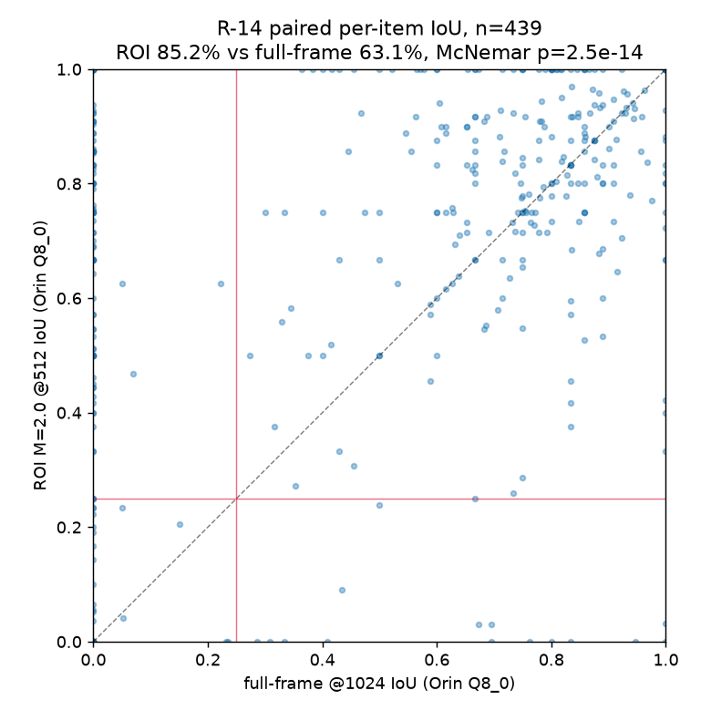

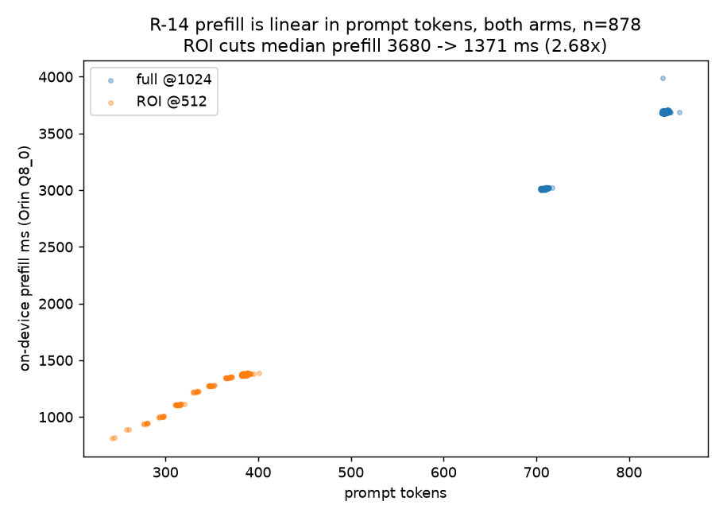

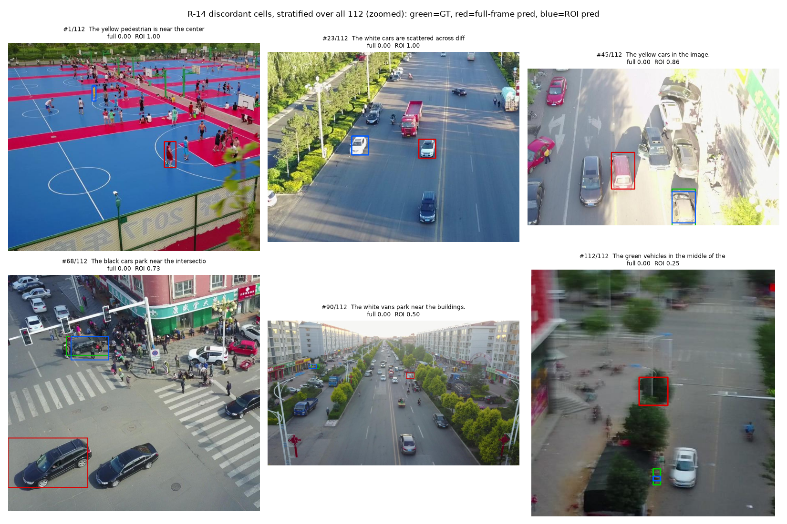

> **[FIGURA POR GENERAR]** rejilla ROI (M x resolución de salida) con los dos ejes, precisión y prefill — es el mejor resultado del proyecto y hoy no tiene imagen (prioritaria) | fuente: experiments/2026-06-25-roi-crop-anchor/sweep_summary.json | script: make_proof.py

### El recorte ROI, en código

<!-- Guion de párrafos. Sustituir cada viñeta por prosa. -->
- **P1 — Cómo se construye el recorte.** El núcleo de la palanca es `roi_window` en `grounding/roi.py`: infla la caja del prior por el factor `margin` (la M), la cuadra sobre `max(bw, bh)`, aplica un suelo `min_side` que rompe la espiral de zoom cuando la caja se encoge, y recorta y fija a los bordes del fotograma; `margin=inf` recupera el frame completo, que es el punto de control gratuito del mismo barrido. La predicción vuelve a coordenadas de imagen completa con solo la ventana de recorte (`map_to_full`), un mapeo métricamente seguro. El extracto muestra la inflación-y-recorte verbatim.

<!-- caption: grounding/roi.py:67-87 — inflación por el factor M, cuadrado, suelo min_side y recorte fijado al fotograma. -->
```python
    x1, y1, x2, y2 = (c / COORD_SCALE for c in bbox_norm)
    bw = max(1.0, (x2 - x1) * img_w) * scale
    bh = max(1.0, (y2 - y1) * img_h) * scale
    cx = (x1 + x2) / 2 * img_w
    cy = (y1 + y2) / 2 * img_h
    if shift:
        r = rng or random
        ang = r.uniform(0, 2 * math.pi)
        d = shift * max(bw, bh)
        cx += d * math.cos(ang)
        cy += d * math.sin(ang)

    if not math.isfinite(margin):
        return (0, 0, img_w, img_h)
    half = max(margin * max(bw, bh), min_side) / 2.0
    x0 = int(round(cx - half)); y0 = int(round(cy - half))
    x3 = int(round(cx + half)); y3 = int(round(cy + half))
    # Clamp to frame (edges go non-square at the border — accepted, realistic).
    x0 = max(0, min(x0, img_w - 1)); y0 = max(0, min(y0, img_h - 1))
    x3 = max(x0 + 1, min(x3, img_w)); y3 = max(y0 + 1, min(y3, img_h))
    return (x0, y0, x3, y3)
```

### Cifras de arrastre y exportación, cada una con su máquina

<!-- Guion de párrafos. Sustituir cada viñeta por prosa. -->
- **P1 — Precisión del arrastre: en la 3090, y sembrada por oráculo.** La precisión del arrastre es 0,849 a `image_size` 1024 y 0,830 a 768, sobre 186 pistas de AerialMind, **en la RTX 3090** — en la Jetson solo se midieron FPS y RAM. Está además sembrada desde una caja de verdad-terreno del primer frame: siembra oráculo, no lenguaje. La afirmación `P3-carry-OP768-accuracy` adopta OP=768 por la regla congelada, y su salvedad es que 768 se eligió **por FPS** con una barra de efecto (dentro de 5 pp del 1024 de referencia), no por igualdad: el coste de precisión, si lo hay, es pequeño y estos datos no lo separan del azar (sign test pareado por pista p = 0,013 sin deflactar, pero sobre las 93 secuencias independientes b = 28, c = 16, **p = 0,096**, y Holm lo deja en 1).
- **P2 — E1, SAM2 → TensorRT: en banco solo.** El encoder de SAM2 exportado a TensorRT fp16 [@tensorrt] sube el arrastre de **4,89 a 6,15 FPS en banco solo** (n = 1); en el bucle integrado el mismo encoder da **5,0 FPS** y despeja la puerta de ≥ 5 exactamente, perdiendo ~1,15 FPS en codificar/decodificar JPEG y en el túnel SSH. Antes de E1 la tasa co-residente era **4,1 FPS** frente a la puerta de 5: un fallo marginal registrado como tal. La afirmación `P3-E1-TRT-fps` es PASS a `image_size`=768 contra un servidor **inactivo**, y queda **superada** por R-16 (siguiente sección).
- **P3 — Paridad de máscara del export.** La exportación fp16 no cambió la aritmética: `P3-E1-TRT-mask-parity` es PASS. Su salvedad es que se trata de una comprobación de equivalencia numérica, no de una afirmación de precisión muestreada — citar "100 frames" como n sería pseudo-replicación de la clase más clara.

### Lo que costaba de verdad el par desplegado (R-16)

<!-- Guion de párrafos. Sustituir cada viñeta por prosa. -->
- **P1 — El único sitio donde se cuenta R-16, y qué retira.** Este es el único sitio del texto donde se cuenta R-16 (el Cap. 3 remite aquí), y lo que retira es grande: los **6,15 FPS quedan retirados de todas las campañas de las Partes IV y V**, que emularon esa constante. La cifra de E1 es correcta y está mal usada, que es peor que estar mal: se midió con SAM2 a `image_size` **768** con encoder TensorRT, y el sistema desplegado arrastra a **1024** en PyTorch eager. La afirmación es `P4-R16-carry-rate-1024`.
- **P2 — La corrección 2,30x, descompuesta limpiamente.** Medido en la placa el 2026-07-22, el módulo desplegado da **2,688 Hz** (2,69 Hz) — una corrección de **2,30x** sobre 6,15, que se descompone en **1,83x** por el tamaño de imagen (768 → 1024, eager, 4,906 → 2,688 Hz) y **1,26x** por haber perdido TensorRT en el camino (TRT → eager a 768, 6,190 → 4,906 Hz). La reproducción de E1 es exacta: 6,190 Hz contra los 6,15 publicados, así que el hueco no es deriva de la placa sino que 6,15 se midió en una configuración que nunca se desplegó. [ver Tabla 2][ver Figura descomposición 2,30x]
- **P3 — La co-residencia sí cuesta.** La Parte IV registró que la co-residencia no costaba FPS, pero lo midió contra un servidor **inactivo**, que solo prueba memoria. Con el servidor sirviendo la carga real de grounding, el arrastre paga un **~2,3x** notablemente uniforme (2,32x, 2,22x, 2,29x, 2,26x) y el VLM paga **~2x** (pared 3753 → 7298-8379 ms de mediana). Ninguno de los dos es inmune: comparten un mismo bus de memoria y una misma iGPU. [ver Tabla 3][ver Figura co-residencia]
- **P4 — `PRUNE_AFTER = 100` no cabe.** El anillo del arrastre está medido en **fotogramas**, así que pasar de 768 a 1024 lo infló 1,78x en bytes sin que nadie tocara la constante. Dos candidatos más el VLM bajo carga **mueren por OOM** al anillo desplegado; a `PRUNE_AFTER = 32` el mismo trabajo sobrevive a 0,540 Hz por candidato sin coste medible de tasa (2,383 vs 2,368 Hz sin servidor) y retira 2,8 GB de swap. No se ha aplicado: cambiar una constante desplegada tiene su propia puerta (¿re-encuentra un objetivo tras oclusión con un horizonte de 32 fotogramas?), cuya evidencia es P5.15 y no esta campaña; es prerrequisito de P6.2.
- **P5 — La división por N era exacta; todo el error estaba en el tamaño.** Se sospechaba que dividir por N era optimista, y es **exacto**: 743,2 ms medidos contra 744,2 predichos a N = 2 (0,14 %), y 1116,3 predichos contra 1111,6 a N = 3 (0,4 %). Todo el error de `CAND_HZ` estaba en el tamaño de imagen, no en la división. La puerta G0 confirmó además que el batching de N `obj_id` en un estado es **bit-idéntico** a N estados separados (IoU de máscara 1,000 en las 500 object-frames), y amortiza el encoder: 1,37x más rápido a n = 2, 1,56x a n = 3. [ver Tabla 4][ver Figura escalado y batching]
- **P6 — Cómo se presenta: sin p-valor ni intervalo.** No lleva p-valor ni intervalo: es descriptiva, `n_efectivo = 1`, sin hipótesis pre-registrada. Su garantía no es inferencial sino de **reproducción** — reprodujo el número publicado de E1 al tercer decimal y repitió su propia celda entre un arranque sucio y otro limpio; se defiende como caracterización determinista, jamás como un efecto medido. Dos salvedades del registro: el brazo 1024+TensorRT quedó **NO EJECUTADO** (el `enc768.plan` de la placa no sirve a 1024), así que la descomposición descansa en tres celdas y no en las cuatro de un factorial completo; y la carga VLM es un cliente cerrado reenviando una imagen y un prompt, que mide contención de memoria e iGPU, no un patrón de peticiones realista.

<!-- caption: Tabla 2. Descomposición de la tasa de arrastre por candidato (R-16, M1, n=1, en la Jetson Orin Nano 8 GB): tamaño de imagen x runtime. -->

| config | image\_size | encoder | tick ms (p50) | Hz por candidato | pico CUDA MB | MemAvailable tras estado |
|---|---|---|---|---|---|---|
| reproducción de E1 | 768 | TRT fp16 | 161,5 | **6,190** | 533 | 4173 |
| ablación de tamaño | 768 | eager | 203,9 | 4,906 | 612 | 4340 |
| **desplegado** | **1024** | **eager** | **372,1** | **2,688** | 725 | 3839 |
| stretch | 1024 | TRT fp16 | NO EJECUTADO | - | - | - |

<!-- caption: Tabla 3. Co-residencia bajo carga real de grounding (R-16, M3, en la Jetson): coste de arrastre ~2,3x, VLM ~2x, OOM a N=2 con anillo 100. -->

| celda | tick p50, sin servidor | tick p50, bajo carga | coste arrastre | VLM pared p50 | swap consumido |
|---|---|---|---|---|---|
| n=1, 1024, anillo 100 | 422,3 ms (2,368 Hz) | 979,2 ms (1,021 Hz) | **2,32x** | 7298 ms | **+2923 MB** |
| n=1, 1024, anillo 32 | 419,7 ms (2,383 Hz) | 930,7 ms (1,074 Hz) | **2,22x** | 8129 ms | +140 MB |
| n=1, 768, anillo 100 | 240,0 ms (4,166 Hz) | 549,4 ms (1,820 Hz) | **2,29x** | 7454 ms | +701 MB |
| n=2, 1024, anillo 100 | 825,5 ms (1,211 Hz) | **OOM-KILLED** | - | - | - |
| n=2, 1024, anillo 32 | 819,7 ms (1,220 Hz) | 1850,4 ms (0,540 Hz) | **2,26x** | 8379 ms | +1287 MB |

<!-- caption: Tabla 4. Escalado por N candidatos a 1024 (R-16, M2, en la Jetson): la división por N es exacta; el batching de un estado amortiza el encoder. -->

| n | mode | tick ms (p50) | Hz por candidato | medido / (n·rate(1)) | pico CUDA MB |
|---|---|---|---|---|---|
| 1 | sep | 372,1 | 2,688 | - | 725 |
| 2 | sep | 743,2 | 1,346 | **0,999x** (744,2 predicho) | 868 |
| 3 | sep | 1111,6 | 0,900 | **0,996x** (1116,3 predicho) | 1012 |
| 2 | bat | 541,9 | 1,845 | 1,37x más rápido que sep | 801 |
| 3 | bat | 711,9 | 1,405 | 1,56x más rápido que sep | 879 |

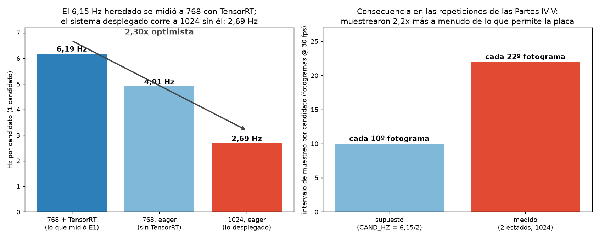

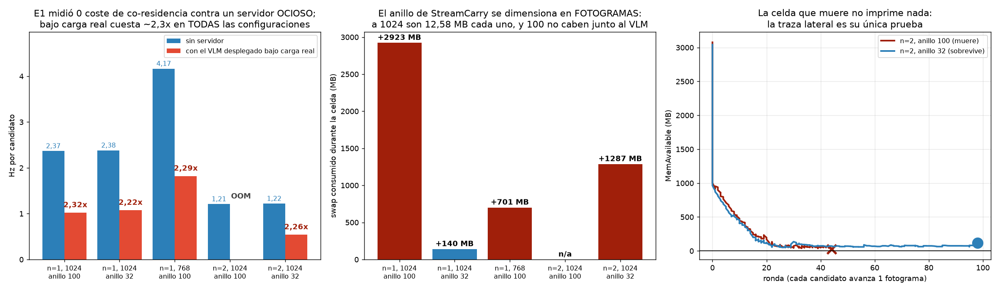

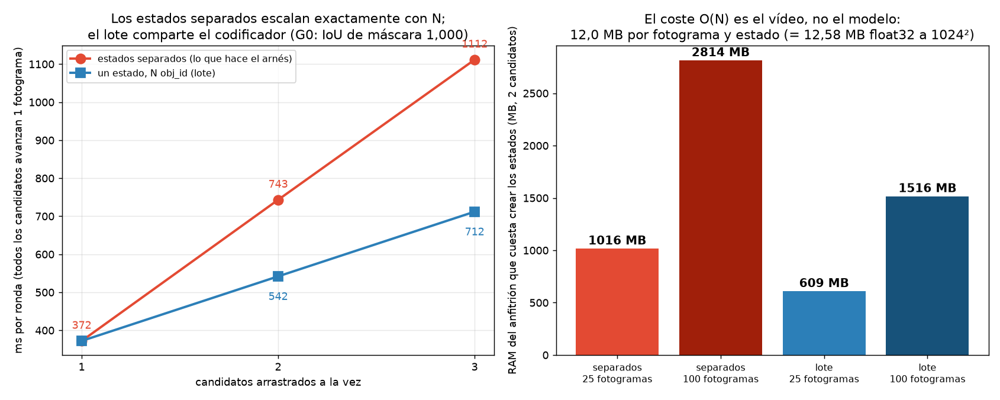

### Dos formulaciones que hay que evitar

<!-- Guion de párrafos. Sustituir cada viñeta por prosa. -->
- **P1 — "Se rechazó EdgeTAM frente a SAM2" es falso.** EdgeTAM era una alternativa condicional pre-registrada a la que nunca se llegó, porque SAM2 + TensorRT despejó la puerta en el paso anterior; nunca se midió, en ningún hardware. La formulación correcta es "no hizo falta el plan B", jamás "ganó la comparación".
- **P2 — "7,6 Hz de tasa del sistema" está inflado por fases ciegas.** Esa cifra promedia fases en las que el objetivo no se estaba fundamentando; la tasa del sistema es la de la fase de arrastre, que R-16 fija en 2,69 Hz solo y 0,540 Hz por candidato con el VLM sirviendo.

### La palanca de super-resolución, descartada por latencia

<!-- Guion de párrafos. Sustituir cada viñeta por prosa. -->
- **P1 — Swin2SR se descarta por latencia, no compra nada medible.** Swin2SR [@conde2022swin2sr] sobre el recorte ROI **no compra nada medible** por +1331 ms por recorte. La afirmación `P3-SR-swin2sr-accuracy` (medida **en la 3090**) es NO — rechazada — y el rechazo es correcto pero debe justificarse sobre la latencia, que es determinista y enorme, no sobre la precisión.
- **P2 — Corrige la nota de laboratorio: no "pierde en IoU".** El re-análisis corrige la nota de laboratorio: la campaña lo registró como "pierde también en IoU", pero sobre los datos por elemento (n = 429) ningún brazo se separa de otro. Frente a LANCZOS, b = 21 y c = 14, **p = 0,31**; frente a bicúbico, b = 22 y c = 12, **p = 0,12**; el propio bicúbico contra el nativo da p = 0,26. Escribir que Swin2SR "pierde en precisión" sería afirmar más de lo que hay. [ver Tabla 5]
- **P3 — Salvedades del probe.** Dos matices más pegados a la afirmación: la prueba usó un recorte oráculo de 400x400 centrado en la verdad-terreno, así que mide el techo que la SR podría ofrecer y no el extremo a extremo; y n = 429 tras descartar 10 muestras por una razón **no aleatoria** — los objetos más grandes no caben en 400 px. La literatura de super-resolución en teledetección [@survey2025rssr; @xiao2023ediffsr] no transfiere a este recorte.

<!-- caption: Tabla 5. Prueba pareada por elemento de la super-resolución (P3-SR-swin2sr-accuracy, en la 3090, n=429): ningún brazo se separa; el descarte es por latencia (+1331 ms). -->

| comparación | b | c | p (McNemar exacto) |
|---|---|---|---|
| LANCZOS vs Swin2SR | 21 | 14 | 0,31 |
| bicúbico vs Swin2SR | 22 | 12 | 0,12 |
| bicúbico vs nativo | - | - | 0,26 |


## El arco de la latencia de adquisición

<!-- Guion de capítulo. Cada viñeta -> un párrafo. Tablas/figuras/código ya colocados. -->

### El fallo que solo aparece con el sistema integrado

<!-- Guion de párrafos. Sustituir cada viñeta por prosa. -->
- **P1 — El fallo emergente de la integración.** Establecer que, con el proceso completo NL->ground->track->fly integrado sobre vídeo real de UAV123 [@mueller2016uav123], aparece un fallo que ningún experimento por componentes veía: la adquisición en frío tarda ~4,85 s y sobre un objetivo en movimiento **la caja se entrega obsoleta**. La frase-tesis del capítulo, literal: «el sistema no falla al encontrar el objeto; falla al encontrarlo donde ya no está». Marcar este como **el capítulo pivote** (Parte IV, E2 a E23).
- **P2 — Por qué es invisible por componentes.** Explicar que cada pieza pasa en aislamiento: el grounding (Qwen2-VL-2B [@wang2024qwen2vl]) acierta en el fotograma que vio, el arrastre SAM2 [@ravi2024sam2] mantiene bien, y el seguidor ByteTrack [@zhang2022bytetrack] funciona. El fallo es una propiedad de temporización del sistema, no de un módulo: la caja es correcta para el fotograma 0 pero se entrega en el fotograma ~146, cuando el objetivo móvil ya la ha abandonado. Solo el sistema integrado lo expone.
- **P3 — El mecanismo: retardo de entrega, no exactitud.** Establecer el *binder* del capítulo: los ~4,85 s de adquisición real en la Jetson descartan **~146 fotogramas** mientras `WallClockVideo` avanza; la caja (correcta en el fotograma que vio) se entrega **obsoleta** y siembra desde ahí el arrastre. No es un fallo de exactitud del grounding, que acierta. Esta distinción —entrega frente a exactitud— es la tesis del capítulo y lo que R-34 certifica después.

### La cifra inferencial del capítulo: E18 a n = 25 (R-34)

<!-- Guion de párrafos. Sustituir cada viñeta por prosa. -->
- **P1 — Reconciliación con el esquema: la cifra dejó de ser descriptiva.** Decir sin rodeos que el propio mapa del capítulo (`00-esquema.md`, §«Advertencias que acompañan a cada cifra de este capítulo») afirmaba «Ninguna cifra de este capítulo es inferencial; el capítulo se defiende por mecanismo, y la certificación llega en el capítulo 7 con P5.2a» porque E18 a n = 6 quedaba en **p = 0,0625** —justo fuera de alfa, con b = 5, c = 0, cuando el suelo bilateral exigía volcar los seis pares y solo volcaron cinco [claim E18-cold-acquire-vs-warm-oracle]. Esta sección **sustituye** esa línea: R-34 (posterior al esquema) lo cambió.
- **P2 — El diseño de R-34.** Detallar la re-ejecución con potencia: los **dos mismos brazos** que E18, onset en el fotograma 0, sobre las **25 secuencias de UAV123** de P5.2a (5 clases: coche, barco, persona, ciclista, wakeboarder), **una celda por clip** (regla R-29: n cuenta clústeres, no celdas; sin repeticiones intra-clip para inflar n). Brazo **COLD** (frío) = una pasada de grounding a fotograma completo en el fotograma 0, que bloquea ~4,85 s de tiempo de pared **real de Jetson** (`JetsonBackend`, q8_0 terse, 15 W + `jetson_clocks`), descarta ~146 fotogramas y siembra el arrastre con la caja obsoleta. Brazo **ORACLE** = SAM2 sembrado desde la caja GT del fotograma 0, sin VLM, REGROUND deshabilitado. **Etiqueta de máquina (obligatoria):** `machine = both` — el arrastre corrió en la 3090, pero la capa de anclaje en frío es tiempo de pared **real de Jetson** vía `JetsonBackend`.
- **P3 — El resultado y su certificación.** Dar las cifras exactas: **ORACLE 23/25 vs COLD 3/25; b = 21, c = 1**. Deflación R-29: solo `car3`/`car3_s` y `person1`/`person1_s` comparten vídeo de origen y ambos clústeres son internamente concordantes, así que el ICC superior 95 % = 1,0 los colapsa por completo -> **n_eff = 23** (b = 19, c = 1). **McNemar exacta: p = 1,10e-05 cruda / 4,01e-05 deflactada / 3,61e-04 Holm (Parte IV) / 1,36e-03 Holm (global)** — sobrevive a Holm por Parte y global [claim E18-cold-acquire-vs-warm-oracle-n25] [ver Tabla y Fig. rejilla-PASS].
- **P4 — Qué significa la promoción.** Enunciar el titular del capítulo: E18 pasa de «negativo sin potencia que motivó la Parte V» (p = 0,0625, n = 6) a **confirmado a n = 25**. Es el **único superviviente inferencial de la Parte IV** y el 9.º superviviente de Holm global del registro. El número que lanzó la Parte V ya se sostiene sobre inferencia, no solo sobre mecanismo.
- **P5 — El binder es entrega, no exactitud, y no se atenúa.** Cerrar el caso: COLD quedó en **3/25**, no en el ≥10/25 pre-registrado como sorpresa —en el conjunto amplio el efecto **no se atenuó, se reforzó**. La única celda a favor de COLD es `car1_s` (cobertura ORACLE 0,41 < 0,50 por **deriva del arrastre**, no una victoria del brazo frío). Corroboración independiente ya en disco: P5.2a corrió estos mismos brazos con onset a mitad de vuelo (t_p = 8 s) dando **ORACLE 22/25 vs COLD 5/25 (b = 17)** —segundo régimen de onset que concuerda, **no contado dos veces**. El retardo de entrega (~146 fotogramas) es idéntico en los tres regímenes, luego el desplazamiento de onset es inmaterial (P5.2b: efecto plano en velocidad) [ver Fig. efecto-3regímenes].
- **P6 — Verificación visual del par discordante (regla «mírala»).** Cerrar con la evidencia de píxeles: `bike1` fotograma 300 —ORACLE mantiene la caja verde sobre el ciclista (enganchada, PASS); COLD lee `LOST` con solo la caja GT roja, porque la semilla obsoleta del fotograma ~141 nunca se recuperó [ver Fig. discordante-bike1].

<!-- caption: E18-n25 (R-34): resultado pareado ORACLE vs COLD sobre 25 secuencias de UAV123, onset en el fotograma 0; carry en 3090, anclaje en frío en tiempo de pared real de Jetson (machine = both) -->
| Brazo | PASS | McNemar (crudo -> deflactado) | p exacta | tras Holm |
|---|---|---|---|---|
| **ORACLE** (seed GT fotograma 0) | **23/25** | b = 21, c = 1 -> b = 19, c = 1 (n_eff = 23) | **4,01e-05** (deflactada; 1,10e-05 cruda) | 3,61e-04 (Parte IV) / 1,36e-03 (global) |
| **COLD** (anclaje en frío ~4,85 s) | **3/25** | — | — | — |

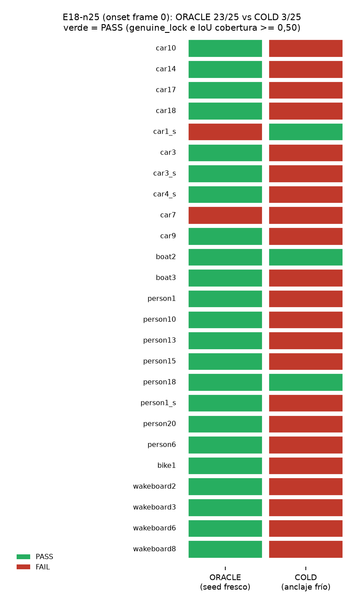

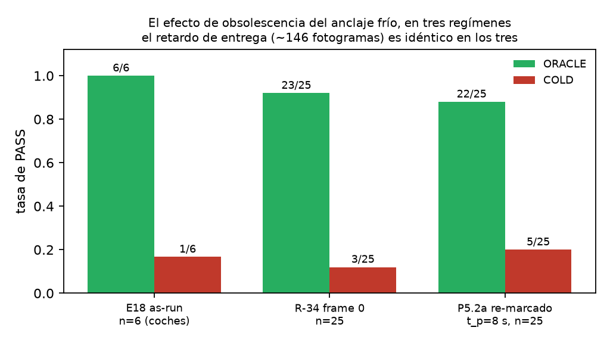

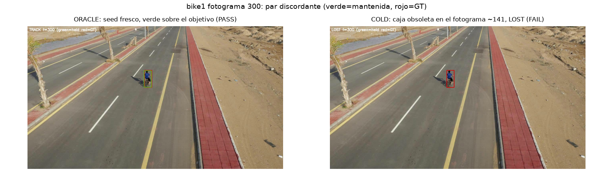

### Intentos de arreglarlo por la vía directa: E19-E23

<!-- Guion de párrafos. Sustituir cada viñeta por prosa. -->
- **P1 — E20: la única sub-2 s que funciona, pero no es autónoma.** Pista de recorte tomada de la frase del operador: adquisición **1,85 s**, una reducción de latencia **2,6x** frente a los 4,85 s, con causa determinista (menos tokens de prefill) y por tanto sin valor p —modelo de coste, no muestra ruidosa [claim E20-acquire-latency, «measured, not gated»]. En tasa de PASS **voltea 3/6** frente a 1/6 de la base (b = 2, c = 0, p = 0,50): la mitad de latencia es real, la mitad de tasa **no es evidencia** [claim E20-operator-crop-hint, PARTIAL hint-fragile].
- **P2 — E19: compensación de movimiento.** Adquisición con compensación de movimiento (búfer de flujo óptico): **PARTIAL [flow-fragile]**, con **un solo par discordante** (b = 1, c = 0, p = 1,0) —estadísticamente vacuo frente a la línea base E18-A; registrado como fallo en alcanzar la puerta, no como «la compensación de movimiento no funciona» [claim E19-motion-compensated-acquire].
- **P3 — E21/E22/E23: automatizar la pista, tres fracasos con causa medible.** Enumerar los tres: **E21** coarse-to-fine (segunda pasada del VLM) **NO**, b = 2, c = 0, p = 0,50, con la votación gruesa de celda acertando solo 2/6 —falla en un paso intermedio medible [claim E21-coarse-to-fine]. **E22** prior de visión clásica en CPU (Phase 0) **NO [prior-insufficient]**, mató la matriz antes de correrla con 2 abstenciones estructuralmente correlacionadas en t = 10 s [claim E22-cv-prior-phase0, `machine = rtx-3090`]. **E23** celda más ancha **NO (REGRESSIVE)**, b = 0, c = 2, p = 0,50, con el barrido de contención offline (HW* = 0,38 se mantiene en 6/6 clips y 19/19 formulaciones) que explica por qué ensanchar no puede ayudar [claim E23-tolerant-cells].
- **P4 — El arco de latencias.** Recoger la escalera cuantitativa: **4,85 s (E18 frío) -> 1,85 s (E20) -> 2,73 s (E21/E22) -> 2,80 s (E23)**, y la escalera de velocidades del objetivo. Es el eje del capítulo y hoy no tiene figura [ver Figura por generar].

> **[FIGURA POR GENERAR]** figura cuantitativa del arco de latencias (4,85 -> 1,85 -> 2,73 -> 2,80 s) y la escalera de velocidades del objetivo | fuente: runs Parte IV E18-E23 | script: make_proof.py

> **[CLIP]** ../experiments/2026-07-03-real-video-replay/proof/car9_A_vs_B.mp4 — LA figura titular de la Parte IV: la adquisición real contra su control (frío obsoleto vs fresco).

> **[CLIP]** ../experiments/2026-07-04-prompt-scoped-acquire/proof/wrong_car10_r1_wrongprobe.mp4 — fragilidad de E20: una pista espacial equivocada hace alucinar al VLM (cobertura 0,000).

### La inferencia que arrastra el resto del documento

<!-- Guion de párrafos. Sustituir cada viñeta por prosa. -->
- **P1 — Cuatro intentos, tres fracasos, un éxito no autónomo.** El recuento: E19, E21, E22 y E23 fallan al automatizar la pista; E20 funciona pero exige una frase espacial correcta del operador. La conclusión **no** es «hay que optimizar más».
- **P2 — El problema está mal planteado.** El razonamiento que arrastra el resto del documento: si la orden llega en t y la respuesta en t + 4,85, ninguna optimización sobrevive a un objetivo que se mueve. Hay que cambiar **cuándo empieza** el cómputo, no cuánto dura. Eso es la Parte V.
- **P3 — El puente a la Parte V.** Anticipar la reformulación: el flujo previo a la orden (pre-prompt) es cómputo gratis; mantener los objetos salientes arrastrados sobre la ventana ociosa y **seleccionar al recibir la orden**, en vez de adquirir en frío bajo presión de tiempo. El hallazgo de retardo de entrega de E18-n25 es exactamente lo que el warm-start elimina, y P5.2a (Cap. 7) es lo que certifica esa victoria.

### Las advertencias que siguen vigentes para el arco n = 6

<!-- Guion de párrafos. Sustituir cada viñeta por prosa. -->
- **P1 — El cable: los ~4,85 s incluyen SSH y base64.** Advertir que los ~4,85 s se midieron con un PNG sin pérdidas en base64 cruzando un túnel SSH desde la estación de trabajo hasta la Jetson —sobrecarga que un despliegue con cámara a bordo no pagaría. El instrumento `transfer_ms`, construido para esta pregunta, nunca se ejecutó sobre la cifra titular de E18, y quedan **~450 ms sin atribuir** entre el `t_lock` de 4,85 s y la mediana instrumentada de 4400 ms. (Nota: la pata COLD de R-34 sí usa tiempo de pared real de Jetson vía `JetsonBackend`; el cable afecta a la descomposición de los 4,85 s, no al veredicto n = 25.)
- **P2 — El arco E19-E23 sigue siendo descriptivo/por-mecanismo.** Precisar que, salvo E18 (ya inferencial vía R-34), el resto del arco es **n = 6 clips, todas coches, un solo dataset**, con captions congeladas a mano, n = 2 repeticiones por celda, **solo percepción** (sin actuación ni vehículo en el lazo) y con el arrastre en la 3090 limitado a 6,15 Hz como sustituto del Orin —**cifra retirada por R-16**: la tasa desplegada es **2,69 Hz** a `image_size` 1024; los 6,15 Hz se midieron a 768 e son inmateriales al binder de retardo de entrega. Los veredictos son 1/6, 2/6 y 3/6 (diferencias de una sola clip); la prueba corre —McNemar exacta— pero no llega: E20/E21/E23 en p = 0,50 (2 discordantes), E19 en p = 1,0 (1 discordante).
- **P3 — E20 no es autónomo, y una pista equivocada es peor que ninguna.** Repetir el matiz clave: E20 exige una frase espacial correcta, y una pista **equivocada** envenena la plantilla de máscara (cobertura 0,000, cero recuperación). El encuadre honesto es «un rodeo con humano en el lazo que resistió tres intentos de automatización», no «una solución» [ver el clip `wrong_car10` arriba].
- **P4 — El techo de 2,5 m/s se midió contra render nadir sintético.** Advertir que el techo de seguimiento de **2,5 m/s (3,0 con chase-hold)** se midió en SITL contra un renderizador nadir sintético (textura plana, rover dibujado a 640x480), no sobre imagen real, con n = 2 o 3 por peldaño. El propio repositorio lo refuta: E11 dio PASS a 3,5 m/s con 2/2 y **E12 lo revirtió** a n = 3 [claim E10-fast-follow-ceiling, ceiling 2,5 m/s].
- **P5 — E14 no replica; E15 es NO MEDIBLE.** Cerrar las salvedades: el «3/3, agujero de identidad cerrado» de E14 [claim E14-identity-hole, YES] se convierte en **6/8 CUALIFIED y explícitamente no fiable** en la replicación E16 —la puerta pre-registrada 7/8 era estadísticamente inalcanzable a n = 8 (Wilson [0,36, 0,89]) [claim E16-relock-replication, QUALIFIED 6/8]. Matiz atenuante: **0 de 8 violaron la identidad**, así que los dos fallos son de temporización aguas arriba de la puerta, no de la puerta. Y los números de estrés de E15 quedan registrados pero **no reclamados**: falló su guarda de línea base, veredicto **NO MEDIBLE**.

### Lo que se comprime: E2-E17 en una sola tabla

<!-- Guion de párrafos. Sustituir cada viñeta por prosa. -->
- **P1 — La compresión y su condición no negociable.** Justificar el recorte: el capítulo baja de 10 a 8 páginas comprimiendo **E2 a E17** —el controlador de seguimiento, la puerta de máscara y el arco de re-anclaje— de narración a **una sola tabla**. E18-E23 se conserva entero porque motiva la Parte V. La condición es no negociable: **la tabla lleva columna de causa** (`match/carry/timing/no-medible`). Sin ella el recorte destruye evidencia, porque lo que estos experimentos aportan no es un recuento de fracasos sino su **taxonomía**. (Los legs más tempranos E2-E8 son la construcción del controlador de seguimiento y no llevan afirmación inferencial propia en el registro.)
- **P2 — Lo que la columna de causa preserva.** Señalar que un «0/3» borraría tres causas distintas: **E11 revertido por E12** es un fallo de tamaño de muestra; **E14 no replicado en E16** es un fallo de temporización aguas arriba de una puerta que nunca se violó (0/8); **E15** es un NO MEDIBLE por guarda de línea base. Esa taxonomía es el contenido, no el recuento.

<!-- caption: E2-E17 comprimido: controlador de seguimiento, puerta de mascara y arco de re-anclaje, con columna de causa obligatoria (match/carry/timing/no-medible). Etiqueta de máquina por fila -->
| ID | Qué probó | Veredicto | n | Máquina | Causa del límite |
|---|---|---|---|---|---|
| E9-retarget-switch | conmutación de re-objetivo | YES | 3/3 | ambas | — (mecanismo válido) |
| E10-fast-follow-ceiling | techo de velocidad de seguimiento | techo 2,5 m/s (3,0 chase-hold) | 4 config. | ambas | carry/control |
| E11 | seguimiento a 3,5 m/s | PASS 2/2 — revertido por E12 | 2 | SITL [VERIFICAR] | muestra (n insuficiente) |
| E12 | replicación de E11 a n = 3 | REVIERTE E11 | 3 | SITL [VERIFICAR] | muestra |
| E13-colour-gate | puerta de color | NO | 0/3 | ambas | match |
| E14-identity-hole | cierre del agujero de identidad | YES (3/3) — no replica | 3 | ambas | timing (aguas arriba) |
| E15 | prueba de estrés | NO MEDIBLE (falló guarda de línea base) | — | [VERIFICAR] | no-medible |
| E16-relock-replication | replicación de E14 | QUALIFIED 6/8 (0/8 violan identidad) | 8 | ambas | timing (aguas arriba de una puerta no violada) |
| E17-reground-chase | re-grounding + chase-hold | NO (0/10) | 10 | ambas | carry |


## Grounding anticipatorio

<!-- Guion de capítulo. Cada viñeta -> un párrafo. Tablas/figuras/código ya colocados. -->

### El planteamiento anticipatorio y la tesis del capítulo

<!-- Guion de párrafos. Sustituir cada viñeta por prosa. -->
- **P1 — El problema que cierra la Parte IV.** Establecer el cuello de botella heredado: la adquisición en frío de ~4,85 s aterriza una caja obsoleta sobre objetivos en movimiento (E18, Cap. 6), y todas las automatizaciones sub-2 s fracasaron; ese retardo de entrega es lo que la Parte V ataca. Enlazar con Parte IV sin re-narrarla.
- **P2 — La premisa del cómputo libre.** La orden del operador llega a mitad de vuelo, no en el frame 0: el flujo previo a la orden es cómputo gratuito. En vez de adquirir en frío bajo presión temporal, se mantiene el objeto saliente arrastrado sobre la ventana ociosa y se selecciona al recibir la orden. Citar la reformulación `experiments/PART5-PROPOSAL-anticipatory-grounding.md`.
- **P3 — Los dos contratos en tensión.** Distinguir **mantener-y-entregar** (arrastrar el objetivo nombrado y entregar la pista ya viva) de **seleccionar-entre-candidatos** (nombrar uno de varios y vincularlo en el instante de la orden). El capítulo defiende el primero y entrega el segundo como propuesta medida, no como resultado.
- **P4 — La frase-tesis del capítulo.** Enunciar sin ambigüedad: mantener-y-entregar es **inferencial** (descansa en P5.2a, la única celda no-definicional de la Parte V que sobrevive a Holm); el refinamiento de selección **no** lo es; y el selector multi-candidato **ni siquiera cabe en la placa** (R-16, Cap. 5). Pila técnica bajo prueba: VLM Qwen2-VL-2B q8_0 desplegado [@wang2024qwen2vl] + arrastre SAM2 [@ravi2024sam2] + ByteTrack [@zhang2022bytetrack], sobre clips UAV123 [@mueller2016uav123].
- **P5 — El mapa de los cuatro hilos.** Anticipar la estructura: (i) mantener-y-entregar funciona; (ii) seleccionar es donde duele; (iii) lo que sí lo desbloqueó (el contrato de entrega directa); (iv) dónde está el límite. Más dos cierres: por qué el selector se queda en propuesta, el desvío de simulación, y un superviviente que se reporta aparte (P5.12). No se narran veinte experimentos en orden: se narran los hilos.
- **P6 — Disciplina de máquina, declarada una vez.** Advertir que casi todo número de la Parte V es `machine = ambas`: el anclaje del VLM corrió en la **Jetson Orin Nano 8 GB (15 W + jetson_clocks)** y el arrastre de SAM2 corrió en la **RTX 3090** con tope de tasa; "todo corre en la placa" es **falso**. Toda tabla que mezcle precisión-3090 con tasa-Jetson etiqueta la máquina por celda.

### Mantener y entregar funciona: lo que se defiende

<!-- Guion de párrafos. Sustituir cada viñeta por prosa. -->
- **P1 — El mecanismo, P5.1.** La semilla-VLM de la ventana ociosa + puesta-al-día de SAM2 + selección-a-la-orden aterriza **5/6** en los clips `car*` de UAV123 donde la adquisición en frío bloqueante aterriza **1/6**, e **iguala exactamente** al oráculo con semilla de verdad-terreno. McNemar exacto bilateral b=4, c=0, **p=0,125**, n efectivo 6. Verdict `YES [carry-bound]` [ver claim P5.1-warm-vs-cold] [ver Tabla McNemar].
- **P2 — Por qué P5.1 no puede ser el titular.** El p=0,125 no alcanza alfa por sí solo: con n=6 harían falta seis discordantes en una dirección y hubo cuatro. Lo que hace defendible la afirmación no es el conteo sino la **comprobación estructural de superconjunto** pre-registrada (el conjunto PASS de WARM contiene el de COLD) más la coincidencia exacta con el oráculo. La certificación la aporta P5.2. Marcar como mecanismo, no como prueba.
- **P3 — El titular, P5.2a.** Barrido de 25 clips x 5 categorías: **WARM 21/25 vs COLD 5/25**. Deflactado a **23 clips independientes**: b=15, c=0, **McNemar exacto bilateral p=6,10e-05**, y **sobrevive a Holm** por Parte (0,001282) y global (0,002258). Sin deflactar era b=16, c=0, p=3,05e-05. Es la única celda no-definicional de la Parte V que sobrevive a Holm: **el ancla estadística del capítulo** [ver claim P5.2a-warm-generalization]. Citar la cifra deflactada (invariante I2 del HANDOFF).
- **P4 — La salvedad que viaja con el titular.** De las cuatro perdidas de WARM, **dos son degeneradas**: el objetivo no está en el frame de entrega, así que el oráculo también falla. Sobre el conjunto no degenerado la cifra correcta es **21/23 = 91%**, y ese calificador debe viajar pegado a la cifra siempre.
- **P5 — Por qué gana: eliminación del retardo, no compensación de movimiento.** P5.2b: la brecha WARM-COLD es **plana en la velocidad del objetivo en pantalla** (Spearman **rho = -0,06**). Es una hipótesis direccional pre-registrada (exigia rho > 0) que salió nula. Salvedad obligatoria: el barrido **no tiene p-valor ni intervalo**, así que sostiene "no se observa dependencia de la velocidad", **no** "es plano" [ver claim P5.2b-speed-sweep]. Consecuencia mecanística: la victoria del warm-start es **eliminación del retardo de entrega**, no compensación de movimiento; el frío falla en general con independencia de la velocidad.
- **P6 — La tabla inferencial de la Parte V.** Introducir la tabla McNemar como el resumen estadístico del capítulo: solo P5.2a alcanza y sobrevive; P5.1 no por sí solo; P5.10/P5.13/P5.17 no corrieron prueba útil; P5.19 es compatible con el azar. Todos los b/c son **posteriores a la deflación** por unidad independiente (R-4).

<!-- caption: Inferencia post-hoc sobre los resultados con puerta de la Parte V, generada desde los volcados por elemento -->

| Resultado | Discordancia | McNemar exacto | Lectura |
|---|---|---|---|
| P5.1 WARM 5/6 vs COLD 1/6 | b = 4, c = 0 | p = 0,125 | No significativo por sí solo |
| P5.2a WARM 21/25 vs COLD 5/25 | b = 15, c = 0 | **p = 6,10e-5** | **El ancla estadística de la parte**; sobrevive a Holm |
| P5.10 DD 24/24 vs RG 24/24 | b = 0, c = 0 | **indefinido** | No hubo prueba, no hubo empate demostrado |
| P5.13 y P5.17 | b = 0, c = 0 | **indefinido** | La única celda discordante se colapsa al agrupar por clip |
| P5.19 SWAP 20/26 vs P5.18 17/26 | b = 2, c = 0 | p = 0,5 | Compatible con el azar |

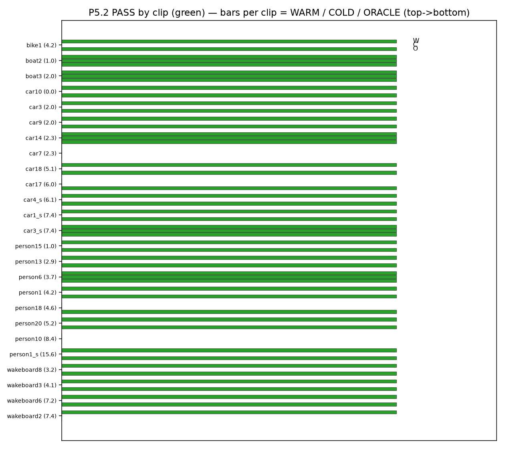

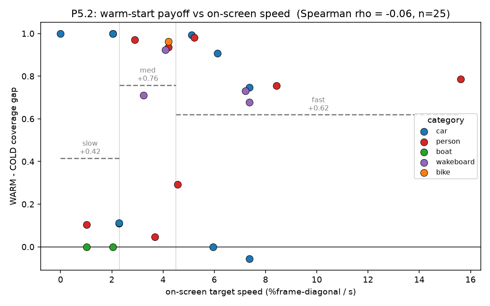

> **[CLIP]** ../experiments/2026-07-04-warm-start-acquire/proof/car10_warm_vs_cold.mp4 — la caja obsoleta a 135 frames: warm-start entrega la pista viva mientras la adquisición en frío aterriza una caja caducada sobre el coche ya desplazado.

### Seleccionar entre candidatos es donde duele

<!-- Guion de párrafos. Sustituir cada viñeta por prosa. -->
- **P1 — Seis intentos, agrupados por causa y no por número.** Establecer que la selección-entre-candidatos fracasó seis veces (P5.3, P5.4, P5.5, P5.10, P5.13, P5.17) y que el interés está en la **causa** de cada fallo, no en la secuencia. Introducir la tabla como el mapa de causas. Todas las celdas son `machine = ambas` (VLM en Jetson, arrastre/render en 3090); ninguna mezcla FPS con precisión.
- **P2 — Las tres primeras: puerta inalcanzable, no evidencia de que la selección no funcione.** P5.3/P5.4/P5.5 corrieron un diseño de un brazo contra un nulo 0,8 donde **incluso 5/5 da p=0,33**: ningún resultado posible podía limpiar la puerta 4/5 en sentido inferencial. Son paradas de ingeniería legítimas, no pruebas de que seleccionar no funcione [claims P5.3/P5.4/P5.5]. P5.4 además arrastra sesgo de piloto (3/5 escenas ya vistas); su única pata sólida es la latencia (adquisición 4,9 s -> 2,08 s), determinista y válida aparte.
- **P3 — P5.5 aporta el mecanismo, no la inferencia.** El re-anclaje ocioso disparó y fue aceptado en **16/16** celdas, y aun así **dos NO_MATCH por deriva de arrastre sobrevivieron** — coches de la misma clase. Ese diagnóstico, no el conteo, es lo que motivó el cambio de contrato de entrega del hilo siguiente [claim P5.5-select-generalization].
- **P4 — Las tres de simulación: empates sin prueba.** P5.10/P5.13/P5.17 empataron los contratos DD (entrega directa) y RG (re-anclaje) en el banco Gazebo. Con **0 pares discordantes** (P5.10) o **uno** (P5.13/P5.17), McNemar es indefinido o p=1,0: **no demuestran equivalencia**, solo que el banco no pudo discriminar. Se desarrollan en el desvío de simulación (7.7). Adelantar la conclusión: la ventaja del contrato bueno vive en la fragilidad ante imagen real, y un render limpio la borra.

<!-- caption: Los seis intentos de selección-entre-candidatos de la Parte V, agrupados por causa; McNemar exacto bilateral y n deflactado; Máquina = ambas en toda la tabla (VLM en Jetson, arrastre/render en RTX 3090) -->

| Resultado | Contraste (aciertos) | McNemar / n_ef | Máquina | Causa | Lectura |
|---|---|---|---|---|---|
| P5.3 multi-candidate | WSEL 3/5, SWAP 2/5 (puerta 4/5) | binomial, n_ef=4, p=0,973 | ambas | match-bound | puerta inalcanzable: incluso 5/5 da p=0,33 contra el nulo 0,8 |
| P5.4 crop-select | VSEL 3/5, VSWP 3/5 | binomial, n_ef=4, p=0,973 | ambas | match/resolution-bound | sesgo de piloto; la latencia 4,9 s -> 2,08 s se sostiene aparte |
| P5.5 select-generalization | WSEL 4/5, SWAP 3/5 | binomial, n_ef=3, p=0,896 | ambas | match/carry-bound | re-anclaje aceptado 16/16, pero 2 NO_MATCH por deriva sobreviven |
| P5.10 simbank-select | DD 24/24 vs RG 24/24 | McNemar b=0 c=0, indefinido | ambas | scene-bound | 0 discordantes: no hubo prueba, no equivalencia |
| P5.13 dd-vs-rg | DD 24/24 vs RG 23/24 | McNemar b=1 c=0, p=1,0, n_ef=15 | ambas | scene-bound | 1 discordante; defecto de orden de profundidad |
| P5.17 dd-vs-rg n=56 | DD 56/56 vs RG 55/56 | McNemar b=1 c=0, p=1,0, n_ef=41 | ambas | scene-bound | de 24 a 56 no dio potencia; discriminación sim CERRADA |

### Lo que sí lo desbloqueó: el contrato de entrega directa

<!-- Guion de párrafos. Sustituir cada viñeta por prosa. -->
- **P1 — El cambio de contrato, P5.14.** El desbloqueo no fue un modelo mayor sino cambiar **el contrato de entrega**: entregar la pista **ya arrastrada** en vez de re-anclar al recibir la orden. Primer YES de selección sobre video real: WSEL **5/5** con `acquire_s = 0,00` frente a **4,51 s** del re-anclaje [claim P5.14-wsel].
- **P2 — La salvedad definicional obligatoria.** `acquire_s = 0,00 s` es **definicional, no medido**: no hay paso de adquisición que cronometrar porque la tubería ya corría. Es válido como enunciado del contrato, pero decir "hicimos la adquisición 4,5 s más rapida" **sin** añadir que el coste se trasladó a la tubería que corre continuamente durante la espera es engañoso. Pegar esta frase al 0,00.
- **P3 — Y por qué la cifra de P5.14 no se cita.** 5/5 contra un nulo 0,8 da p=0,33: la puerta no se limpió inferencialmente a este n. P5.18 re-corrió la afirmación a n=26 y halló la tasa real cerca de 0,85 (WSEL) y 0,65 (SWAP): **se cita P5.18, no P5.14**. La celda SWAP 4/5 daba p=0,74, literalmente lo que predice el nulo [claims P5.14-wsel, P5.14-swap].
- **P4 — Quitar el oráculo de la semilla, P5.16.** Se elimina la semilla de verdad-terreno: WSEL cuesta **exactamente una celda de doce** (4/5). Pero el número que importa no es ese 4/5, sino **24/24 descubrimientos VLM de la ventana ociosa aceptados**, que hace la tubería **GT-free de extremo a extremo** — una afirmación de capacidad con denominador limpio [claim P5.16-autodisc-wsel].
- **P5 — P5.16 no es un resultado vigente.** Advertir de entrada que su 4/5 fue **derribado por P5.18** con el mismo arnés byte a byte: la tasa real es 17/26 = 0,65. Se presenta como un paso cuyos números no sobrevivieron, no como un logro. Encadena directamente con el hilo del límite.

### Dónde está el límite: el arrastre, la entrega y las palancas muertas

<!-- Guion de párrafos. Sustituir cada viñeta por prosa. -->
- **P1 — La pregunta del hilo.** Si mantener-y-entregar funciona y seleccionar duele, ¿dónde está exactamente el límite? Adelantar la respuesta: el arrastre **no** es la parte frágil (aguanta 24 s), la entrega a tamaño real deja un residuo (SWAP), y todas las palancas de capacidad y de recorte para el arrastre están **muertas**.

#### El arrastre aguanta: P5.15, P5.20 y P5.21 cierran las palancas de carry

<!-- Guion de párrafos. Sustituir cada viñeta por prosa. -->
- **P1 — El arrastre no es la parte frágil, P5.15.** Un arrastre cálido **no mantenido** sobrevive una ventana ociosa de 24 s en **24/25** clips, contra el suelo pre-registrado de 18/25 (0,72): p exacta unilateral **0,002908**. Salvedad estadística pegada: bajo Holm por Parte sube a **0,05525 — NO sobrevive**, y bajo la familia global a **0,09887, tampoco**. Registrar por qué cambió: sí sobrevivía por los pelos (0,04653) mientras la Parte V tenía m = 18; al registrarse R-36, R-38 y P5.21 el 2026-07-24 la familia creció a m = 21, el umbral de Holm se estrechó y la afirmación cayó al otro lado. Es el precio previsto de corregir por Parte, y se deja escrito porque no es intuitivo: seguir corriendo experimentos dentro de una Parte encarece retroactivamente las afirmaciones ya publicadas de esa misma Parte. Lo que se sostiene es descriptivo y sigue siendo carga útil: Wilson [0,80, 0,99], **el arrastre no es la parte frágil**, lo que redirige el análisis de fallo hacia entrega y selección. El YES inferencial de la Parte V es P5.2a, no este [claim P5.15-plain-carry-survival].
- **P2 — El re-anclaje ocioso es una regresión neta, retirado.** P5.15 también midió la palanca desplegada: PLAIN 24/25 vs MAINT 22/25 a los 16 s, b=3 c=1, **p=0,625**. La regresión **no** está establecida estadísticamente; lo honesto es que el mantenimiento no compró nada medible y costó cómputo. El mecanismo (100/100 re-anclajes aceptados sin suelo de IoU, causando intercambios de identidad entre objetos de la misma clase) es la evidencia diagnóstica que justifica retirar la palanca [claim P5.15-maint-vs-plain].
- **P3 — Un SAM2 mayor recupera cero, P5.20.** Palanca de capacidad: SAM2 hiera-small (46M) **recupera 0 celdas de selección y regresa 1** (b=0, c=1, p=1,0). No es evidencia de que la capacidad no ayude, sino de que este diseño no vio efecto en ninguna dirección; lo que hace defendible "palanca muerta" es el **mecanismo**: el mismo bloqueo de deriva entre coches de la misma familia aparece en ambos brazos [claim P5.20-carry-capacity]. "Usar un tracker más grande" es una palanca muerta.
- **P4 — La ultima palanca de carry no-de-capacidad, P5.21 (nuevo).** El re-anclaje ROI-crop + lanczos (MARGIN 2.0 / RES 512 / LANCZOS4), adoptado para el prefill de adquisición, se prueba **por primera vez como contraste de resultado de arrastre** en secuencias duras: **plain 28/34 vs ROI 26/34**, McNemar b=1, c=3, **p=0,625, dirección CONTRA ROI** (c>b). b+c=4 < el suelo de 6 discordantes: ninguna prueba alcanza alfa, Holm moot. Piloto retenido 5/8 = 0,62 (headroom real, no artefacto de banco facil). Arrastre limitado a la tasa desplegada **2,69 Hz** (R-16; stride 11) para no clavar ambos brazos al techo [claim P5.21-roi-carry].
- **P5 — El refuerzo de deriva materializado.** El fallo pre-registrado de refuerzo de deriva ocurrio: en **car10** el re-anclaje recortó alrededor de una caja ya desviada, el VLM on-device fundamentó fuera de objetivo y la pista se perdió mientras plain aguantaba (IoU 0,86). Un único acierto del lado b (car14: ROI recupera un coche pequeño que plain perdió) queda superado 3 a 1. Conclusión: **ROI se queda solo para el prefill de adquisición**; no es una mejora de arrastre. Consistente con P5.15 (el arrastre no es frágil) y P5.20 (un SAM2 mayor no recupera nada): **la ultima palanca de carry no-de-capacidad queda medida y cerrada**. Nota de máquina: la re-anclaje ROI del brazo B fundamentó en la **Jetson** (q8_0, JetsonBackend); el arrastre SAM2 corrió en la 3090; el PASS/McNemar es independiente de máquina (IoU final vs GT).

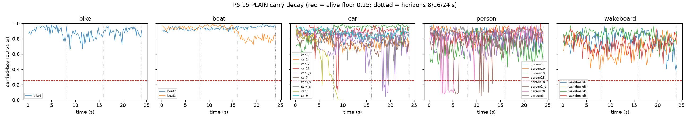

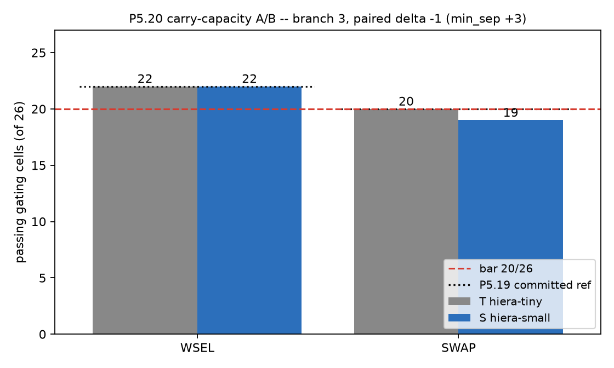

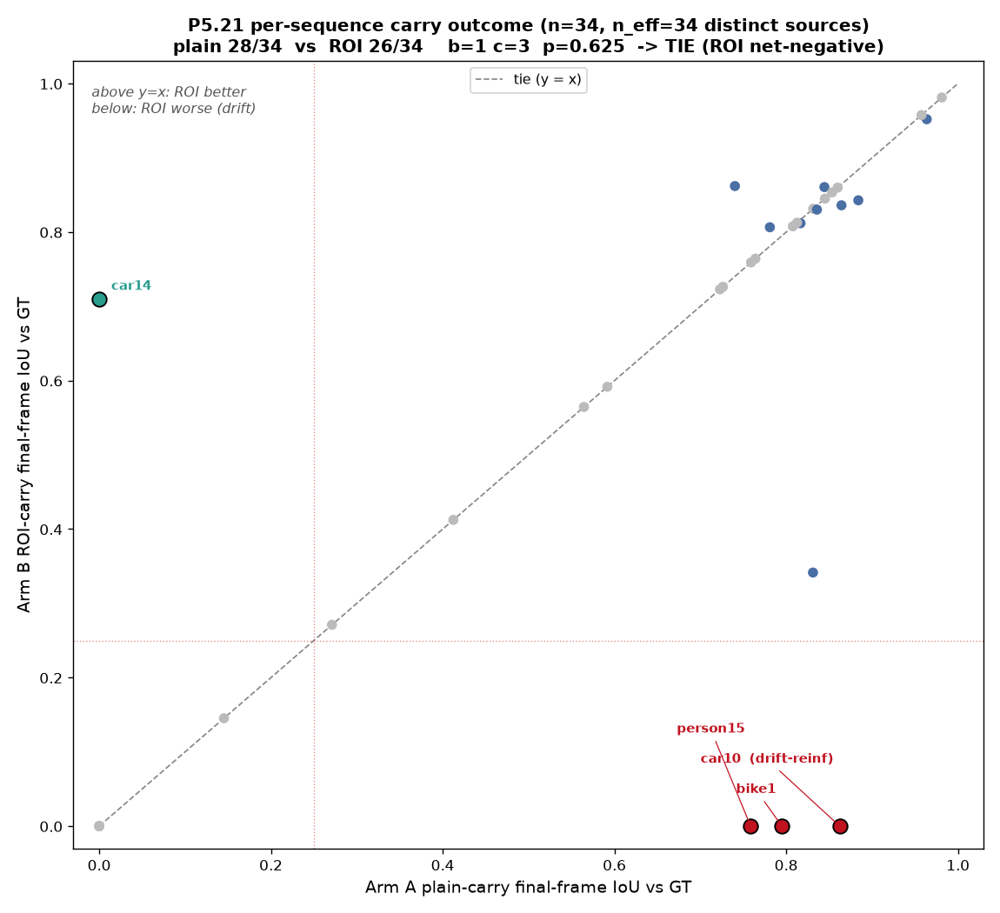

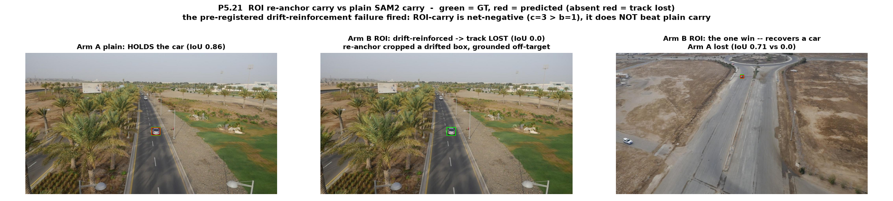

#### El listón de la entrega a tamaño real: P5.18 y la advertencia de P5.19

<!-- Guion de párrafos. Sustituir cada viñeta por prosa. -->
- **P1 — La entrega a n real, P5.18.** Re-corrida a n=26: **WSEL 22/26 = 0,846** contra el listón 0,8 — limpia **descriptivamente** (p exacta 0,37, Wilson [0,67, 0,94] contiene la puerta), la frase correcta es "compatible con la tasa pre-registrada", no "la supera". Pero **SWAP reforzado cae a 17/26 = 0,65 y no llega** [claims P5.18-n25-wsel, P5.18-n25-swap].
- **P2 — El repositorio cazando su propio error.** El detalle más valioso del re-análisis: en las 5 celdas compartidas P5.18 reproduce P5.16 **exactamente** (4/5, cero cambios); todo el vuelco viene de las **21 celdas nuevas**, donde SWAP es 13/21 = 0,62. Demostración directa y medida de que **el 4/5 de P5.16 era optimismo de n pequeño** — la tasa real de SWAP es 0,65. Esta es la figura que obliga a poner P5.18 [ver Figura de trayectoria con Wilson].
- **P3 — El rescate de entrada tardía, P5.19.** Dedup alineado (el guardia de P5.18 estaba desalineado por frame y disparó 0/108) + entrega con gracia acotada (0,37-0,60 s vs 4,68 s en frío) voltean SWAP **17/26 -> 20/26** con cero regresión de WSEL (22/26 -> 22/26, ninguna celda cambia). b=3, c=0 [claims P5.19-swap-late-entry-rescue, P5.19-wsel-no-regressión].

> **[FIGURA POR GENERAR]** Trayectoria de la afirmación de selección de P5.14 a P5.20 CON intervalos de Wilson al 95% por punto (WSEL y SWAP), marcando el listón 0,8/0,769 y como el intervalo lo cruza en P5.18/P5.19; la figura que obliga a poner P5.18 sobre P5.14/P5.16. | fuente: runs Parte V results.json (P5.14/P5.16/P5.18/P5.19/P5.20) | script: make_proof.py

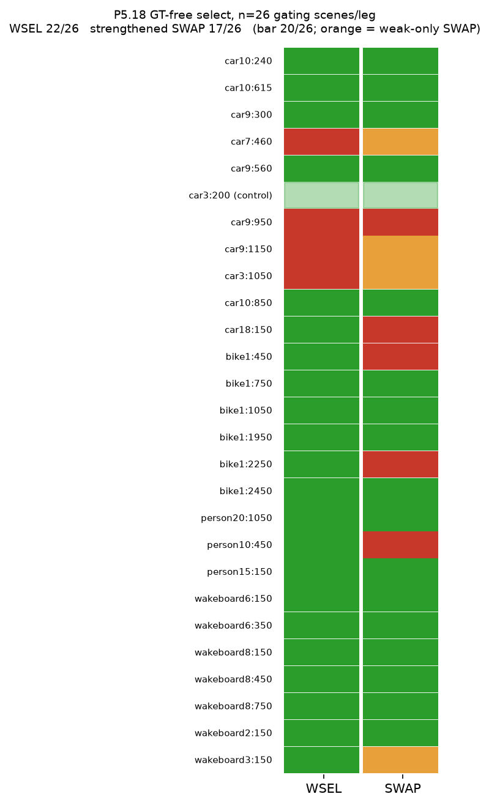

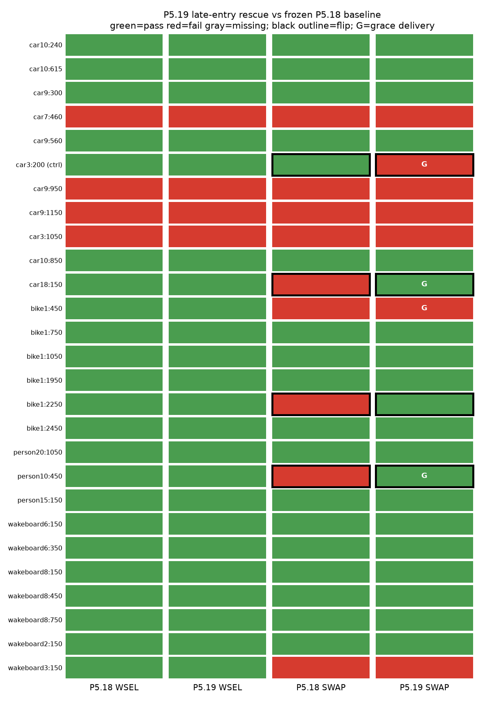

##### Advertencia obligatoria sobre P5.19

<!-- Guion de párrafos. Sustituir cada viñeta por prosa. -->
- **P1 — Pasa el listón exactamente, y eso no basta.** P5.19 alcanza **20/26 contra un listón de 20**. Con tres pares discordantes en una sola dirección, McNemar exacto bilateral da **p=0,25**, y el intervalo de Wilson al 95% es **[0,579, 0,890]**, que **cruza el listón de 0,769**. La mejora es compatible con el azar al tamaño usado: harían falta **seis** discordantes en la misma dirección a n=26, y hubo tres [claim P5.19-swap-late-entry-rescue].
- **P2 — La deflación borra justo el margen.** Las 26 celdas salen de **13 videoclips**. Deflactada a esa unidad la discordancia baja a b=2, c=0, **p=0,5**, y el listón 20/26 se vuelve 10/13 sobre una línea base 8/13. El p nunca fue significativo; lo que la deflación borra es el margen justo en la barra, que era precisamente el argumento del resultado.
- **P3 — Se defiende por replicación, no por p.** Se presenta como una **señal a replicar**. El argumento fuerte no es el contraste: que **P5.20 reprodujera P5.19 celda por celda, cero cambios en 52 pares**, es mejor evidencia de que el efecto es real que cualquier prueba a este n. Eso certifica **repetibilidad**, una propiedad distinta de la significancia [claim P5.20-replication-of-P5.19].
- **P4 — El peor modo de fallo: la caja confiada sobre el objeto equivocado.** La precisión de la entrega con gracia es **2/4** (Wilson [0,15, 0,85]: casi ninguna información sobre la precisión real). Lo que importa es el **modo de fallo**: cuando falla, **entrega una caja ajustada y confiada sobre el objeto equivocado** (IoU 0,679 y 0,865) en vez de abstenerse. En despliegue no hay verdad-terreno que lo detecte: es un **fallo silencioso**, el peor modo posible para algo que pilota. Falsifico además su propia predicción de "suelo de regresión ~0" [claim P5.19-grace-precisión].

### Por qué el selector se queda en propuesta, y no por una sola razon

<!-- Guion de párrafos. Sustituir cada viñeta por prosa. -->
- **P1 — La placa lo veta por arriba, R-16.** El multi-candidato **no es desplegable**: R-16 (Cap. 5) mata por OOM el segundo candidato con el anillo desplegado (`PRUNE_AFTER=100`), y el arrastre real es **2,69 Hz** en solitario a `image_size` 1024 — no los retirados 6,15 FPS — cayendo a 1,02 Hz co-residente con el VLM bajo carga con un candidato. Cerrar la puerta del hardware es necesario, pero es la versión cómoda del argumento.
- **P2 — Y por abajo, donde la memoria no ataba, sigue fallando.** En la réplica sobre la 3090 donde la memoria no ataba, la selección seguía fallando por **deriva del arrastre** y **ambigüedad referencial**: dos palancas, de capacidad (P5.20) y de latencia/recorte (P5.4), movieron **cero celdas**. El capítulo debe cerrar diciendo las dos cosas; quedarse solo con el hardware ocultaría que el selector tampoco funciona donde sí cabe.
- **P3 — El grounding NO es el cuello de botella, R-38 (nuevo).** Aislando la etapa de grounding: sobre el **mismo fotograma de la orden** el VLM desplegado fundamenta la frase-objetivo y una frase-distractor arbitraria, cada caja contra su propia GT (nunca cruzada). Resultado **simétrico**: **target 13/14 vs distractor 12/14**, McNemar b=2, c=1, **p=1,0**, n=14. El fallo de select **no vive en el grounding** [claim R-38-REG-grounding-isolation].
- **P4 — Lo que R-38 refuta y a dónde redirige el fallo.** El piloto (solo brazo distractor) dio **12/14 = 0,857**, muy por encima del 0,65 de extremo a extremo de P5.18 -> ese 0,65 **no era grounding**, confundía carry+delivery. La lectura OOD de "colapso a lo saliente" queda **refutada al mirar**: la caja del distractor cae **sobre el objeto distractor** (car9 = el pórtico de señales, car10 = un coche distante distinto, wakeboard8 = el barco), no sobre el target. Excluyendo person13 (GT de distractor mal colocada sobre suelo vacío) -> b=1/c=1, aun más simétrico. Conclusión: el fallo residual de select **se redirige aguas abajo a carry/delivery**, lo que apoya mantener-y-entregar (el grounding resuelve ambos referentes con competencia; la dificultad es **mantener** la pista). Descomposición dependiente de R-36, misma familia Holm (no se doble-cuenta).
- **P5 — El techo potenciado del negativo de select, R-36 (nuevo).** El contraste pareado mantener-vs-seleccionar a n alcanzable: **b=5, c=0, n=14, p=0,0625** (banco audit-clean). Titular = **escasez de escenas**, no una tasa: curar a mano 10 candidatos frescos de UAV123 dio **8/10 de un solo objetivo** — el encuadre "el dron sigue a un objetivo" casi nunca muestra dos candidatos co-visibles de la misma clase, así que la escena SWAP-dura apenas existe. Rama MISS pre-registrada [claim R-36-maintain-vs-select].
- **P6 — La dirección consistente que apoya la tesis.** Las tres lecturas de R-36 (n=13 b=4 c=0 p=0,125; **n=14 b=5 c=0 p=0,0625 REGISTRADA**; n=15 b=6 c=0 p=0,03125 que limpia la puerta mecanicamente pero **se retira** en la auditoria visual por descansar en una celda con GT defectuosa) comparten **c=0 en todas partes**: select **nunca gana una discordante**. Underpowered para rechazar H0, pero la dirección apoya inequivocamente **mantener-y-entregar**, no select. Es el techo honesto del negativo de selección, no una corrida fallida.

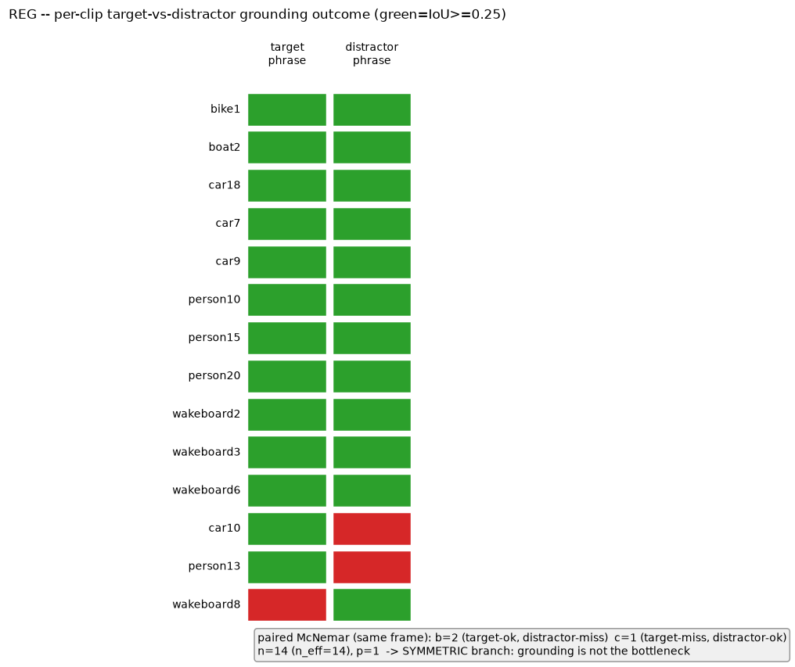

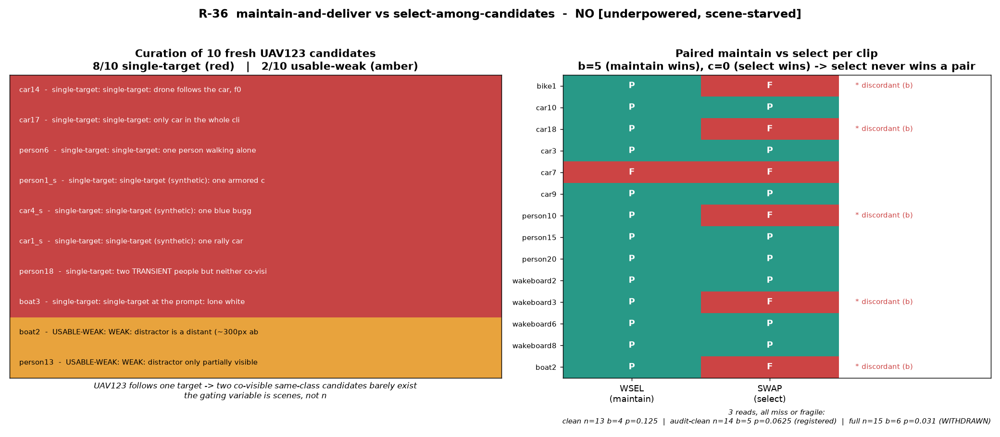

> **[CLIP]** ../experiments/2026-07-19-realvid-dd-select/proof/p514_swap_car7_460_deliver_OFFOBJECT.png — la deriva de arrastre entre coches de la misma clase: el fotograma de entrega con la caja aterrizada FUERA del objeto, el bloqueo residual de select que R-38 redirige a carry/delivery. (Sustituye al clip `car7_460_SWAP_MC_driftNOMATCH.mp4` del esquema, que no existe.)

### El desvío de simulación: un negativo metodológico en dos páginas

<!-- Guion de párrafos. Sustituir cada viñeta por prosa. -->
- **P1 — Por qué se construyó el banco.** P5.7 a P5.13 y P5.17 construyen un banco de escenas sintéticas en Gazebo [@gazebo2024harmonic] para conseguir los cruces y oclusiones que UAV123 no da. Justificar en dos párrafos, no diez: era la ruta para separar los contratos DD y RG donde el video real no ofrecía cruces.
- **P2 — Terminan en un NO por render demasiado limpio.** El VLM ancla **56 de 56 renders limpios** (P5.17), los contratos empatan siempre y el banco no discrimina. Ir de 24 a 56 celdas **no dio potencia**: cayó la tasa de fallo (RG fallo 1 de 56, el SEP_MARGIN pre-registrado pedía 7), no apareció el efecto. La discriminación sim-select queda **CERRADA**: no proponer banco v4 [claim P5.17-dd-vs-rg-tie-n56].
- **P3 — La conclusión útil es metodológica.** La ventaja del contrato bueno vive en la **fragilidad ante imagen real**, y un render limpio la borra: el VLM que ancla 56/56 renders sintéticos es el mismo cuya fragilidad ante imagen real es el residuo de select. Es un enunciado sobre el instrumento, no sobre la hipótesis.
- **P4 — El defecto que P5.13 encontro mirando.** Merece mención el defecto de **orden de profundidad**: el coche blanco era el más cercano en **0 de 300 frames** de todas las clips — profundidad constante, y ninguna puerta lo cubría. Es el caso concreto para el que se escribió la regla "mira el frame": el banco pasaba las puertas mecánicas y aun así no podía separar los contratos.

### Un superviviente que se reporta aparte: P5.12

<!-- Guion de párrafos. Sustituir cada viñeta por prosa. -->
- **P1 — Un superviviente de Holm que no puede ser titular.** P5.12 **sobrevive a la corrección de Holm** — una de las ~10 pruebas de todo el registro que lo hacen — y aun así no puede encabezar nada: es la **recalibración del banco de escenas**, no un resultado de selección. Va en subsección propia justamente por eso: enterrarlo en el desvío de simulación ocultaría un superviviente; ascenderlo a la narración principal prometería algo que no entrega. Máquina: **RTX 3090** [claim P5.12-bankv21-recal].
- **P2 — Lo que dice.** El mismo generador que pasaba **3 de 12** pasa **12 de 12** tras una pantalla de admisión y dos suelos recalibrados (G6c 60 -> 40, G8b 0,55 -> 0,40), congelados antes de la ejecución, y la predicción de frame limpio fuera de línea acierta con **delta 0 en las doce**, incluidas las seis semillas no vistas.
- **P3 — La salvedad que debe viajar pegada: parcialmente definicional.** Los suelos se recalibraron a partir de la **propia población de P5.11**, así que bajar un umbral y luego reportar que más celdas lo limpian **no es un efecto**. La parte genuinamente **fuera de muestra** son las **seis semillas nuevas**, no las doce clips. Se presenta como una **corrección de calibración**, nunca como una mejora 4x, y un superviviente de Holm cuya hipótesis se ajustó a los datos que la ponen a prueba se reporta con esa frase al lado o no se reporta.

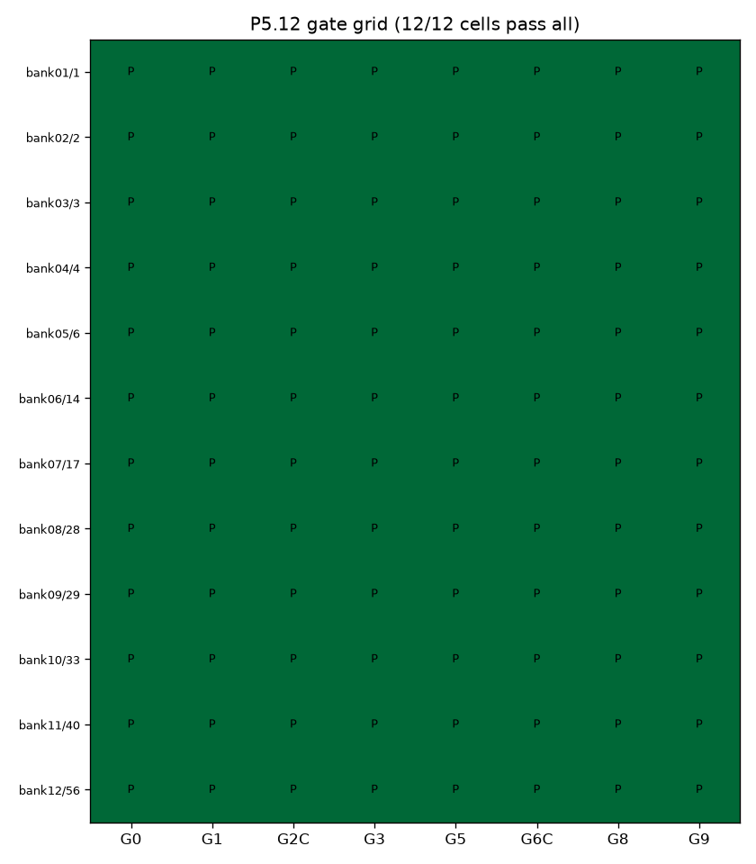

### Síntesis: que se defiende, que se propone, que no cabe

<!-- Guion de párrafos. Sustituir cada viñeta por prosa. -->
- **P1 — Lo que se defiende, inferencialmente.** Mantener-y-entregar elimina el retardo de entrega que capaba el arco de la Parte IV, y está certificado: **P5.2a, WARM 21/25 vs COLD 5/25, p=6,10e-05 deflactado, sobrevive a Holm** — la única celda no-definicional de la Parte V que lo hace. La victoria es eliminación del retardo, no compensación de movimiento (P5.2b, rho=-0,06).
- **P2 — Lo que se propone, no se prueba.** El refinamiento de selección **no es inferencial**: los YES pequeños (P5.14/P5.16) fueron optimismo de n; P5.18 los corrige (SWAP 0,65); P5.19 pasa el listón exacto pero compatible con el azar (p=0,25) y se defiende por replicación (P5.20), con un fallo silencioso residual (gracia 2/4). R-36 lo confirma como techo underpowered que apoya mantener-y-entregar (c=0 siempre).
- **P3 — Lo que no cabe, y dónde no vive el fallo.** El selector multi-candidato **ni cabe en la placa** (R-16 OOM al segundo candidato), y donde la memoria no ataba sigue fallando por deriva de arrastre y ambigüedad referencial. R-38 aisla el grounding como **simétrico**: el fallo residual **no vive en el grounding** sino aguas abajo en carry/delivery. Las palancas de arrastre (capacidad P5.20, recorte ROI P5.21) están medidas y cerradas. El capítulo entrega la selección como propuesta medida, no como resultado.


## Hacia el lazo cerrado

<!-- Guion de capítulo. Cada viñeta -> un párrafo. Tablas/figuras/código ya colocados. -->

<!-- RECONCILIACIÓN: el cuerpo del Cap 8 del esquema (`00-esquema.md`, §"Lo que este capítulo NO afirma": "P6.2 no se ha ejecutado") está OBSOLETO. P6.2 se completó el 2026-07-23/24. Este guion reestructura el capítulo alrededor del resultado insignia P6.2-DELIVERY (superviviente de Holm) y conserva íntegro el material de validez R-10 / síncrono-asíncrono / cámara-al-cielo del esquema. -->

### Motivación: poner la selección delante de un vehículo que vuela

<!-- Guion de párrafos. Sustituir cada viñeta por prosa. -->
- **P1 — Toda la Parte V se midió sobre vídeo que el sistema no podía influir.** Establecer que las 25 clips × 5 categorías de P5.2, el banco UAV123, los bancos de Gazebo (P5.9–P5.17) y las cifras de select se puntuaron sobre secuencias grabadas: no había vehículo en el lazo, así que los píxeles nunca fueron consecuencia de la salida de control del propio sistema. La Parte VI existe para cerrar exactamente ese hueco. [ver Cap 6-7]
- **P2 — La Parte VI pone la selección delante de un copter volando.** Enunciar la arquitectura bajo prueba: ArduCopter SITL [@ardupilot] como física, CARLA 0.9.16 `Town10HD_Opt` [@dosovitskiy2017carla] como renderizador esclavizado a la pose, de modo que la cámara nadir sigue el vuelo del copter y los píxeles pasan a ser una consecuencia de su propio control. Es la etapa SIL (software-in-the-loop) del marco de [@jiang2025dronepipeline].
- **P3 — Decisión de arquitectura declarada y sostenida: NO acoplar la física a CARLA.** El copter no se hace actor de CARLA ni se somete a la física de CARLA (que es de vehículo terrestre, no de multirrotor), y no se adopta el lockstep de `ardupilot_gazebo`. El esclavizado a la pose ya entrega la ego-motion bajo prueba y es lo que hizo el renderizador intercambiable. Lo cedido: downwash del rotor y dinámica de fuselaje visibles en el render, y el determinismo cuadro-a-cuadro — ninguno es portante para una pregunta de percepción-en-el-lazo. [ver §8.6]
- **P4 — Mapa del capítulo.** Anunciar la estructura: infraestructura habilitante (P6.0, P6.1) comprimida a un párrafo; el resultado insignia P6.2-DELIVERY; el nulo acotado de acoplamiento P6.2-COUPLING; la demostración en dispositivo P6.2-SHOWCASE; y lo que este capítulo NO retira (material de validez R-10 y límites vigentes).

### Infraestructura habilitante: P6.0 y P6.1 (n=1, exentas por decisión)

<!-- Guion de párrafos. Sustituir cada viñeta por prosa. -->
- **P1 — P6.0, puerta de capacidad del rig de vuelo: PASS, y dos defectos reales encontrados.** El rig (pila Phase B/C de la Parte I) se creía funcional y no lo estaba. La puerta cerró G1–G4 y destapó el fallo de re-emparejamiento de ByteTrack [@zhang2022bytetrack]: los tracks perdidos sólo se re-emparejaban en la ronda 2 contra detecciones de puntuación BAJA, así que una fuente esparcida `score=1.0` (inyección a 1 Hz) nunca revivía un track y el «coasting de Kalman» degeneraba en un mantenedor de orden cero. El arreglo de re-find bajó el error de píxel de **64,7 a 36,0** (−44 %) a tasa de control idéntica, y los IDs de track de **40 a 7** en un vuelo de 40 s. n=1 es CORRECTO: una puerta de capacidad pregunta «¿puede este montaje cerrar el lazo siquiera?» y una demostración lo responde. [claim `P6.0-flight-rig-gate`] [ver Figura tracker-id-churn]
<!-- caption: P6.0 — el fallo de re-emparejamiento de ByteTrack, mismo vuelo cerrado de 40 s antes/despues; la mejora 64,7->36,0 px es un antes/despues de un solo vuelo, NO un error esperado -->
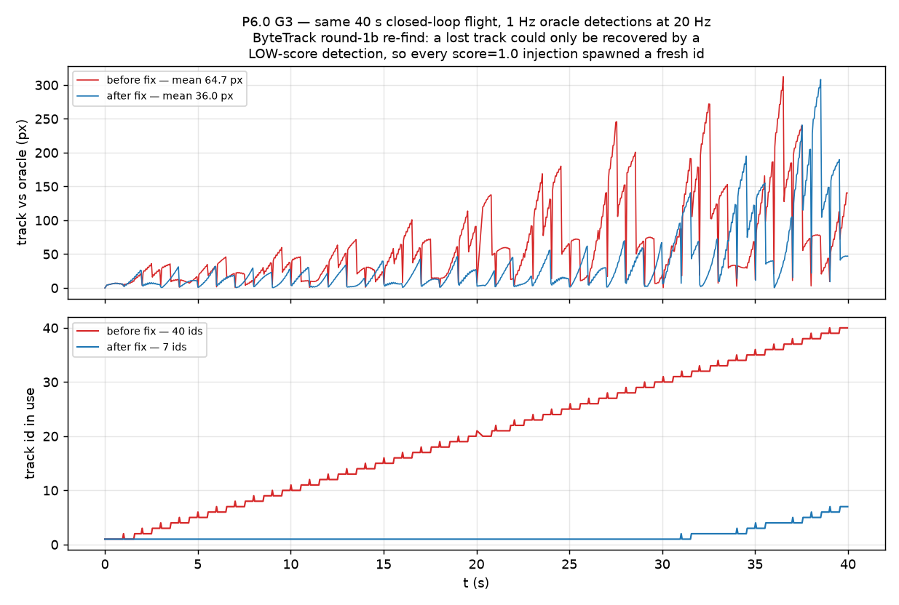
- **P2 — P6.1, cambio de renderizador Gazebo → CARLA: YES.** CARLA 0.9.16 `Town10HD_Opt` renderiza con **40 vehículos autónomos** mientras la cámara sigue un vuelo GUIDED real (0 → **84,4 m** norte a 60 m sobre el terreno) con la pila de control intacta. Precisar que los **48,1 Hz** son tasa del bucle de renderizado SIN percepción en la ventana (ni VLM, ni SAM2, ni ByteTrack, ni PID) y que el renderizador quedó esclavizado **en posición, no en pose** (el guiñado nunca llegó). [claim `P6.1-carla-renderer`] [ver Figura carla-nadir-frame]
<!-- caption: P6.1 — render CARLA Town10HD nadir a 60 m con trafico autónomo, la cara "despues" del cielo vacio de Gazebo -->
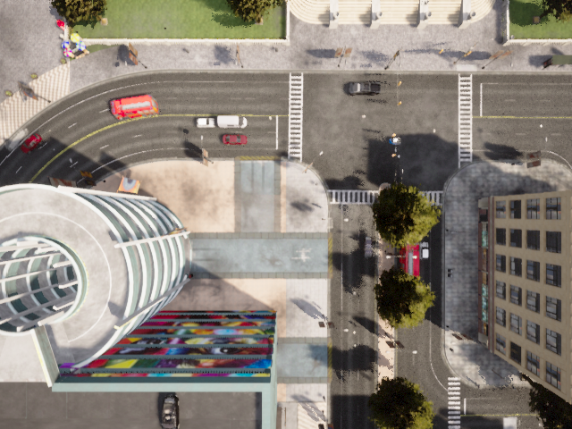
- **P3 — Ambas son puertas de capacidad a n=1, exentas por decisión declarada de la regla n≥25.** Registrar que P6.0 y P6.1 son `design: descriptive`, no arms de investigación: no sostienen una afirmación muestreada y por eso no entran en la familia de Holm. La compresión del capítulo (el *cómo* de la migración de renderizador, el detalle de la puerta y la construcción del banco GT) baja a este párrafo más el anexo; ninguna de esas páginas sostenía una afirmación. [claim `P6.0-flight-rig-gate`] [claim `P6.1-carla-renderer`]

### El resultado insignia: P6.2-DELIVERY

<!-- Guion de párrafos. Sustituir cada viñeta por prosa. -->
- **P1 — El primer resultado de lazo cerrado del proyecto, y la culminación del TFM.** Establecer que P6.2-DELIVERY es la prueba en lazo cerrado del hallazgo de obsolescencia de E18-n25: en un copter que vuela su propia salida de control, ¿aterriza el warm-start mantener-y-entregar un lock usable y seguible donde la adquisición fría bloqueante aterriza obsoleto? El retardo de ~4,85 s del lock frío se paga ahora en reloj de pared real mientras copter y objetivo se mueven. La distinción síncrono/asíncrono es load-bearing: el modo asíncrono es deliberado, porque el síncrono borraría el retardo de entrega bajo prueba (una adquisición de 4,5 s costaría 0 s de simulación). [claim `P6.2-DELIVERY-warm-vs-cold-closedloop`] [ver §8.6]
- **P2 — El resultado: WARM 23/25 vs COLD 2/25, McNemar b=21 c=0, p=9,5e-07, SOBREVIVE A HOLM.** Dar las cifras exactas: FOLLOW PASS = lock genuino en la entrega Y cobertura post-prompt ≥ 0,5 Y sin cambio de identidad. McNemar exacta bilateral p=**9,54e-07**, sin deflación (25 semillas CARLA independientes, `n_effective`=25), sobrevive Holm por Parte y global. Co-primaria C1: la tasa de lock absoluta WARM con Wilson 95 % **[0,750, 0,978]** — la pista mantenida sobrevive al lazo. Es una de las **11** afirmaciones que sobreviven a Holm en todo el registro (76 afirmaciones). [claim `P6.2-DELIVERY-warm-vs-cold-closedloop`] [ver Tabla 8.2] [ver Figura p62_warm_vs_cold] [ver Figura p62_follow_pass]
<!-- caption: Tabla 8.2 — P6.2-DELIVERY: WARM vs COLD en lazo cerrado, n=25 semillas CARLA (McNemar exacta bilateral). Máquina = RTX 3090 en todas las celdas (grounding retirado, sin Jetson en este experimento; arrastre SAM2 topado a la tasa Jetson 2,69 Hz). Notas verbatim del README. -->

| métrica | WARM | COLD | nota |
|---|---|---|---|
| FOLLOW PASS (/25) | **23** | **2** | genuine_lock AND coverage>=0.5 AND no swap |
| target-in-frame at delivery (/25) | 25 | 25 | COLD exit-frame count = **0**: el frío falla por obsolescencia, no por salir de cuadro |
| McNemar b / c | 21 | 0 | b=WARM-pass&COLD-fail; **unidireccional, c=0** |
| p deflactada, n_eff | p=**9.54e-07** | n_eff=25 | alcanzable (b+c=21 >> 6); Holm Parte-VI m=1 -> sobrevive |
| tasa de lock WARM, Wilson 95 % | **[0.750, 0.978]** | (n/a) | co-primaria C1: la pista mantenida sobrevive al lazo |
| banda de ruido de programación | 0 volteos | 0 volteos | semillas 0-2 ambas réplicas coinciden (warm pass, cold fail); efecto(b=21) >> ruido(0) |

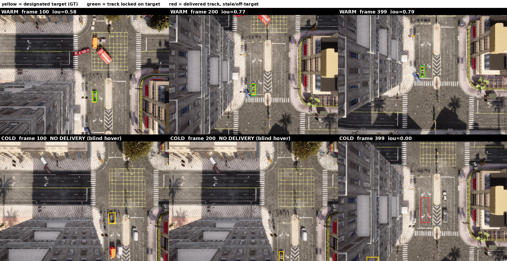
- **P3 — El coste del frío es OBSOLESCENCIA, no salir de cuadro.** Precisar que `cold_target_exits_frame=0`: cada vuelo frío entrega una caja tras el retardo bloqueante de ~4,85 s y en 23/25 cae fuera del objetivo (`on_target=0`, sobre calzada vacía o un distractor). Los 2 aciertos fríos (semillas 14, 20) son objetivos lentos/favorables — la semilla 20 tiene el menor desplazamiento del banco (15,2 m), así que la caja obsoleta aún solapaba. Enunciar que la rama-sorpresa pre-registrada (COLD ≥ 10/25 → el lazo no amplifica el retardo) quedó nula: el lazo cerrado **amplifica** el hallazgo de E18-n25, no lo estrecha — la ego-motion auto-inducida durante los ~4,85 s deja al copter flotando ciego y luego entrega una caja obsoleta. [claim `P6.2-DELIVERY-warm-vs-cold-closedloop`] [ver Figura p62_follow_pass]
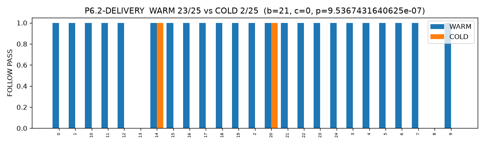
- **P4 — ALCANCE ORÁCULO: el grounding se mantiene constante, y esto es una condición, no un adorno.** La puerta G6 establece que el q8_0 desplegado NO es discriminativo en nadir a 45 m: fija el objetivo sólo bajo un caption espacial escogido a mano (`the car in the center`, IoU **0,329**), agarra el coche equivocado de la misma clase con frases genéricas y la sonda descentrada dio 0/8. Por eso la matriz aísla la variable de temporización de entrega en lazo cerrado **manteniendo el grounding constante por designación por oráculo** (caja GT en el fotograma de ventana ociosa). La afirmación resultante es de **ACOPLAMIENTO DE CONTROL condicionada a designación correcta** — «dado que el operador designa el objetivo, warm mantener-y-entregar aterriza un lock seguible donde frío aterriza obsoleto» — NO una afirmación de grounding+entrega. Sin esta condición, la afirmación se sobrevende. Es la salvedad S5, registrada en el campo `caveats`. [claim `P6.2-DELIVERY-warm-vs-cold-closedloop`] [ver Tabla 8.1] [ver Figura g6_caption_sensitivity]
<!-- caption: Tabla 8.1 — puerta G6: sensibilidad del q8_0 desplegado al caption, un solo arranque de Jetson, seis frases sobre el frame target_nadir a la geometria P6.2 (Town10HD_Opt, nadir). Máquina = Jetson Orin Nano 8 GB, 15 W + jetson_clocks, max_side 1024. Verbatim del README. -->

| caption | IoU | pred | verdict |
|---|---|---|---|
| `the car` | 0.00 | (480,130,499,144) — un coche pequeño **distinto**, resuelto | FAIL |
| `the black car` / `the small dark car` | 0.00 | (70,115,96,134) | FAIL |
| `the car in the center` | **0.329** | (320,230,326,254) — sobre el objetivo | **PASS** |
| `the dark car in the middle of the road` | 0.00 | (198,192,218,216) | FAIL |


- **P5 — Etiquetado de máquina y fidelidad de dispositivo.** Declarar que la matriz se midió **íntegramente en la RTX 3090** (grounding retirado por la designación por oráculo = sin Jetson en este experimento). El arrastre SAM2 va **topado a la tasa de la Jetson 2,69 Hz** (paridad E1, `prune_after=32` por la restricción de OOM de R-16) y el retardo frío se aplica como stub, así que ninguna cifra dependiente de dispositivo se sirve desde la 3090. NO citar 6,15 FPS de arrastre: la tasa desplegada es 2,69 Hz. La Parte VI de vuelo pierde el determinismo que tenía toda la Parte V (SITL a tiempo real, no avanzable frame a frame); la mitigación es estadística (semilla de escena + n≥25 + banda de ruido de programación de 3 semillas × 2 vuelos), no exacta. [claim `P6.2-DELIVERY-warm-vs-cold-closedloop`] [ver §8.6]
- **P6 — Los dos residuales WARM (2/25), mirados.** Registrar honestamente: la semilla 8 (cobertura 0,091) mantuvo 96 frames y luego el arrastre SAM2 derivó a la izquierda sobre calzada vacía mientras el coche de policía se movía a la derecha — deriva de arrastre tardía, el residual P5.19/P5.20 ahora en lazo cerrado. La semilla 13 (cobertura 0,0, sin lock) nunca estableció la pista y muestra además una caja GT anómala que abarca la calzada, **marcada para revisión de autor**; contada WARM=0 en cualquier caso (conservador, no infla WARM). [claim `P6.2-DELIVERY-warm-vs-cold-closedloop`]

### P6.2-COUPLING: cerrar el lazo no degrada el arrastre (nulo acotado)

<!-- Guion de párrafos. Sustituir cada viñeta por prosa. -->
- **P1 — La pregunta C1 aislada: ¿el propio lazo de control degrada la pista mantenida?** Enunciar el diseño pareado-continuo: brazo COUPLED = los vuelos WARM de P6.2-DELIVERY reutilizados (la pista warm pilota el PID vía `CascadePID` → `send_velocity_body`); brazo DECOUPLED = percepción warm byte-idéntica sobre las mismas 25 semillas, pero la `actor_box` del oráculo pilota el PID (cortada la realimentación percepción→control). La métrica es el error de seguimiento post-prompt (px) de la pista warm vs `actor_box`, idéntica en ambos brazos, así que la única diferencia es quién pilota. Wilcoxon de rangos con signo NO admite deflación por reescalado de un conteo, luego una sola vuelta por brazo por semilla, sin réplicas. [claim `P6.2-COUPLING-warm-carry-coupled-vs-decoupled`]
- **P2 — El resultado: NULO ACOTADO (outcome ii del gate congelado). C1 cerrada.** Dar las cifras exactas: Wilcoxon bilateral p=**0,596** (n.s.), diferencia pareada mediana **−0,42 px**, IC bootstrap 95 % **[−4,56, +4,08] px**, DENTRO de la banda de ruido de programación del brazo warm (max |dif réplica| **6,70 px**, media 2,58; DELIVERY 3 semillas × 2 vuelos). Cerrar el lazo — dejar que la pista warm pilote el copter, de modo que los píxeles sean consecuencia de su propio movimiento — NO degrada sistemáticamente la pista mantenida: cualquier penalización por acoplamiento queda bajo el suelo de ruido. Es un **nulo acotado por diseño bilateral, NO una equivalencia probada**. C1 cerrada como «el arrastre en caliente sobrevive a la ego-motion auto-inducida». [claim `P6.2-COUPLING-warm-carry-coupled-vs-decoupled`] [ver Tabla 8.3] [ver Figura p62_coupling_paired]
<!-- caption: Tabla 8.3 — P6.2-COUPLING: error de seguimiento post-prompt (px) de la pista warm, brazo COUPLED (la pista pilota) vs DECOUPLED (el oráculo pilota), mismas 25 semillas. Wilcoxon bilateral + IC bootstrap 10000. Máquina = RTX 3090 (arrastre topado a 2,69 Hz). Verbatim del README. -->

| métrica | COUPLED | DECOUPLED | nota |
|---|---|---|---|
| media error de seguimiento (px) | 26.77 | 63.18 | media inflada por outliers de deriva de arrastre (abajo); la mediana es el centro honesto |
| **diferencia pareada mediana (px)** | — | — | **−0.42** (coupled menos decoupled) |
| **Wilcoxon rangos con signo, p (bilateral)** | — | — | **p = 0.596 (n.s.)** |
| IC bootstrap 95 % de la diferencia mediana | — | — | **[−4.56, +4.08] px** |
| banda de ruido de programación (brazo warm, px) | — | — | max |dif réplica| **6.70**, media 2.58 (DELIVERY, 3 semillas × 2 vuelos) |

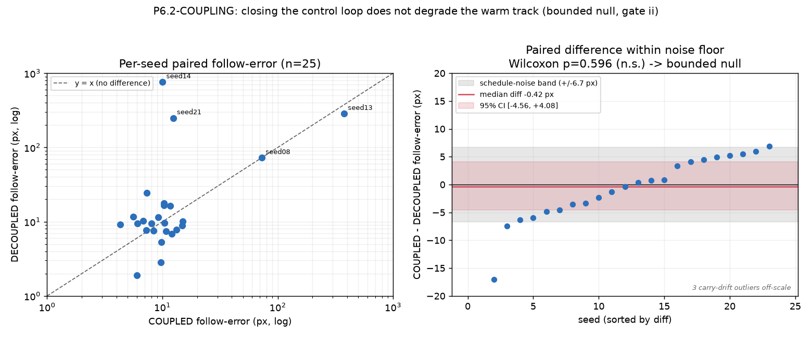
- **P3 — Por qué las MEDIAS divergen: deriva de arrastre estocástica, NO una penalización de acoplamiento.** Explicar que la media acoplada (26,8) < desacoplada (63,2) SOLO porque la deriva de SAM2 saltó en semillas distintas por vuelta: la re-vuelta desacoplada sacó dos fugas catastróficas que la acoplada no (semilla 14 = 760 px, semilla 21 = 249 px); ambos brazos derivaron en la semilla 13 (377 vs 285) y la semilla 8 (~72). Es varianza de arrastre propia de la vuelta — aparece en el brazo SIN lazo de realimentación — y la mediana/rangos con signo (que los outliers no dominan) no ve diferencia; **22 de 25 semillas caen en 5–25 px en ambos brazos**. [claim `P6.2-COUPLING-warm-carry-coupled-vs-decoupled`] [ver Figura decoupled_seed14]
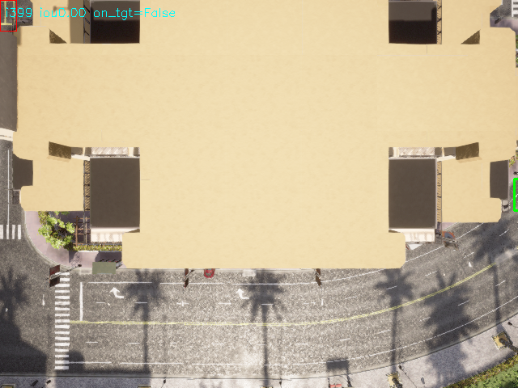
- **P4 — Salvedad de la banda y alcance S5.** Anotar honestamente que la banda de ruido warm es n=3 pares y sesgada por uno (semilla 1, |dif|=6,70; los otros dos <1 px), así que el nulo acotado descansa sobre todo en el Wilcoxon no significativo y la mediana casi nula, y la banda corrobora. Repetir el alcance heredado S5: un PASS en CARLA dice que la pista warm sobrevive a la ego-motion DE ESTE rig, no que transfiera a percepción con imagen real (el sim fundamenta demasiado limpio, P5.17). Esta afirmación está entre las **23** probadas-no-significativas del registro. [claim `P6.2-COUPLING-warm-carry-coupled-vs-decoupled`]

### P6.2-SHOWCASE: vuelo en dispositivo (cualitativo)

<!-- Guion de párrafos. Sustituir cada viñeta por prosa. -->
- **P1 — Lo más cerca del despliegue real que llega el proyecto.** Establecer que SHOWCASE es una **demostración cualitativa, NO una afirmación inferencial** — no está registrada en la familia de Holm. Demuestra la capacidad en dispositivo que la matriz aproximó: el arrastre SAM2 corre **literalmente en el Orin** sobre ssh-stdio en lazo cerrado, con un gemelo `_HostCarry` en la 3090 puntuado en lockstep para la puerta de paridad in-rig. La grounding queda por designación por oráculo (coherente con el alcance de DELIVERY); el copter vuela su propio PID. [ver §8.7]
- **P2 — Media de arrastre en dispositivo standalone: 24/24, mediana IoU 0,92.** Registrar la mitad GPU-independiente, corrida antes del vuelo sobre imagen real UAV123: el arrastre desplegado (`jetson_carry_service.py` en el Orin, `image_size=1024`, 15 W + jetson_clocks) sembrado por la caja GT del oráculo y avanzado 24 frames de `car9` a stride 11 (la cadencia 2,69 Hz) **mantuvo 24/24 a IoU≥0,25, mediana IoU 0,92** vs GT, a **2,35 Hz en dispositivo** (425 ms/step de cómputo), con ~10 ms de overhead de socket. De-risquea el vuelo al lazo cerrado de CARLA solo. [ver Figura ondevice_carry_trace]
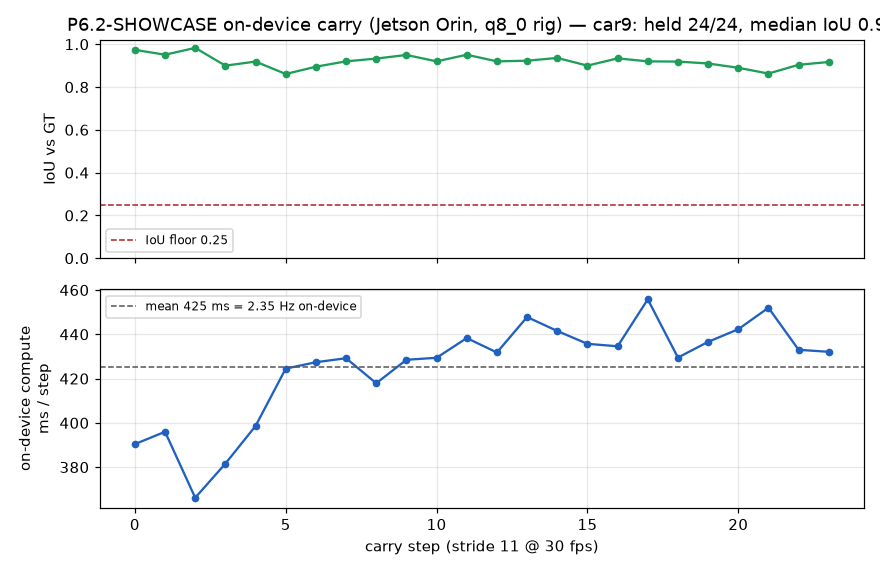
- **P3 — El vuelo en lazo cerrado: paridad de mediana IoU 0,960 con el gemelo 3090.** Dar las cifras del vuelo WARM de 28 s (`run_p62_matrix.py --showcase --alt 45 --t-prompt 14 --seconds 28`, objetivo `vehicle.dodge.charger_police_2020`, designación por oráculo): cobertura post-prompt **0,495** (202/560 frames de lock), y la **puerta de paridad PASA — Jetson-carry vs gemelo 3090, mediana IoU 0,960** (mín 0,805, 90 % de steps ≥ 0,9) sobre 52 steps in-loop. Así el arrastre en dispositivo reproduce en vivo el arrastre 3090 verificado por paridad, confirmando que la paridad de máscara E1 (1,000) se sostiene en el lazo. El cargador de policía se mantuvo a través de una curva de carretera, con el copter volando su propio PID. [ver Tabla 8.4] [ver Figura flight_follow_overlay]
<!-- caption: Tabla 8.4 — P6.2-SHOWCASE, un vuelo WARM en lazo cerrado con el arrastre SAM2 corriendo LITERALMENTE en el Orin sobre ssh-stdio. Máquina por celda: arrastre = Jetson Orin Nano 8 GB (15 W + jetson_clocks); render = RTX 3090 (CARLA, cap 220 W); fisica = ArduCopter SITL. Verbatim del README. -->

| métrica | valor | nota |
|---|---|---|
| lock del vuelo sostenido (arrastre Jetson) | **cobertura 0,495**, 202/560 frames de lock | overlays VISTOS (ocioso t=7s, prompt t=14s, curva t=28s); objetivo mantenido a través de una curva |
| paridad arrastre-Jetson vs gemelo-3090 (mediana IoU/step) | **0,960** (mín 0,805, 90 % ≥ 0,9) | 52/52 steps con ambas cajas; puerta ≥ 0,95 PASS |
| round-trip ssh (mediana ms/step) | **424 ms** (~2,4 Hz); cómputo 422 ms | transporte ~2 ms; domina el cómputo de arrastre, NO es coste de despliegue |
| semilla / entrega | acquire ≈ 0 s (oráculo), primera entrega t=1,95 s | siembra de ventana ociosa, sin latencia de adquisición fría |

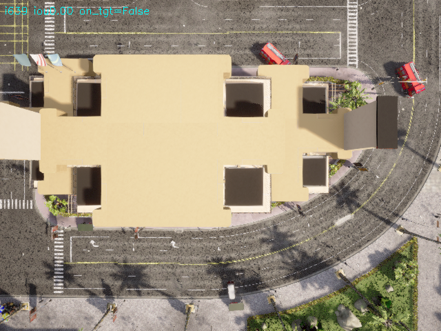
- **P4 — El follow es honesto, no perfecto — y el transporte ssh es un artefacto de banco.** Precisar que la cobertura 0,495 refleja la cadencia de arrastre 2,69 Hz contra un GT a 20 Hz: la caja entregada envejece entre actualizaciones, el IoU dibuja dientes de sierra (picos ~0,5–0,6). El round-trip ssh mediano de 424 ms es dominado por el cómputo de arrastre (422 ms); el transporte (~2 ms) es un artefacto de banco que el dron real a bordo no paga — por eso la matriz usó el proxy 3090 topado para el experimento de temporización. No confundir esta latencia con un coste de despliegue.

### Lo que este capítulo NO retira: material de validez

<!-- Guion de párrafos. Sustituir cada viñeta por prosa. -->
- **P1 — Tres cifras vacuas de la infraestructura, con la auditoría R-10 que las desautoriza.** Conservar íntegro: (1) `slave_err` = 0,000 m es vacuo — la cámara es un `sensor.camera.rgb` sin `attach_to`, un actor cinemático, así que `get_transform()` devuelve exactamente lo que `set_transform()` acaba de recibir; además el 0,000 NO está en el fichero (el artefacto guarda **1,815e-06**, el cero es el formato `:.3f`); y la métrica sólo lee `.location`, ciega a la rotación — el yaw de `pose_track` tiene UN ÚNICO valor (0,0) en los 600 ticks porque el sondeo `ATTITUDE` nunca entregó: el renderizador estaba esclavizado **en posición, no en pose**. (2) «0 pérdidas de pista» en P6.0 es vacua pero NO por el fallo de ByteTrack que el cuaderno le atribuía: el contador sólo se incrementa con lista vacía, lo que exige `MAX_LOST_FRAMES=30` a 20 Hz = 1,5 s sin ninguna detección; esa rama era igual de alcanzable antes y después del arreglo (ambas ejecuciones reportan 0), y la ejecución diseñada para forzar la sequía (`GAP_INJECT_RUN=3`) nunca se lanzó bajo `--runs 1`. (3) Los 48,1 Hz no son comparables con los **15,88 Hz** del banco GT, y el «2,4x la tasa de control» queda RETIRADO (modo síncrono, 2,41 = desfase de reloj reenunciado). [claim `P6.0-flight-rig-gate`] [claim `P6.1-carla-renderer`]
- **P2 — Existe un sustituto no vacuo de `slave_err`, calculable del artefacto ya comprometido.** Registrar el reemplazo de R-10 (`pose_staleness.py`): **60,4 %** de los ticks reutilizan una pose MAVLink caducada, el hueco máximo entre muestras frescas es **0,547 s** y a 7,21 m/s eso son **~3,9 m** de retraso de cámara en el peor caso (0,38 m típico) — seis órdenes de magnitud mayor que la cifra publicada, falsificable, y degrada en la dirección correcta cuando el stream de pose se atasca. La corrección es en sí misma contenido: una métrica se puede desautorizar por el motivo equivocado (como el diagnóstico vacuo de la métrica vacua) y seguir pareciendo bien auditada. [claim `P6.1-carla-renderer`]
- **P3 — La distinción síncrono/asíncrono, que hay que declarar siempre.** Conservar: el banco GT corre en modo **síncrono** y el banco de vuelo en **asíncrono**, y cada resultado debe nombrar cuál lo produjo — porque en síncrono una adquisición de 4,5 s cuesta **cero segundos de simulación** y el retardo de entrega que las Partes IV y V existen para medir deja de existir. Mezclar ambos conjuntos de cifras invalidaría justamente lo que el TFM defiende. Corolario: la Parte VI de vuelo pierde el determinismo que tenía toda la Parte V; la mitigación es estadística, no exacta. [claim `P6.2-DELIVERY-warm-vs-cold-closedloop`]
- **P4 — Los dos fallos que valen media página cada uno (aportación metodológica, no anécdota).** Conservar: (1) **la cámara apuntaba al cielo** — un pitch de `+pi/2` en Gazebo es **ABAJO**, no arriba; durante toda una fase el log salía limpio y la conclusión asociada (RQ-S1.4) hubo que **retirarla a UNANSWERED**, medida a través de una imagen gris plana (100 % de un solo color). Es el caso concreto que motivó la regla de verificación visual del proyecto: en trabajo de simulación, un `exit 0` no es evidencia sobre píxeles. (2) **La métrica vacua desautorizada por el motivo equivocado** («0 pérdidas de pista»): la lección de segundo orden es que desautorizar una métrica no es lo mismo que entenderla, y una nota de «no citar esta cifra» puede envejecer tan mal como la cifra. [claim `P6.0-flight-rig-gate`]

### Límites que P6.2 no retira

<!-- Guion de párrafos. Sustituir cada viñeta por prosa. -->
- **P1 — Ninguna campaña de la Parte VI tuvo la Jetson en el lazo del RENDER — salvo el arrastre en Orin del showcase.** Establecer que el servidor de CARLA exige una GPU de sobremesa y no corre en el Orin; toda la percepción de la matriz (grounding retirado por oráculo, arrastre en la 3090 topado a 2,69 Hz) se ejerció fuera del dispositivo, así que ninguna cifra inferencial de la Parte VI es una cifra de render en dispositivo. La única excepción es el arrastre SAM2 corrido literalmente en el Orin en P6.2-SHOWCASE (cualitativo, no inferencial). [claim `P6.2-DELIVERY-warm-vs-cold-closedloop`]
- **P2 — Nadir fijo a mediodía despejado, frente al oblicuo del vídeo real.** Registrar que todos los frames son mediodía despejado y la cámara es **nadir fija**, mientras que el vídeo real de UAV y el banco de la Parte V son **oblicuos**; ni tiempo atmosférico ni hora del día se ejercitaron como factor con potencia (fue covariable por semilla, no factor). Una afirmación de fidelidad que sólo vale al mediodía y desde arriba es una afirmación estrecha. [claim `P6.1-carla-renderer`]
- **P3 — G6 no valida CARLA para grounding, y la afirmación insignia es condicional.** Reiterar que la puerta G6 es un PASS *condicional* (el q8_0 fundamenta a 45 m nadir sólo bajo un caption espacial discriminativo, IoU 0,329) y que CARLA no es comparable con el banco de Gazebo de la Parte V (los 56/56 de P5.17 son un contraste, no una línea base). Por eso P6.2-DELIVERY es una afirmación de **acoplamiento de control condicionada a designación correcta**, NO una afirmación de grounding+entrega ni de percepción con imagen real. Cerrar remitiendo la validez de percepción a la Parte V / E18-n25. [claim `P6.2-DELIVERY-warm-vs-cold-closedloop`] [ver §8.3]


## Amenazas a la validez

<!-- Guion de capítulo. Cada viñeta -> un párrafo. Tablas/figuras/código ya colocados. -->

### Encuadre del capítulo

<!-- Guion de párrafos. Sustituir cada viñeta por prosa. -->
- **P1 — Por qué un capítulo y no una nota al pie.** Establecer que las amenazas a la validez de este trabajo son un capítulo propio, no una nota al margen, porque cada una condiciona qué puede sostener una cifra concreta del cuaderno. Enunciar el criterio de selección: son las que un tribunal encontraría, ordenadas de la más estructural (qué máquina midió qué) a la más local (irreproducibilidad de los pesos). Advertir que recortar cualquiera de ellas convertiría una afirmación honesta en una falsa, y que por eso ninguna se omite ni se suaviza aquí. [ver 00-esquema §9]
- **P2 — La fuente de verdad de las cifras.** Aclarar que todo número de este capítulo es trazable a `thesis/00-esquema.md`, al registro `thesis/claims.json` (76 afirmaciones) y a `thesis/stats-report.md`, y que las salvedades citadas son literales del registro. La columna «Máquina» de ese registro etiqueta el hardware que produjo cada número, y `ambas` —VLM en la Jetson, arrastre SAM2 en la RTX 3090— es la respuesta honesta y mayoritaria en las Partes IV y V. [ver stats-report §Cómo leer]

### «Todo corre en la placa» no es lo que se midió

<!-- Guion de párrafos. Sustituir cada viñeta por prosa. -->
- **P1 — El eslogan y la realidad.** Establecer la amenaza número uno: `README.md` dice «Todo corre en la placa, sin nube», pero en la Parte V **el arrastre con SAM2 nunca se ejecutó en la Jetson** — corrió en la RTX 3090 con un tope de tasa como sustituto del Orin. En las Partes anteriores la precisión del arrastre se midió siempre en la 3090 mientras la placa aportaba solo FPS. La formulación correcta, que sustituye al eslogan, es **«tasa y memoria medidas en el dispositivo; precisión del arrastre, solo en la 3090»**. [ver 00-esquema §9]
- **P2 — Qué estrecha R-16 y qué no.** Precisar que R-16 (2026-07-22) **estrecha pero no cierra** la brecha: el arrastre desplegado corrió por fin en la placa y co-residente con el VLM bajo carga real, pero **solo para tasa y memoria**; la precisión del arrastre sigue sin medirse nunca en la Jetson. R-16 sí retira la coartada opuesta que registraba la Parte IV —que la co-residencia «no costaba FPS», medida contra un servidor *inactivo*—: con el servidor sirviendo de verdad, el arrastre paga ~2,3x y el VLM ~2x. Y la constante desplegada `PRUNE_AFTER = 100` no admite dos candidatos más el VLM en 8 GB: el núcleo mata el proceso (OOM a N = 2). [ver 00-esquema §9]
- **P3 — La tasa de arrastre desplegada es 2,69 Hz, no 6,15 Hz.** Corregir el error que R-16 desmontó: `CARRY_HZ = 6.15` está **retirada**. Ese 6,15 Hz se midió en E1 a `image_size` **768** con un codificador TensorRT que el sistema desplegado no usa; el despliegue corre a **1024**, y la tasa real medida en la placa es **2,69 Hz** en solitario, una corrección de 2,30x. La única medida co-residente integrada dio 4,1 FPS frente a su propia puerta de 5 antes de E1, y 5,0 FPS después — despejándola exactamente, con **n = 1**. Que el arrastre a 768 no pierda precisión medible frente a 1024 es cierto por tamaño de efecto, no por igualdad demostrada [ver claim @P3-carry-OP768-accuracy]. [ver 00-esquema §9]
- **P4 — Qué se corrigió y dónde.** Documentar el commit `cd8cca6` (2026-07-21) que retiró en `README.md` las tres frases «todo corre en la placa», el compuesto de **+22,6 pp** (una resta entre máquinas, hoy sustituido por los **+22,1 pp** de R-14 medidos íntegramente en la Orin, 63,10 % → 85,19 %), la precisión de arrastre de 1024 px citada para un sistema que en E1 desplegaba 768 px, y el techo de seguimiento publicado como 3,0 m/s cuando 3,0 es el ajuste que **falló**. Añadir la salvedad de fondo: el salto a Q8_0 es «sin pérdida medible», no «−2,7 pp de pérdida» — la pérdida de fidelidad está en la exportación, no en la cuantización de 8 bits (b=17, c=10, p=0,248) [ver claim @P1-S3.3-quantisation-is-not-the-cost]. [ver 00-esquema §9]
- **P5 — La Parte VI agrava esto, salvo el showcase.** Cerrar la amenaza: la Parte VI **agrava** el problema en lugar de resolverlo, porque el servidor de CARLA exige una GPU de sobremesa y **ninguna de sus campañas tuvo la Jetson en el lazo** — el arco de lazo cerrado se mide íntegramente en la 3090. La **única** excepción es la mitad de arrastre del showcase P6.2 (commit `bbe146d`): el arrastre desplegado corrió en el Orin sobre `ssh-stdio`, sostuvo 24/24 celdas con IoU mediana **0,92**, y su gemelo en 3090 dio una paridad de IoU mediana **0,960** (cobertura 0,495). Ese es el único trozo de la Parte VI con la placa dentro. [ver 00-esquema §9]

### Composiciones entre máquinas

<!-- Guion de párrafos. Sustituir cada viñeta por prosa. -->
- **P1 — Filas que describen un sistema que nunca existió.** Establecer la segunda amenaza: varias tablas del cuaderno emparejan una precisión medida en la 3090 con unos FPS medidos en el Orin, y **cada una de esas filas describe un sistema que nunca existió**. La regla del TFM es dura: **etiquetar la máquina en cada celda o separar las tablas** — no hay término medio, porque una celda sin máquina se lee por defecto como una sola configuración on-device. [ver 00-esquema §9]
- **P2 — El mapa del defecto, con la cobertura exacta.** Dar las cifras de la auditoría de divulgación (R-1, 2026-07-21) sobre las 76 campañas: cobertura **61 stated, 9 inferred, 6 unknown**; host del VLM **47 Jetson, 7 ambas, 5 3090, 15 n/a, 2 unclear**. Situar el defecto donde de verdad está y no donde se supondría: **la Parte I es 9/9 stated** (nombrar la placa y el modo de potencia era el objetivo), y la concentración cae en **la Parte III (4 de 11 `unknown`)** —trabajo de SITL y cinemática sin VLM— y **la Parte IV (7 de 27 `inferred`)** —plataforma heredada por referencia, «byte-identical to E19», cuya cadena nunca termina en una máquina. [ver @machine-disclosure] [ver Figura disclosure-by-part]
- **P3 — El compuesto insignia sin declarar.** Nombrar el caso más caro (hallazgo M4): `2026-07-04-warm-start-generalization` (P5.2, W 21/25 vs COLD 5/25) es un compuesto no divulgado — **la cadena «3090» no aparece en toda la campaña**, aunque la mitad del arrastre corrió allí; el host solo se alcanza siguiendo «Reuses the P5.1 rig unchanged» hasta P5.1. La misma forma, a uno o dos saltos de herencia, en E20, E21 y E23. La disposición fue **divulgar, no re-medir**, porque el brazo bajo prueba —el ancla del VLM— sí corrió en la Jetson y domina la latencia del arco. [ver @machine-disclosure]
- **P4 — Las dos figuras que prueban y corrigen.** Presentar las dos figuras de la auditoría como la evidencia visual de esta amenaza, y señalar que `disclosure-by-part.png` **falsificó el primer borrador** del párrafo del mapa, que había afirmado la concentración contraria: es la razón por la que se gana su sitio en `proof/`. [ver Figura disclosure-by-part] [ver Figura vlm-host-by-part]


### Tamaños de muestra e inferencia

<!-- Guion de párrafos. Sustituir cada viñeta por prosa. -->
- **P1 — El daño cuantificado.** Establecer la tercera amenaza: buena parte de las decisiones se tomaron con **n de 2 a 6**. El re-análisis del 2026-07-24 lo cuantifica sobre las 76 afirmaciones del registro: **10** corrieron su contraste contra una puerta que **ningún resultado posible habría superado a esa n** (categoría «puerta pre-registrada inalcanzable por diseño»), y solo **11 sobreviven a la corrección de Holm por Parte** (10 en familia global). Los tamaños de familia son I m = 4, II m = 3, III m = 5, IV m = 9, V m = 21, VI m = 2; el esquema añade la lectura agregada de que 38 de las 70 afirmaciones con puerta salen de diseños que no podían alcanzar alfa. Las cifras vigentes se leen de `thesis/stats-report.md`, no de aquí. [ver stats-report §Qué sobrevive] [ver Tabla McNemar Parte V]
- **P2 — El repositorio detectando su propio error.** Dar la demostración empírica, que es la forma más fuerte de presentarla: **P5.18** convirtió un 4/5 de n pequeño en un **17/26** al medirlo bien — en las 5 celdas compartidas reprodujo P5.16 exactamente (cero inversiones) y todo el vuelco vino de las 21 celdas nuevas, donde SWAP cae a 13/21 = 0,62; deflactado por clip queda 8/13 frente a la barra de 0,8, y una deflación solo puede ensanchar el intervalo, no rescatar un NO [ver claim @P5.18-n25-swap]. En la Parte IV, **E12 revirtió a E11 por la misma razón**. Y E18 pasó de negativo sin potencia (p = 0,0625 a n = 6) a **confirmado** a n = 25 (ORACLE 23/25 vs COLD 3/25, McNemar deflactado p = 4,0e-05) — el único superviviente inferencial de la Parte IV [ver claim @E18-cold-acquire-vs-warm-oracle-n25]. [ver 00-esquema §9]
- **P3 — La regla llegó tarde, y la excepción declarada.** Cerrar con las dos matizaciones honestas: el proyecto adoptó la regla de **n ≥ 25** para todo brazo con puerta, pero es **post-data a las Partes I–IV completas**; los resultados anteriores se presentan con su n visible y, donde importa, con su intervalo de Wilson. La regla admite una **excepción declarada**: P6.0 y P6.1 son puertas de capacidad con **n = 1** —dos vuelos únicos, y P6.0 tampoco se pre-registró—, tomada a propósito porque una puerta de capacidad pregunta «existe la carretera», no «cuánto se tarda», y **no soporta ninguna afirmación de rendimiento**. [ver 00-esquema §9]

<!-- caption: Inferencia post-hoc sobre los resultados con puerta de la Parte V, generada desde los volcados por elemento; McNemar exacto bilateral, b/c posteriores a la deflación por unidad independiente (R-4) -->

| Resultado | Discordancia | McNemar exacto | Lectura |
|---|---|---|---|
| P5.1 WARM 5/6 vs COLD 1/6 | b = 4, c = 0 | p = 0,125 | No significativo por sí solo |
| P5.2a WARM 21/25 vs COLD 5/25 | b = 15, c = 0 | **p = 6,10e-5** | **El ancla estadística de la parte**; sobrevive a Holm |
| P5.10 DD 24/24 vs RG 24/24 | b = 0, c = 0 | **indefinido** | No hubo prueba, no hubo empate demostrado |
| P5.13 y P5.17 | b = 0, c = 0 | **indefinido** | La única celda discordante se colapsa al agrupar por clip |
| P5.19 SWAP 20/26 vs P5.18 17/26 | b = 2, c = 0 | p = 0,5 | Compatible con el azar |

### Una misma medida usada dos veces

<!-- Guion de párrafos. Sustituir cada viñeta por prosa. -->
- **P1 — Dos supervivientes que comparten un brazo.** Establecer la cuarta amenaza: de las once afirmaciones que sobreviven a Holm, dos son **R-13** (`P3-R13-owlv2-vs-vlm`, el VLM contra el detector de vocabulario abierto) y **R-14** (`P3-ROI-M2.0-512-ondevice`, la confirmación en dispositivo del recorte ROI), y **comparten un brazo**: el **63,10 %** de IoU@0,25 del VLM a frame completo es el **mismo volcado leído dos veces** —el mismo `items-full.jsonl`, la misma k—, una vez como línea base del detector y otra como brazo A de la rejilla ROI. [ver Tabla detector OWLv2]
- **P2 — Por qué infla el recuento, y por qué se hizo igual.** Explicar la consecuencia estadística: Holm supone una familia de contrastes distintos, y dos que comparten una medición no son independientes, así que **el recuento de supervivientes está por su lado optimista** — contar dos veces incluso agranda m y endurece la corrección, luego el efecto va en contra de la tesis, no a favor. Reutilizar el volcado fue **deliberado y correcto** (volver a medir el mismo brazo en la misma placa habría gastado horas de GPU para producir ruido), pero hay que decirlo donde se citen los dos números juntos. [ver stats-report §Dos dependencias]

<!-- caption: Comparación VLM desplegado (Q8_0, Orin) frente a OWLv2 fp16, mismas 439 muestras de RefDrone val, mismo camino de puntuación; el brazo titular es el más fuerte del detector, no el más favorable -->

| Brazo | IoU@0,25 | Qué es |
|---|---|---|
| VLM desplegado | **63,10 %** | el sistema de la tesis |
| D-phrase | 47,38 % | sintagma nominal con adjetivos — el mejor brazo del detector |
| D-full | 25,74 % | la expresión referencial entera |
| D-head | 24,60 % | el núcleo nominal a secas |
| D-oracle | 90,43 % | **no es un sistema**: elige entre las diez primeras con la verdad-terreno |

### El re-análisis es post-hoc, y la deflación es una decisión

<!-- Guion de párrafos. Sustituir cada viñeta por prosa. -->
- **P1 — Ninguna afirmación se pre-registró con su contraste.** Establecer la quinta amenaza: **ninguna de las 76 afirmaciones se pre-registró con su prueba**. La familia sobre la que corre Holm se **ensambló retroactivamente**, en julio de 2026, sobre experimentos ya ejecutados — eso protege contra la comparación múltiple, no contra la selección del contraste una vez vistos los datos. [ver 00-esquema §9]
- **P2 — La deflación empezó siendo un juicio, y R-29 lo cerró a medias.** Precisar la corrección más agresiva del marco: la deflación a n efectivo (agrupar por videoclip cuando dos celdas comparten vídeo fuente) empezó siendo una **decisión** tomada después de existir los datos, y otra unidad de agrupación daría otro p. R-29 (2026-07-23) cerró esa grieta **a medias**, y hay que decir qué mitad: el **grado** de agrupación ya no se elige, se **mide** —correlación intraclase por conglomerado, deflactando con su límite superior al 95 %— pero **cuál es el conglomerado sigue siendo el juicio** de antes. Rematar con la defensa: la calibración **no recuperó ningún superviviente**, y el valor colapsado se publica como suelo de sensibilidad en `icc.collapsed_floor`, así que el marco está **sesgado hacia no afirmar**. [ver 00-esquema §9]

### El instrumento cambió durante el proyecto

<!-- Guion de párrafos. Sustituir cada viñeta por prosa. -->
- **P1 — Casi todas las latencias son tiempo de pared con transporte sin medir.** Establecer la sexta amenaza: casi todas las latencias de VLM del documento son **tiempos de pared** medidos desde la estación de trabajo, con la imagen en base64 cruzando un túnel SSH hasta la placa. Cuánto de esa cifra es transporte y cuánto cómputo solo se caracterizó **al final, en R-13**: unos **103 ms** de los 4319 ms de reloj, es decir el cómputo en dispositivo son **4216 ms** (prefill 3680 + decodificación 536). [ver claim @P3-R13-owlv2-vs-vlm]
- **P2 — La consecuencia para el resto del cuaderno.** Sacar la implicación: **toda cifra de latencia anterior a R-13 lleva una componente de transporte sin medir**, incluidos los **~4,85 s de E18** que sostienen el capítulo pivote —donde además quedan ~450 ms sin atribuir—. Matizar la magnitud para no exagerar: la corrección es pequeña en proporción y no invalida ningún veredicto (por eso la razón de coste del detector es 16,0x y no el 16,4x del reloj), pero un despliegue con cámara a bordo no pagaría ese transporte. [ver 00-esquema §9] [ver Tabla detector OWLv2]

### El sim no es el mundo

<!-- Guion de párrafos. Sustituir cada viñeta por prosa. -->
- **P1 — Un PASS de render no sostiene una afirmación sobre imagen real.** Establecer la séptima amenaza: un PASS sobre render de Gazebo o CARLA **no** sostiene una afirmación sobre imagen real, y la Parte V lo demostró por la vía dura — el VLM acierta el **100 % de los renders limpios** y de ahí no sale ninguna discriminación entre contratos de selección. Ilustrarlo con los tres empates de simulación (P5.10, P5.13, P5.17), que con cero o una sola celda discordante dan McNemar bilateral indefinido o p = 1,0: **ausencia de prueba, no equivalencia demostrada** [ver Tabla McNemar Parte V]. Añadir que el techo de seguimiento de la Parte IV se midió además contra una textura plana con un rover dibujado. [ver 00-esquema §9]

### Resultados retirados

<!-- Guion de párrafos. Sustituir cada viñeta por prosa. -->
- **P1 — La Fase C de la Parte I: cámara al cielo.** Establecer la octava amenaza con el caso que motivó la regla «look at it» en el propio repositorio: los números de seguimiento en lazo cerrado de la **Fase C** están **retirados** (2026-07-20) — se midieron a través de una cámara que apuntaba al cielo (el pitch `+pi/2` de la cámara de gz es **hacia abajo**, no hacia arriba), de modo que los píxeles de entrada eran un fotograma de cielo vacío. Existen 13 CSVs por fotograma y **deliberadamente no se extrajeron**, porque producirían números bien formados sobre nada; si el TFM los menciona es como caso de fallo metodológico, con las cifras tachadas y **RQ-S1.4 declarada sin responder** [ver claim @P1-S1.4-phaseC-vlm-closed-loop]. [ver 00-esquema §9]
- **P2 — Los tres regímenes de `track_gain`.** Añadir el segundo resultado retirado: la nota de la campaña del banco GT que describía **tres regímenes distintos de `track_gain`** está retirada — a n = 25 solo la ganancia 1,0 es un régimen limpio y los otros dos se solapan. `track_gain` no es un factor válido y **no debe aparecer como eje de ninguna figura**. [ver 00-esquema §9]

### Irreproducibilidad de los pesos

<!-- Guion de párrafos. Sustituir cada viñeta por prosa. -->
- **P1 — Los GGUF desplegados no se pueden re-exportar.** Establecer la novena amenaza: el directorio de entrenamiento HF/safetensors fusionado **se perdió** y no sobrevive ningún adaptador LoRA, así que los GGUF desplegados **no se pueden re-exportar** — un reentrenamiento daría un modelo distinto y rompería la comparabilidad celda a celda de las Partes II a V. Matizar el respaldo existente y su límite: hay copia verificada por sha256 en `/home/gara/grounding-checkpoint-backup/`, pero es una copia **en la misma máquina**, sin réplica externa. [ver 00-esquema §9]
- **P2 — La Parte I no lleva manifiesto.** Cerrar el capítulo con la garantía más débil: las ejecuciones de la **Parte I no llevan manifiesto** (SHA de git, hash del lockfile, hash del dataset), porque preceden a ese aparato — su garantía de reproducibilidad es estrictamente más débil, y arreglar eso fue un **objetivo declarado de la Parte II**. Terminar señalando que esta amenaza es la única puramente de higiene y no de validez, pero se registra igual porque el cuaderno de laboratorio es un entregable de primera clase. [ver 00-esquema §9]

### Con N=1, la ventaja del brazo warm es la identidad del objetivo (S6)

<!-- Guion de párrafos. Sustituir cada viñeta por prosa.
     Nota de orden: registrada la última (2026-07-25, R-51) pero condiciona la
     afirmación estrella del trabajo, así que al redactar debe subir en el capítulo. -->
- **P1 — La objeción, en las palabras en que se hizo.** Establecer la décima amenaza con la pregunta del propio autor mientras conducía el panel de demostración en vivo: *si solo funciona con un objeto, y el operador lo preselecciona a mano, ¿no es warm frente a cold una comparación trivial?* Reconocer que **la mitad de la objeción es correcta**: con **un solo candidato mantenido**, la ventaja de información del brazo WARM **es la identidad del objetivo** — al sistema se le dijo qué objeto sostener, de modo que no anticipa nada, **sostiene**. [claim `P6.2-DELIVERY-warm-vs-cold-closedloop`]
- **P2 — Por qué N=1 y no K candidatos: el mecanismo que lo haría no trivial está muerto.** Enunciar que mantener K candidatos sin nombrar y dejar que la orden elija —el **arco de selección**— es exactamente lo que habría hecho la comparación no trivial, y que está **muerto en 8 corridas sobre este hardware**: P5.3, P5.4, P5.5, P5.10, P5.13, P5.17, P5.18 y R-36, con **c = 0 en todas**, es decir, la selección **nunca gana un par discordante**. Añadir el límite duro de memoria: R-16 mata por OOM el selector multi-candidato ya en N = 2 sobre el anillo desplegado. Concluir que **«grounding anticipatorio» se retira como titular** (decisión de autor R-28 + R-51). [ver Tabla McNemar Parte V]
- **P3 — Lo que sí sostiene la matriz, y por qué la objeción no lo toca.** Corregir el enunciado en lugar de defender el antiguo: leer lo que la matriz **mide de hecho** — `cold_target_exits_frame = 0` y `on_target = 0` en **23/25** —, es decir, el brazo frío **no falla por elegir mal** sino porque la caja llega **~4,85 s (~146 fotogramas) después** de la orden. Por tanto el resultado es **agnóstico al origen de la caja** (clic, pista previa, designación pre-vuelo, enlace de datos externo) y el enunciado honesto es: *en este dispositivo, una caja que **existe antes** de la orden produce un lock seguible y una caja **calculada después** no; el grounding no cabe en la ruta crítica de la orden con 8 GB*. Es una afirmación **más débil y más robusta** que la retirada. [claim `P6.2-DELIVERY-warm-vs-cold-closedloop`]
- **P4 — El brazo frío no es un hombre de paja.** Cerrar esa vía: el brazo frío **es el sistema que las Partes II–IV construyeron y desplegaron** (frase → VLM → seguimiento), medido sobre **vídeo real de UAV123** en R-34 con **3/25**. Llamarlo hombre de paja exigiría llamar así al entregable previo del propio proyecto. [claim `E18-cold-acquire-vs-warm-oracle-n25`]
- **P5 — La implicación hacia adelante: la comparación dice en qué gastar hardware.** Señalar para qué sirve entonces el par warm/cold: **localiza la restricción vinculante en la latencia de adquisición**, porque todo lo que hay aguas abajo de una caja correcta en el instante de la orden está certificado por separado — P5.15 (el arrastre no es la parte frágil, 24/25 contra suelo 18, p = 0,0016), P6.2-COUPLING (nulo acotado bajo ego-motion autoinducida) y P6.2-SHOWCASE (24/24 a IoU mediana 0,92 en el Orin, paridad de vuelo 0,960). Es decir, una adquisición podada a ~1 s dejaría el arrastre desplegado **dentro de su envolvente ya demostrada**, acotado al régimen probado (nadir, diurno, UAV123/CARLA, coche o persona) y con la **deriva de arrastre** como dueña del fallo residual. [claim `P5.15-plain-carry-survival`] [claim `P6.2-COUPLING-warm-carry-coupled-vs-decoupled`] [showcase P6.2, commit `bbe146d`]
- **P6 — Lo que cuesta mantener: ya está medido, y sale a favor.** Cerrar la amenaza en lugar de aplazarla. Era **la crítica más afilada** porque no era de alcance sino de medida ausente: WARM quema SAM2 durante **toda la ventana ociosa** para ahorrar **4,85 s una vez**, y no existía ninguna cifra de vatios. P6.6 la mide en la placa desplegada (15 W + `jetson_clocks`, cinco brazos de 300 s, 3 repeticiones): **mantener cuesta +5,65 W** sobre una placa ociosa (arrastre a 640 px, 10,842 W frente a 5,193 W en reposo con el modelo residente), es decir **entre el 1,4 % y el 3,8 % del vuelo estacionario** — franja de 150-400 W tomada de la literatura, **no medida aquí**, porque este proyecto no tiene aeronave. El cruce que la objeción pedía existe y es corto: **el punto de equilibrio frente a una adquisición fría es una ventana ociosa de 9,9 s**, y más allá WARM gasta más energía por menos obsolescencia, pero **acotado** (1,54× a los 30 s, 1,92× a los 120 s, asíntota 2,09×). Añadir los dos hallazgos secundarios, que son los que cambian el argumento: la **residencia es gratis** (un `llama-server` cargado y ocioso cuesta −0,002 W, luego todo el precio es del arrastre) y el arrastre está **limitado por el raíl, no por el trabajo** (512 px corre 1,60× más rápido con 0,15 W *menos*, ambos al 99 % de `GR3D_FREQ`, de modo que el julio por fotograma sostenido baja un 38 %). Cerrar con la mitad térmica, que también estaba abierta: la tasa **no decae** en 300 s — G1 pasa 6/6 y el signo es **al alza** (+0,17 % a +0,53 %) mientras `tj` se satura de 57 a 65 °C —, y declarar el límite: 300 s es la ventana medida, una espera de 20 minutos es extrapolación. R-52 queda cerrada. [ver `experiments/2026-07-25-maintain-cost/`, `machine=jetson-orin-nano`]


## Conclusiones y trabajo futuro

<!-- Guion de capítulo. Cada viñeta -> un párrafo. Tablas/figuras/código ya colocados. -->

### La contribución: un replanteamiento, no una arquitectura

<!-- Guion de párrafos. Sustituir cada viñeta por prosa. -->
- **P1 — El titular.** Establecer que la contribución central del TFM **no** es una red, un módulo ni una arquitectura de despliegue, sino un **replanteamiento del problema**: cuando la orden del operador llega a mitad de vuelo y no en el instante cero, la ventana previa a la orden es cómputo gratuito, y el instante en que **empieza** el cómputo importa más que su **duración**. Enunciarlo como la tesis defendida del esquema (`00-esquema.md`, §«Tesis defendida», la frase única que arranca «Cuando la orden del operador llega a mitad de vuelo y no en el instante cero»): gastar la ventana previa en mantener el objetivo vivo y limitarse a **entregar** la pista ya arrastrada elimina la latencia de adquisición que hace que un sistema de grounding sobre vídeo aéreo entregue una caja ya obsoleta.
- **P2 — Por qué es un replanteamiento y no una optimización.** Contrastar con lo que **no** funcionó: optimizar la propia adquisición no arregla el cuello de botella. La adquisición en frío cuesta ~4,85 s de retardo bloqueante y la caja llega ~146 fotogramas tarde; recortar ese coste no cierra la brecha (E18/E20 de la Parte IV, y P5.4 recortó la adquisición de 4,9 s a 2,08 s moviendo el veredicto **cero celdas**). El giro conceptual — no acelerar el frío sino **evitar pagarlo**, sembrando en la ventana ociosa — es lo transferible, con independencia del VLM, del arrastre o del vehículo concretos que se enchufen debajo. [cita @wang2024qwen2vl] [cita @ravi2024sam2]
- **P3 — Qué queda como artefacto reproducible, subordinado al replanteamiento.** Aclarar que el sistema construido (VLM Qwen2-VL-2B Q8\_0 desplegado en un Orin Nano de 8 GB + arrastre SAM2 + ByteTrack + PID→MAVLink) es la **instancia que sostiene la medida**, no la contribución en sí; el replanteamiento sobrevive a que se sustituya cualquiera de esas piezas. [cita @zhang2022bytetrack] [ver Cap. 8]

### Lo que la evidencia sostiene, y hasta dónde

<!-- Guion de párrafos. Sustituir cada viñeta por prosa. -->
- **P1 — La cota es estadística, y es estrecha.** Abrir con el marco de `thesis/claims.json`: de **76 afirmaciones** registradas, sólo **11 sobreviven a Holm por Parte** (10 en familia global — `thesis/stats-report.md`, §«La familia de corrección, y por qué esta y no la otra»: «Sobreviven 11 por Parte frente a 10 en familia global»). Nombrar los 11 supervivientes (§«Qué sobrevive», la categoría «Significativas tras corrección de Holm (11)»): `P1-S3.3-export-parity-catastrophe`, `P2-RQ2.1-resolution-ladder-1024`, `P2-RQ3.1-lora-aerial-gate`, `P2-RQ4.1-deploy-fidelity`, `P3-ROI-M2.0-512`, `P3-ROI-M2.0-512-ondevice`, `P3-R13-owlv2-vs-vlm`, `E18-cold-acquire-vs-warm-oracle-n25`, `P5.2a-warm-generalization`, `P5.12-bankv21-recal`, `P6.2-DELIVERY-warm-vs-cold-closedloop`. Sobre estos once — y sobre todo sobre cinco de ellos — descansa toda la tesis; el resto son medidas descriptivas, puertas inalcanzables por diseño o contrastes que no rechazaron.
- **P2 — Pilar 1: la generalización del warm-start (P5.2a).** Establecer la afirmación con **más potencia estadística de la Parte V** y con la que la tesis debe abrir: 25 clips × 5 categorías de UAV123, WARM **21/25** frente a COLD **5/25**; McNemar exacto **bilateral**, **deflactado a 23 clips independientes**, b=15, c=0, **p = 6,10e-05**, sobrevive a Holm en toda la familia (0,001831). Pegar la salvedad de cita obligatoria (HANDOFF I2): se cita el valor **deflactado y bilateral**, nunca el «~1,5e-5» unilateral sin deflactar de un borrador anterior. Y su matiz mecánico: la ganancia es **eliminación del retardo de entrega, no compensación de movimiento** — la brecha WARM−COLD es plana en velocidad (`P5.2b-speed-sweep`, Spearman ρ = −0,06). [cita @mueller2016uav123]
- **P3 — Pilar 2: el cuello de botella confirmado a potencia (E18-n25).** Establecer que la staleness del frío quedó **confirmada** con n=25 (`E18-cold-acquire-vs-warm-oracle-n25`, R-34): ORACLE **23/25** frente a COLD **3/25**, b=21/c=1, deflactado por ICC a n efectivo 23, McNemar exacta **p = 4,0e-05**, sobrevive Holm por Parte y global. Es el número que **lanzó la Parte V**, promovido de `p = 0,0625` a n=6 (justo fuera de alfa, «un clip de menos») a confirmado a n=25. El coste del frío es **retardo de entrega** (~4,85 s / ~146 fotogramas), no error de precisión: en el conjunto amplio el efecto **se reforzó**, no se atenuó.
- **P4 — Pilar 3: la culminación en lazo cerrado (P6.2-DELIVERY).** Establecer el **primer resultado de lazo cerrado** del proyecto y la culminación de la Parte VI: un copter que vuela su **propia salida de control** (ArduCopter SITL como física, CARLA `Town10HD_Opt` como renderizador nadir esclavizado a la pose, **asíncrono a propósito** para no borrar el retardo de entrega bajo prueba). WARM **23/25** frente a COLD **2/25**, b=21, c=0, McNemar exacta **bilateral p = 9,5e-07**, **sin deflación** (semillas independientes, n = 25), sobrevive Holm por Parte y global; WARM Wilson95 [0,750, 0,978]. Pegar la salvedad **S5 (alcance oráculo)**: el grounding se mantiene constante por **designación por oráculo** (caja GT) porque el q8\_0 desplegado **no es discriminativo** en nadir a 45 m (puerta G6, IoU 0,329, agarra el coche equivocado de la misma clase), de modo que la afirmación es de **acoplamiento de control condicionada a designación correcta**, NO una afirmación de grounding+entrega. Cerrar el lazo **no degrada** la pista mantenida (`P6.2-COUPLING`, Wilcoxon bilateral p = 0,596, nulo acotado dentro de la banda de ruido). [cita @dosovitskiy2017carla] [cita @ardupilot]
- **P5 — El bloqueo residual es la deriva del arrastre entre misma clase — no el grounding, no la entrega.** Situar el fallo que queda: la **deriva del arrastre entre objetos de la misma clase**. Descartar las otras dos causas con evidencia: el **grounding no es el cuello** — `R-38-REG-grounding-isolation` lo aísla como **simétrico** (objetivo 13/14 frente a distractor 12/14, McNemar b=2/c=1, p = 1,0; la caja del distractor aterriza sobre el objeto distractor, se refuta el colapso-a-lo-saliente); y la **entrega está certificada** (E18-n25 y P6.2-DELIVERY arriba). Lo que sobra es arrastre que deriva a un vecino de su clase.
- **P6 — El refinamiento de SELECCIÓN queda en señal a replicar, y la placa lo veta.** Ser explícito con lo que **no** está demostrado, por decisión de autor R-28: **seleccionar** entre candidatos mantenidos es una **propuesta medida**, no un resultado. El único SÍ a n real (`P5.19-swap-late-entry-rescue`, SWAP 20/26) se queda en **p = 0,25**, y en **p = 0,5** al deflactar a 13 clips distintos; la tasa robusta del selector es `P5.18-n25-swap` = **17/26** (0,65). Y el techo de despliegue: `R-16` mide los dos candidatos co-residentes con el VLM en el Orin y a **N = 2** con el anillo desplegado (`PRUNE_AFTER=100`) el proceso **muere por OOM**; la tasa de arrastre desplegada es **2,69 Hz**, no la retirada 6,15 FPS. Donde la memoria no ató (réplica en la 3090), la selección seguía fallando por deriva del arrastre y ambigüedad de la expresión referencial.
- **P7 — El grounding en dispositivo es real y cabe en la placa.** Cerrar el alcance con los pilares de despliegue: el salto a Q8\_0 es **sin pérdida medible** en la exportación (`P2-RQ4.1-deploy-fidelity`; F16 273 y Q8\_0 275 quedan por encima de la referencia HF 261 — la frase defendible es «no hay pérdida medible», no «la mejoró»; la pérdida real estuvo en la **exportación**, no en la cuantización de 8 bits), y el re-anclaje ROI se midió **en el propio dispositivo** (`P3-ROI-M2.0-512-ondevice`, +22,1 pp sobre pantalla completa, misma sesión de llama-server sobre el checkpoint desplegado). Todo el techo de potencia del dispositivo es **15 W + jetson_clocks** (no MAXN/25 W). Insertar aquí la tabla de las tres afirmaciones subordinadas para fijar el reparto capítulo↔evidencia↔límite. [ver Tabla 10.1]

<!-- caption: Las tres afirmaciones subordinadas, el capítulo que sostiene cada una y el límite de esa evidencia (verbatim del esquema, §Tesis defendida) -->

| Afirmación | Cap. | Límite de la evidencia |
|---|---|---|
| Un VLM de 2B cuantizado hace grounding referencial útil sobre imagen aérea y cabe en un Orin Nano de 8 GB | 4-5 | Protocolo propio, más fácil que el benchmark publicado. La parte medida **en la placa** es el grounding de un frame (R-13, R-14); la precisión del arrastre nunca se midió allí |
| La adquisición en frío es el cuello de botella del sistema integrado, y no se arregla optimizando la adquisición | 6 | n = 6 clips, todas coches, sin vehículo en el lazo |
| Anticipar **mantener + entregar** sí lo arregla; **seleccionar** entre candidatos queda propuesto, no demostrado | 7 | Desigual, y esa es la tesis: mantener-y-entregar es inferencial (P5.2a, p = 6,10e-05, sobrevive a Holm) — el **refinamiento de la selección** no lo es, el único SÍ a n real (P5.19, 20/26) queda en p = 0,25 y en p = 0,5 al deflactar a 13 clips, y el selector multi-candidato ni siquiera cabe en la placa (R-16: OOM a N = 2) |

### La comparación externa: el valor del VLM está en la selección

<!-- Guion de párrafos. Sustituir cada viñeta por prosa. -->
- **P1 — Por fin comparado contra algo externo.** Establecer que hasta la Parte III el VLM se medía sólo contra sí mismo; `P3-R13-owlv2-vs-vlm` lo enfrenta a un **detector de vocabulario abierto** (OWLv2 fp16 contra el VLM desplegado a Q8\_0, **las dos en el Orin**, sobre las mismas 439 muestras bien planteadas de RefDrone val y con el mismo camino de puntuación). Pareado y deflactado a 316 imágenes únicas, VLM contra D-phrase da **p = 2,26e-07** y sobrevive a Holm. Insertar la tabla de los cuatro brazos. [cita @minderer2023owlv2] [cita @refdrone] [ver Tabla 10.2]

<!-- caption: OWLv2 (cuatro brazos, el titular es el más fuerte del detector) frente al VLM desplegado, IoU@0,25 sobre RefDrone val (verbatim del esquema, Cap. 5) -->

| Brazo | IoU@0,25 | Qué es |
|---|---|---|
| VLM desplegado | **63,10 %** | el sistema de la tesis |
| D-phrase | 47,38 % | sintagma nominal con adjetivos — el mejor brazo del detector |
| D-full | 25,74 % | la expresión referencial entera |
| D-head | 24,60 % | el núcleo nominal a secas |
| D-oracle | 90,43 % | **no es un sistema**: elige entre las diez primeras con la verdad-terreno |

- **P2 — El resultado que importa es la descomposición, no la tasa.** Establecer el hallazgo clave: el detector **propone bien y no sabe elegir**. Su recall sube de **47,4 % en k = 1** a **88,8 % en k = 10** (sólo 49 de 439 ítems, 11,2 %, no tienen ninguna caja correcta entre las diez); la distancia `recall@1`→`recall@10` del **mismo** brazo D-phrase es de **41,5 pp** — enunciarlo así, porque el 90,43 % de D-oracle es otra cosa (la brecha del oráculo, 27,3 pp, no es un sistema: usa la verdad-terreno). La segunda propuesta del detector ya empata con el top-1 del VLM. Conclusión: el valor del VLM está en la **selección**, no en la localización.
- **P3 — La ruta descompuesta queda como trabajo futuro, NO como ruta recomendada.** Cerrar con la corrección de la decisión de 2026-06-14: aquella campaña cerró la bifurcación «VLM extremo a extremo contra detector + selector» **por latencia y sin haber medido un detector jamás**, y esa justificación estaba del revés — medido, OWLv2 es ~**16,0x más barato** por llamada (263,5 ms de pasada contra 4216 ms de cómputo en placa del VLM) y ocupa ~5x menos. Lo que **sí** descarta la ruta descompuesta es la **brecha de selección** (un argumento de calidad), y una salvedad decisiva: su **etapa de selección está sin costear**, y la propia medida advierte de que **si ese selector fuese a su vez un VLM el ahorro desaparece**. La decisión de quedarse con el VLM extremo a extremo sobrevive; su justificación registrada, no.

### Trabajo futuro

<!-- Guion de párrafos. Sustituir cada viñeta por prosa. -->
- **P1 — Cerrar la precisión del arrastre en la Jetson.** Fijar la primera partida: la precisión del arrastre **nunca se midió en la placa** (en dispositivo sólo hay grounding de un frame, R-13/R-14, y tasa/memoria del arrastre, R-16); el bloqueo residual de todo el sistema es la deriva de arrastre entre misma clase (P5). Palancas ya descartadas que **no** hay que re-proponer: un SAM2 mayor recupera 0 celdas (`P5.20-carry-capacity`, palanca muerta por mecanismo, no por recuento) y el re-anclaje ROI **no** mejora el carry (`P5.21-roi-carry`, TIE con dirección contra ROI, b=1/c=3; el refuerzo de deriva se materializó en car10) — mantener ROI **sólo** para el prefill del acquire.
- **P2 — El selector multi-candidato necesita memoria o un arrastre que no derive.** Enunciar la condición doble para desbloquear la **selección**: o **más memoria** (R-16 lo mata por OOM a N = 2 en el Orin con el anillo desplegado; con anillo 32 sobrevive a 0,540 Hz por candidato) o **un arrastre que no derive entre objetos de la misma clase** — porque allí donde la memoria no ató (3090) la selección seguía fallando por deriva y por ambigüedad referencial. Sin una de las dos, el selector se queda en propuesta medida.
- **P3 — Grounding en dispositivo discriminativo a altitud nadir.** Señalar la muleta a retirar: la **designación por oráculo** de P6.2-DELIVERY (salvedad S5) existe porque el q8\_0 desplegado no es discriminativo en nadir a 45 m (puerta G6: IoU 0,329, agarra el coche equivocado de la misma clase, sonda descentrada 0/8). El trabajo pendiente es un grounding **en dispositivo** que sepa fijar el objetivo correcto a esa geometría, para convertir P6.2 de una afirmación de acoplamiento-de-control-condicionada en una afirmación de grounding+entrega. [cita @qwen2025qwen25vl]
- **P4 — Del coste de mantener queda la ventana larga y la aeronave, no la cifra.** Retirar de esta lista el hueco energético — P6.6 lo midió (**+5,65 W**, equilibrio a **9,9 s** de ventana ociosa, tasa sin decaer en 300 s con G1 6/6) — y dejar en su lugar sólo lo que sigue sin medir: (i) **ventanas más largas que 300 s**, porque una espera de 20 minutos es extrapolación y no resultado, y (ii) el **denominador de vuelo**, que aquí es una franja de literatura de 150-400 W y no una medida, porque no hay aeronave; sin ella, el «1,4-3,8 % del vuelo estacionario» es una regla de tres honesta, no una cifra de plataforma. Añadir la palanca que P6.6 dejó servida y sin cobrar: el arrastre está **limitado por el raíl**, así que bajar la resolución a 512 px daría 1,60× la tasa con 0,15 W menos — falta comprobar que EXP-1 no pierda precisión ahí antes de cambiar el valor por omisión.
- **P5 — El régimen ambiental no está ejercitado.** Cerrar el alcance no probado: **tiempo del día, atmósfera y oblicuidad** de la cámara **no se han ejercitado** — todos los números son nadir, con imagen sintética (CARLA) o vídeo diurno de UAV123. Un PASS en CARLA dice que la pista warm sobrevive a la ego-motion **de este rig**, no que transfiera a percepción con imagen real (salvedad S5 de P6.2-COUPLING). Es trabajo futuro medir la robustez fuera de ese régimen.

### Cierre honesto: falta el vehículo real

<!-- Guion de párrafos. Sustituir cada viñeta por prosa. -->
- **P1 — Lo que aún falta es la prueba que importa.** Cerrar el TFM sin sobrevender: cada número, incluida la culminación de lazo cerrado (P6.2-DELIVERY), se midió con **ArduCopter SITL como física y CARLA como renderizador** — el vehículo cierra su propio lazo **en simulación**, no fuera de ella. Nada se ha medido todavía con un **vehículo real** cerrando su propio lazo sobre imagen real; ese es el escalón que separa este trabajo de un despliegue, y se declara pendiente en vez de insinuarlo cerrado.
- **P2 — Por qué el cierre honesto es, en sí, coherente con la tesis.** Rematar enlazando con el prime directive del cuaderno de laboratorio: los negativos son contenido de tesis, las estimaciones se marcan como estimaciones, y ningún «todo corre en la placa» se defiende (el arrastre SAM2 corrió en la 3090; sólo tasa/memoria se midieron en la Jetson, y toda cifra que mezcle precisión-3090 con FPS-Jetson va etiquetada por máquina). El replanteamiento se sostiene sobre los ~11 supervivientes de Holm y sobre cinco pilares (P5.2a, E18-n25, P3-R13, P3-ROI-M2.0-512-ondevice, P6.2-DELIVERY); lo que queda por hacer está nombrado, no escondido.
