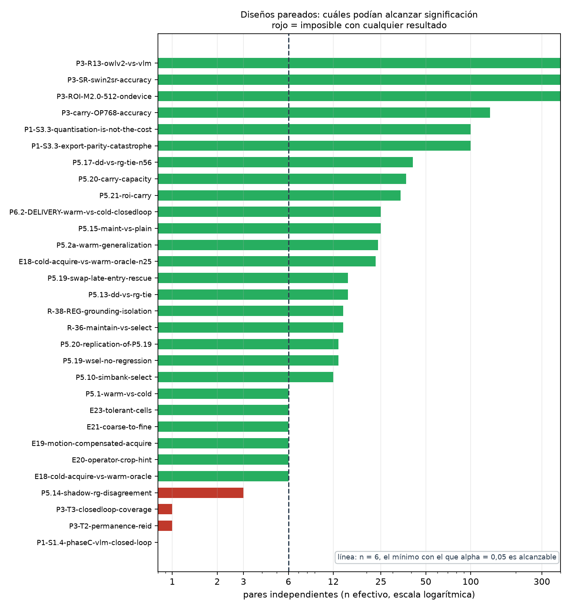
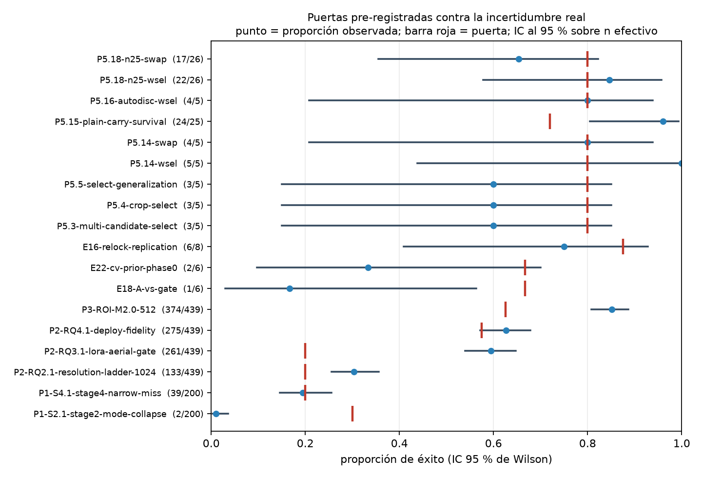

## Cómo leer esta tabla

Generada por `thesis/run_stats.py` desde `thesis/claims.json`. No se edita
a mano. El método y las reglas de rechazo están en
`thesis/01-metodo-estadistico.md`.

`p` indefinido no significa 'sin efecto': significa que no hubo prueba,
casi siempre por 0 pares discordantes. `alcanzable = no` significa que el
diseño no podía llegar a alpha = 0,05 con ningún resultado posible.

<!-- caption: Re-análisis exacto de las afirmaciones con puerta, con corrección de Holm-Bonferroni -->

| Afirmación | Parte | Diseño | n efectivo | Prueba | p | p (Holm) | Alcanzable | Lectura |
|---|---|---|---|---|---|---|---|---|
| P1-S1.2-zeroshot-smolvlm | I | binario de un brazo | 47 | IC de Wilson | indefinido | — | **no** | sin puerta pre-registrada; solo intervalo [deflactado desde 0/50: ver independence_note] |
| P1-S2.1-stage2-mode-collapse | I | binario de un brazo | 200 | binomial exacta | 1 | 1 | sí | 2/200 contra puerta 0.30; hacían falta >=72/200 para alpha=0,05 |
| P1-S3.3-export-parity-catastrophe | I | binario pareado | 100 | McNemar exacta | 0.0001345 | 0.004304 | sí | significativa (b=45, c=15) |
| P1-S3.3-quantisation-is-not-the-cost | I | binario pareado | 100 | McNemar exacta | 0.2478 | 1 | sí | no significativa (b=17, c=10); hacían falta >=6 discordantes en una dirección, hubo 17 |
| P1-S3.4-coco-to-aerial-domain-shift | I | binario de un brazo | 47 | IC de Wilson | indefinido | — | **no** | sin puerta pre-registrada; solo intervalo [deflactado desde 1/50: ver independence_note] |
| P1-S4.1-stage4-narrow-miss | I | binario de un brazo | 200 | binomial exacta | 0.5981 | 1 | sí | 39/200 contra puerta 0.20; hacían falta >=50/200 para alpha=0,05 |
| P1-S1.3-phaseB-control-stack | I | binario de un brazo | 1 | IC de Wilson | indefinido | — | **no** | sin puerta pre-registrada; solo intervalo [deflactado desde 3/3: ver independence_note] |
| P1-S1.4-phaseC-vlm-closed-loop | I | binario pareado | 0 | ninguna | indefinido | — | **no** | SIN DATOS - no se defiende; en cola de re-ejecución |
| P2-RQ0.3-spine-selection | II | binario de un brazo | 100 | IC de Wilson | indefinido | — | **no** | sin puerta pre-registrada; solo intervalo |
| P2-RQ1.1-dataset-well-posedness | II | descriptivo | 1421 | descriptiva | indefinido | — | **no** | solo descriptiva - no se pre-registró ninguna hipótesis |
| P2-RQ2.1-resolution-ladder-1024 | II | binario de un brazo | 316 | binomial exacta | 7.771e-06 | 0.0002642 | sí | 133/439 contra puerta 0.20; hacían falta >=76/316 para alpha=0,05 [deflactado desde 133/439: ver independence_note] |
| P2-RQ3.1-lora-aerial-gate | II | binario de un brazo | 316 | binomial exacta | 3.679e-53 | 1.325e-51 | sí | 261/439 contra puerta 0.20; hacían falta >=76/316 para alpha=0,05 [deflactado desde 261/439: ver independence_note] |
| P2-RQ4.1-deploy-fidelity | II | binario de un brazo | 316 | binomial exacta | 0.0355 | 0.9939 | sí | 275/439 contra puerta 0.57; hacían falta >=197/316 para alpha=0,05 [deflactado desde 275/439: ver independence_note] |
| P3-wholeframe-resolution-knee | III | descriptivo | 316 | descriptiva | indefinido | — | **no** | solo descriptiva - no se pre-registró ninguna hipótesis [deflactado desde 277/439] |
| P3-ROI-M2.0-512 | III | binario de un brazo | 316 | binomial exacta | 7.235e-19 | 2.532e-17 | sí | 374/439 contra puerta 0.63; hacían falta >=213/316 para alpha=0,05 [deflactado desde 374/439: ver independence_note] |
| P3-ROI-drift-robustness | III | descriptivo | 316 | descriptiva | indefinido | — | **no** | solo descriptiva - no se pre-registró ninguna hipótesis [deflactado desde 326/439] |
| P3-SR-swin2sr-accuracy | III | binario pareado | 312 | McNemar exacta | 0.3105 | 1 | sí | no significativa (b=21, c=14); hacían falta >=6 discordantes en una dirección, hubo 21 |
| P3-carry-OP768-accuracy | III | binario pareado | 93 | McNemar exacta | 0.01267 | 0.3675 | sí | significativa (b=55, c=31) |
| P3-E1-TRT-fps | III | descriptivo | 1 | descriptiva | indefinido | — | **no** | solo descriptiva - no se pre-registró ninguna hipótesis |
| P3-E1-TRT-mask-parity | III | descriptivo | 1 | descriptiva | indefinido | — | **no** | solo descriptiva - no se pre-registró ninguna hipótesis |
| P3-T1-memoryless-baseline | III | descriptivo | 1 | descriptiva | indefinido | — | **no** | solo descriptiva - no se pre-registró ninguna hipótesis |
| P3-T2-permanence-reid | III | binario pareado | 1 | ninguna | indefinido | — | **no** | SIN DATOS - no se defiende; en cola de re-ejecución |
| P3-T3-closedloop-coverage | III | binario pareado | 1 | ninguna | indefinido | — | **no** | SIN DATOS - no se defiende; en cola de re-ejecución |
| P3-T0a-anchor-cadence | III | descriptivo | 1 | descriptiva | indefinido | — | **no** | solo descriptiva - no se pre-registró ninguna hipótesis |
| P3-T4a-tracker-cost | III | descriptivo | 1 | descriptiva | indefinido | — | **no** | solo descriptiva - no se pre-registró ninguna hipótesis |
| E18-cold-acquire-vs-warm-oracle | IV | binario pareado | 6 | McNemar exacta | 0.0625 | 1 | sí | no significativa (b=5, c=0); hacían falta >=6 discordantes en una dirección, hubo 5 |
| E18-A-vs-gate | IV | binario de un brazo | 6 | binomial exacta | 0.9986 | 1 | **no** | 1/6 contra puerta 0.67; ningún k habría alcanzado alpha |
| E20-operator-crop-hint | IV | binario pareado | 6 | McNemar exacta | 0.5 | 1 | sí | no significativa (b=2, c=0); hacían falta >=6 discordantes en una dirección, hubo 2 |
| E20-acquire-latency | IV | continuo pareado | 6 | ninguna | indefinido | — | **no** | solo sobreviven estadísticos agregados; hacen falta los valores por elemento para una prueba |
| E19-motion-compensated-acquire | IV | binario pareado | 6 | McNemar exacta | 1 | 1 | sí | no significativa (b=1, c=0); hacían falta >=6 discordantes en una dirección, hubo 1 |
| E21-coarse-to-fine | IV | binario pareado | 6 | McNemar exacta | 0.5 | 1 | sí | no significativa (b=2, c=0); hacían falta >=6 discordantes en una dirección, hubo 2 |
| E22-cv-prior-phase0 | IV | binario de un brazo | 6 | binomial exacta | 0.9822 | 1 | **no** | 2/6 contra puerta 0.67; ningún k habría alcanzado alpha |
| E23-tolerant-cells | IV | binario pareado | 6 | McNemar exacta | 0.5 | 1 | sí | no significativa (b=0, c=2); hacían falta >=6 discordantes en una dirección, hubo 2 |
| E16-relock-replication | IV | binario de un brazo | 8 | binomial exacta | 0.9327 | 1 | **no** | 6/8 contra puerta 0.88; ningún k habría alcanzado alpha |
| E17-reground-chase | IV | binario de un brazo | 1 | IC de Wilson | indefinido | — | **no** | sin puerta pre-registrada; solo intervalo [deflactado desde 0/10: ver independence_note] |
| E14-identity-hole | IV | binario de un brazo | 1 | IC de Wilson | indefinido | — | **no** | sin puerta pre-registrada; solo intervalo [deflactado desde 3/3: ver independence_note] |
| E13-colour-gate | IV | binario de un brazo | 1 | IC de Wilson | indefinido | — | **no** | sin puerta pre-registrada; solo intervalo [deflactado desde 0/3: ver independence_note] |
| E9-retarget-switch | IV | binario de un brazo | 1 | IC de Wilson | indefinido | — | **no** | sin puerta pre-registrada; solo intervalo [deflactado desde 3/3: ver independence_note] |
| E10-fast-follow-ceiling | IV | descriptivo | 4 | descriptiva | indefinido | — | **no** | solo descriptiva - no se pre-registró ninguna hipótesis |
| P5.1-warm-vs-cold | V | binario pareado | 6 | McNemar exacta | 0.125 | 1 | sí | no significativa (b=4, c=0); hacían falta >=6 discordantes en una dirección, hubo 4 |
| P5.2a-warm-generalization | V | binario pareado | 23 | McNemar exacta | 3.052e-05 | 0.001007 | sí | significativa (b=16, c=0) |
| P5.2b-speed-sweep | V | continuo pareado | 23 | ninguna | indefinido | — | **no** | solo sobreviven estadísticos agregados; hacen falta los valores por elemento para una prueba |
| P5.3-multi-candidate-select | V | binario de un brazo | 4 | binomial exacta | 0.9728 | 1 | **no** | 3/5 contra puerta 0.80; ningún k habría alcanzado alpha [deflactado desde 3/5: ver independence_note] |
| P5.4-crop-select | V | binario de un brazo | 4 | binomial exacta | 0.9728 | 1 | **no** | 3/5 contra puerta 0.80; ningún k habría alcanzado alpha [deflactado desde 3/5: ver independence_note] |
| P5.5-select-generalization | V | binario de un brazo | 4 | binomial exacta | 0.9728 | 1 | **no** | 3/5 contra puerta 0.80; ningún k habría alcanzado alpha [deflactado desde 3/5: ver independence_note] |
| P5.9-kerbsafe-scenebank | V | binario de un brazo | 15 | IC de Wilson | indefinido | — | **no** | sin puerta pre-registrada; solo intervalo |
| P5.10-simbank-select | V | binario pareado | 12 | McNemar exacta | indefinido | — | sí | 0 pares discordantes - los brazos son indistinguibles con estos datos. No es equivalencia; es ausencia de prueba. |
| P5.12-bankv21-recal | V | binario no pareado | 12 | Fisher exacta | 0.0003365 | 0.01043 | sí | 12/12 contra 3/12 (grupos independientes) |
| P5.13-dd-vs-rg-tie | V | binario pareado | 12 | McNemar exacta | 1 | 1 | sí | no significativa (b=1, c=0); hacían falta >=6 discordantes en una dirección, hubo 1 |
| P5.14-wsel | V | binario de un brazo | 3 | binomial exacta | 0.512 | 1 | **no** | 5/5 contra puerta 0.80; ningún k habría alcanzado alpha [deflactado desde 5/5: ver independence_note] |
| P5.14-swap | V | binario de un brazo | 3 | binomial exacta | 0.896 | 1 | **no** | 4/5 contra puerta 0.80; ningún k habría alcanzado alpha [deflactado desde 4/5: ver independence_note] |
| P5.14-shadow-rg-disagreement | V | binario pareado | 3 | McNemar exacta | 0.25 | 1 | **no** | n=3 pares no alcanzan alpha=0,05 bilateral ni volteando todos. Diseño sin potencia por construcción. |
| P5.15-plain-carry-survival | V | binario de un brazo | 25 | binomial exacta | 0.002908 | 0.08724 | sí | 24/25 contra puerta 0.72; hacían falta >=23/25 para alpha=0,05 |
| P5.15-maint-vs-plain | V | binario pareado | 25 | McNemar exacta | 0.625 | 1 | sí | no significativa (b=3, c=1); hacían falta >=6 discordantes en una dirección, hubo 3 |
| P5.16-autodisc-wsel | V | binario de un brazo | 3 | binomial exacta | 0.896 | 1 | **no** | 4/5 contra puerta 0.80; ningún k habría alcanzado alpha [deflactado desde 4/5: ver independence_note] |
| P5.18-n25-wsel | V | binario de un brazo | 26 | binomial exacta | 0.3833 | 1 | sí | 22/26 contra puerta 0.80; hacían falta >=25/26 para alpha=0,05 |
| P5.18-n25-swap | V | binario de un brazo | 26 | binomial exacta | 0.9768 | 1 | sí | 17/26 contra puerta 0.80; hacían falta >=25/26 para alpha=0,05 |
| P5.19-swap-late-entry-rescue | V | binario pareado | 26 | McNemar exacta | 0.25 | 1 | sí | no significativa (b=3, c=0); hacían falta >=6 discordantes en una dirección, hubo 3 |
| P5.19-wsel-no-regression | V | binario pareado | 26 | McNemar exacta | indefinido | — | sí | 0 pares discordantes - los brazos son indistinguibles con estos datos. No es equivalencia; es ausencia de prueba. |
| P5.19-grace-precision | V | binario de un brazo | 4 | IC de Wilson | indefinido | — | **no** | sin puerta pre-registrada; solo intervalo |
| P5.20-carry-capacity | V | binario pareado | 26 | McNemar exacta | 1 | 1 | sí | no significativa (b=0, c=1); hacían falta >=6 discordantes en una dirección, hubo 1 |
| P5.20-replication-of-P5.19 | V | binario pareado | 26 | McNemar exacta | indefinido | — | sí | 0 pares discordantes - los brazos son indistinguibles con estos datos. No es equivalencia; es ausencia de prueba. |
| P5.17-dd-vs-rg-tie-n56 | V | binario pareado | 28 | McNemar exacta | 1 | 1 | sí | no significativa (b=1, c=0); hacían falta >=6 discordantes en una dirección, hubo 1 |
| P6.0-flight-rig-gate | VI | descriptivo | 1 | descriptiva | indefinido | — | **no** | solo descriptiva - no se pre-registró ninguna hipótesis |
| P6.1-carla-renderer | VI | descriptivo | 1 | descriptiva | indefinido | — | **no** | solo descriptiva - no se pre-registró ninguna hipótesis |

## Qué sobrevive

- **Significativas tras corrección de Holm (6):** P1-S3.3-export-parity-catastrophe, P2-RQ2.1-resolution-ladder-1024, P2-RQ3.1-lora-aerial-gate, P3-ROI-M2.0-512, P5.2a-warm-generalization, P5.12-bankv21-recal
- **Sin prueba posible, 0 pares discordantes (26):** P1-S1.2-zeroshot-smolvlm, P1-S3.4-coco-to-aerial-domain-shift, P1-S1.3-phaseB-control-stack, P2-RQ0.3-spine-selection, P2-RQ1.1-dataset-well-posedness, P3-wholeframe-resolution-knee, P3-ROI-drift-robustness, P3-E1-TRT-fps, P3-E1-TRT-mask-parity, P3-T1-memoryless-baseline, P3-T0a-anchor-cadence, P3-T4a-tracker-cost, E20-acquire-latency, E17-reground-chase, E14-identity-hole, E13-colour-gate, E9-retarget-switch, E10-fast-follow-ceiling, P5.2b-speed-sweep, P5.9-kerbsafe-scenebank, P5.10-simbank-select, P5.19-wsel-no-regression, P5.19-grace-precision, P5.20-replication-of-P5.19, P6.0-flight-rig-gate, P6.1-carla-renderer
- **Diseño incapaz de alcanzar alpha (33):** P1-S1.2-zeroshot-smolvlm, P1-S3.4-coco-to-aerial-domain-shift, P1-S1.3-phaseB-control-stack, P2-RQ0.3-spine-selection, P2-RQ1.1-dataset-well-posedness, P3-wholeframe-resolution-knee, P3-ROI-drift-robustness, P3-E1-TRT-fps, P3-E1-TRT-mask-parity, P3-T1-memoryless-baseline, P3-T0a-anchor-cadence, P3-T4a-tracker-cost, E18-A-vs-gate, E20-acquire-latency, E22-cv-prior-phase0, E16-relock-replication, E17-reground-chase, E14-identity-hole, E13-colour-gate, E9-retarget-switch, E10-fast-follow-ceiling, P5.2b-speed-sweep, P5.3-multi-candidate-select, P5.4-crop-select, P5.5-select-generalization, P5.9-kerbsafe-scenebank, P5.14-wsel, P5.14-swap, P5.14-shadow-rg-disagreement, P5.16-autodisc-wsel, P5.19-grace-precision, P6.0-flight-rig-gate, P6.1-carla-renderer
- **Sin datos crudos, en cola de re-ejecución (3):** P1-S1.4-phaseC-vlm-closed-loop, P3-T2-permanence-reid, P3-T3-closedloop-coverage

## Cola de re-ejecución

Afirmaciones cuyos datos por elemento no sobreviven. No se defienden en
el TFM hasta que se re-ejecuten.

<!-- caption: Trabajo de re-ejecución necesario para hacer defendible cada afirmación sin datos -->

| Afirmación | Qué falta | Coste | Comando |
|---|---|---|---|
| P1-S1.4-phaseC-vlm-closed-loop | píxeles válidos — la medida es inválida en origen | superado; el rig de CARLA (P6.1) es el sitio correcto para volver a preguntarlo | `runners/run_phase_c.py con el renderizador CARLA, tras corregir el pitch de cámara` |
| P3-T2-permanence-reid | puntuaciones por clip; solo sobrevive la prosa del README | ~1 h en la 3090; los clips y el scorer están versionados | `.venv-ft/bin/python -m grounding.eval.score_clips --clips experiments/2026-06-18-t1-temporal-contract/clips --arms memoryless,reid` |
| P3-T3-closedloop-coverage | registros por vuelo; solo prosa del README | ~2 h; necesita n>=10 vuelos por brazo para decir algo sobre una tasa | `runners/run_phase_c.py --arms memoryless,reid --reps 10 (renderizador CARLA)` |

## Figuras

<!-- caption: Diseños pareados por n efectivo; en rojo los que no podían alcanzar significación con ningún resultado -->

<!-- caption: Proporciones observadas con intervalo de Wilson al 95 %; la barra roja marca la puerta pre-registrada -->

